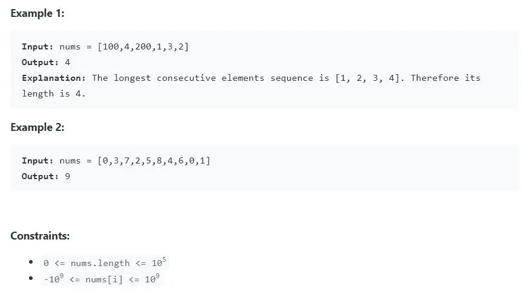

# 最长的连续序列— Leetcode 128 [Medium]

> 原文：<https://medium.com/nerd-for-tech/longest-consecutive-sequence-leetcode-128-medium-1adea28af7a5?source=collection_archive---------4----------------------->

 [## 最长连续序列- LeetCode

### 提高你的编码技能，迅速找到工作。这是扩展你的知识和做好准备的最好地方…

leetcode.com](https://leetcode.com/problems/longest-consecutive-sequence/) 

给定一个未排序的整数数组`nums`，返回*最长连续元素序列的长度。*

你必须写一个在`O(n)`时间内运行的算法。

## 天真的解决方案:

一个简单的解决方案是对给定的数组进行排序，然后进行线性遍历以找到最长的连续长度。这是一个简单的解决方案，但是由于排序的原因，时间复杂度是 O(nlogn)。所以，面试的时候不会接受。

## 使用器械包的高效解决方案:

所以我们有一个未排序的列表，我们需要最长的连续序列。我们在 O(n)中需要它，所以它告诉我们不能多次遍历元素。

*   制作给定列表中所有元素的集合
*   对于每个数字 num，如果(num-1)存在于集合中，则继续下一次迭代。如果没有，您需要计算该数字的最大连续序列数

考虑例子[100，4，200，1，3，2]。

*   **索引 0- > 100-** 99，即(100–1)不在集合中，因此计算 100 的最大连续长度。101，即(100+1)也不在集合中，所以最大连续序列是 1。
*   **索引 1- > 4-:** 3，即(4–1)在集合中，因此继续下一个索引。
*   **索引 2- > 200** :我们得到最大连续序列为 1。
*   **索引 3- > 1** : 0 即(1–1)不在集合中。所以计算的最大连续序列。2，3，4 在集合中。所以你得到的最大连续序列是 4。
*   **索引 4- > 3:** 2，即(3–1)已经在集合中。所以继续下一次迭代。
*   **索引 5- > 2:** 1，即(2–1)已经在集合中。所以继续下一次迭代。

所以最后我们得到最大连续序列长度为 4。

# 时间复杂度:

时间复杂度为 O(n)。for 循环里面的 while 循环可以让你以为是 O(n)解，其实不是。原因是内部 while 循环不会为 for 循环的每个 I 运行。内部的 while 循环依赖于外部 for 循环的值，所以我们将运算相加而不是相乘，即它不是 O(n*n)，而是 O(n+n)。所以我们得到整体复杂度为 O(n)