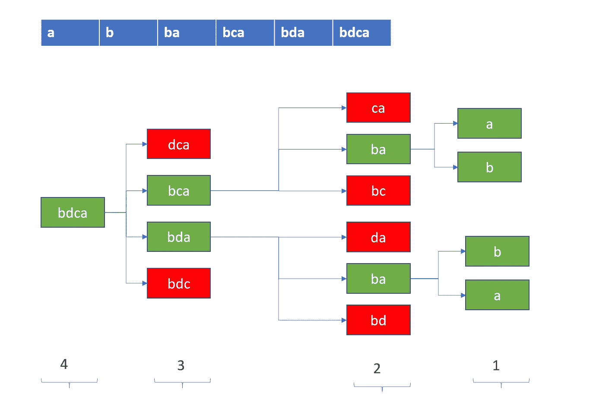

# 最长的字符串链—每日挑战可能

> 原文：<https://medium.com/nerd-for-tech/longest-string-chain-daily-challenge-may-a07eda8b112b?source=collection_archive---------7----------------------->


迈克·阿隆佐在 [Unsplash](https://unsplash.com/s/photos/chain?utm_source=unsplash&utm_medium=referral&utm_content=creditCopyText) 上拍摄的照片

今天的问题来自每日 Leetcode 编码挑战赛——五月版。这是一个中等标签的问题。让我们看看问题陈述。

## [1048](https://leetcode.com/problems/longest-string-chain/) 。最长的字符串链

给定一个单词列表，每个单词由英文小写字母组成。

假设`word1`是`word2`的前身，当且仅当我们可以在`word1`的任意位置添加一个字母，使其等于`word2`。比如`"abc"`就是`"abac"`的前身。

一个*单词链*是一个带有`k >= 1`的单词序列`[word_1, word_2, ..., word_k]`，其中`word_1`是`word_2`的前任，`word_2`是`word_3`的前任，以此类推。

从给定的`words`列表中选择单词，返回单词链的最大可能长度。

示例:

```
**Input:** words = ["a","b","ba","bca","bda","bdca"]
**Output:** 4
**Explanation**: One of the longest word chain is "a","ba","bda","bdca".
```

## 理解问题

问题是要求我们找到最长的链，它不关心顺序。因此，我们可以从最大的单词开始，向较小的单词移动，并继续检查对于较大的单词，在实际的给定单词列表中是否存在任何前身？我们通过从单词中移除单个字符来获得前身。需要注意的一点是，我们跟踪前辈的数量来获得链的长度。



在上图中，红框表示原始数组中不存在的单词，它们打断了链，因此被丢弃。

## 代码实现

```
class Solution:
    def longestStrChain(self, words: List[str]) -> int:
        words.sort(key=len, reverse=True)
        pred_map = {word:1 for word in words}
        for word in words:
            for i in range(len(word)):
                new_word = word[:i]+word[i+1:]
                if new_word in pred_map:
                    pred_map[new_word] = max(pred_map[new_word], 1 + pred_map[word])
        return max(pred_map.values())
```

## 马后炮！

如果你看看这个问题，我们会发现以下两点:

*   它要求**最长的**可能单词链，所以这是一个优化问题。
*   通过添加新单词来扩展该链，该新单词仅依赖于该链的最后一个单词。所以，它可以被分解成子问题。

考虑到以上两点，我们应该考虑 DP。我们实际上也做了同样的事情。我们的 pred_map 存储了可能从该特定字符串开始的 max 链。

## 复杂性分析

*   时间复杂度:O(N*W) 其中 *N* 为字数，W 为最长单词的长度。
*   空间复杂度:O(N)存储前任链映射。

编码快乐！！