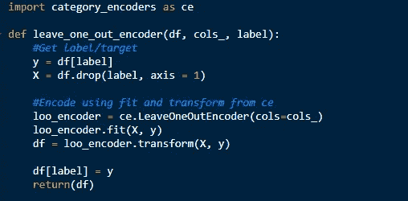
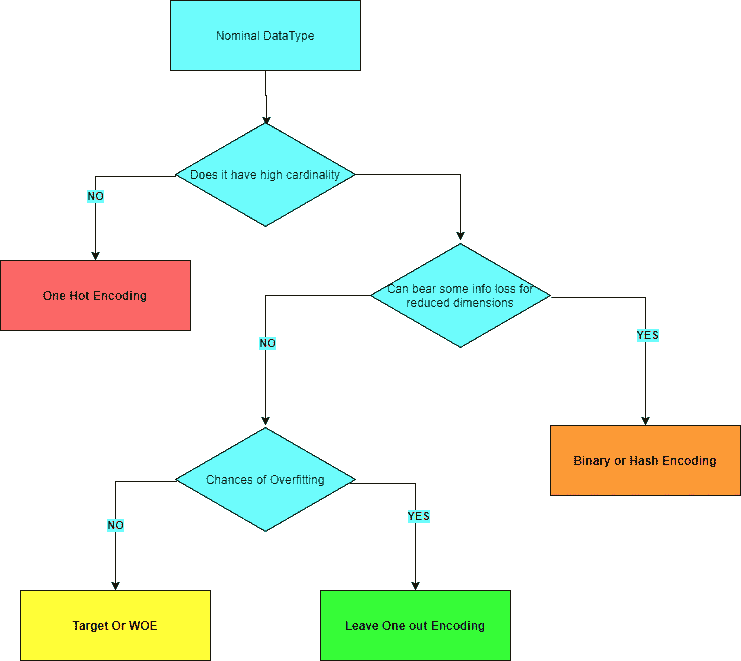

# 超越一次性编码

> 原文：<https://medium.com/nerd-for-tech/look-beyond-one-hot-encoding-f4b264c6a83?source=collection_archive---------1----------------------->

图像源取消飞溅

一键编码将分类列分解为虚拟变量，用 1 和 0 表示虚拟变量(新特性)在记录中是否重要。如果我们有少于 3-4 个类别或值的特性，这似乎没问题。但是当我们有更多的类别时，它开始成为一个棘手的问题。

对具有大量不同值的列进行热编码会增加维数灾难。假设我们有一个在 windows 机器上安装了防病毒软件的列。这是一个有 100 个独特项目的分类特征。当我们试图发现这些反病毒产品将如何影响系统中恶意软件存在的检测时，如果我们进行一次性编码，它将简单地在数据集中添加 100 列，几乎所有单元都为零。在每一行中，我们将有一个值为 1 的单元格，其余所有单元格的值都为 0。类似地，我们将在 AV 列中有很多不太常见的零。这基本上创建了一个有很多零的稀疏数据集。

此外，我们也开始看到这些维度之间的关系。如果我们知道哪个维度的值为 1，我们就可以计算出其他维度的值。这是因为我们知道我们默认安装了一个 AV，所以其他维度将为零。维度之间存在相关性。

这些额外的维度会增加数据对象内存占用的压力。假设您在一台内存为 12GB 的机器上加载一个大小为 4GB 的数据集，一旦您开始对一个包含 1000 个分类值的列进行一键编码，您的系统就会耗尽内存。

图像源取消飞溅

解决这个问题的一种方法是将编码限制在最常见的前 ***N*** 类。但是也有其他的选择。让我们探索这些选择。

## 受监督:

> **目标编码** —特征值替换为各个类别的目标值的平均值
> 
> **LeaveOneOut 编码** —类似于 target，但它不容易出现异常值，因为它在计算 Target 均值时忽略了当前记录
> 
> **证据权重** —用比值比对数替换的值。

LeaveOneOut 编码器的实现

## 无人监督的

> **二进制** —做序数编码，把整数转换成二进制代码，把数字拆分成单独的列。列的数量比一位热码编码中的少。
> 
> **计数/频率** —用该类别的计数替换类别值
> 
> **哈希编码** —类似 OneHot 但固定维度更少。使用哈希方法(来自 hashlib)生成新的 n 维

我不记得在哪里看到过类似的东西，但这很有帮助。

[category_encoder](https://github.com/scikit-learn-contrib/category_encoders) 包包含其他编码器，如 CatBoost、M-estimator、Contrast(和/赫尔默特/多项式/后向差分)。阅读它们，了解哪一个适合你的要求。