# JavaScript 中的循环

> 原文：<https://medium.com/nerd-for-tech/loops-in-javascript-76844e73bf75?source=collection_archive---------20----------------------->

## 我们有什么选择？

即使我们坚持 JavaScript 的基本循环，我们仍然有相当多的选择。这可以根据我们的目标而变化，但最终可以归结为您自己的个人风格或编码偏好。一个循环，不管怎么构造，永远是一个循环。为了在我们开始之前复习，我们创造循环，这样我们可以重复做一些事情。这可以从操纵整个数据集到仅仅试图发现数据集中是否存在匹配。既然我们觉得准备好了，就让我们开始吧。

**为循环**

for 循环的基本原则是，只要条件的值为真，它就会不断重复。一旦它的条件等于假，这是一个指标，它自己，现在是时候执行下一行代码，循环后。让我们看看下面的例子。

我创建了一个名为 forLoop1 的函数，它接受一个数组作为参数。从这里你可以看到我已经创建了一个空字符串来保存我们的数字。这就是神奇的地方，我们创建了 for 循环。我们的 for 循环条件由三部分组成。首先是初始表达式，这是我们创建索引变量的地方，因为它是首先执行的。第二，我们有我们的条件表达式，这是我们将决定是否在循环中前进或突破的地方。第三，也是最后一点，我们有增量表达式，这是我们增加索引的地方，这样我们就可以移动到下一个索引。一旦完成，我们就可以在循环中访问我们想要做的事情。

在这种情况下，我们将得到 num 的字符串，加上 num 的原始值，即给定数组中当前索引处的数字，最后是新的一行。新系列只是为了让我们的回归看起来更好。如上所述，这将继续循环，直到我们的索引大于我们的数组的长度。for 循环之后的函数中的最后一行代码是我们的 return，它将返回数组中的所有数字。看看我们的回报。

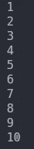

如你所见，我们已经返回了数组中的所有数字。这也是一个很好的例子，我们的 for 循环运行了多少次，10 次。如果我想列出我收藏的当前汽车怎么办？我们也可以为此使用 for 循环。看看下面的例子。

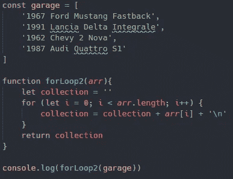

返回

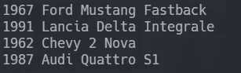

**为 in 循环**

看起来和我们常规的 for 循环没有太大的不同，但是执行起来有点不同。虽然我们不担心真值或假值来保证循环继续，但是 for in 循环遍历了我们所有的可枚举属性。虽然这是一个很好的遍历对象的选项，但是我们将使用它来遍历我们的数组。让我们来看看怎样才能达到和以前一样的目标。

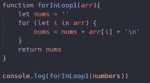

返回

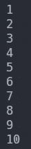

正如你所看到的，我们循环了数字数组并返回了数字。主要区别是我们的 for 循环参数。如你所见，我们为索引创建了一个变量，对于数组中的每个索引，我们都将循环，直到不再有索引需要循环。我们也仍然能够在每次循环迭代中做完全相同的事情。看看我们的车库做着同样的事情。

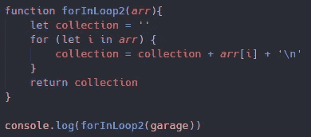

返回

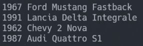

**For of 循环**

虽然在执行中非常类似于我们的 for in 循环，但我们仍然循环所有的可枚举属性，但不是我们的变量保存我们的索引，事实上它保存的是那个索引的值。看看下面的代码。

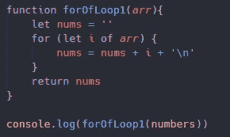

之前我们的变量 I 是我们的索引，虽然它仍然是索引的一个表示，它是那个索引的值。与我们以前从数组索引(arr[i])中获取值不同，在这种情况下，我们直接获得了值。看看我们的回报。

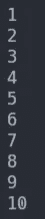

再说一次，即使我们以不同的方式循环，我们也能找到相同的解决方案。这也适用于我们的第二个例子。

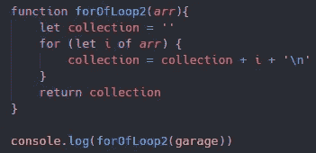

返回

**While 循环**

现在我们已经用不同的 for 循环覆盖了所有的基础，是时候进入 while 循环了，它实际上并没有什么不同。只要条件为真，它们就会一直循环，一旦条件为假，它们就会中断。那么，真正的区别是什么呢？让我们看看这个例子。

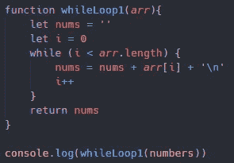

同样，它与我们的 for 循环有很多相似之处，但它仍然是不同的。首先，你会注意到我们在循环参数之外声明了索引变量。这是因为我们只需要在参数中有一个条件表达式。你可能也注意到了，索引的增量是循环中最后一个运行的项，这很好，因为到了下一次出现的时候，我已经增加了。您可能还注意到了，我们需要使用索引从数组中提取事件。让我们看看返回。

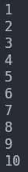

我们再次能够通过使用不同的手段来实现相同的目标。这就是我的意思，当它真的归结为个人喜好。我们能够使用四种不同类型的循环达到相同的解决方案。也许不得不修改一些代码来完成它，但是我们仍然能够完成它。这是第二个例子。

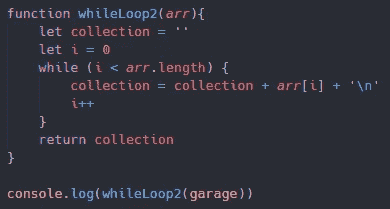

返回

**边做边循环**

do while 循环与 while 循环完全相同，除了首先声明循环期间要做的事情，然后声明 while 语句。对我来说，这看起来很有趣，因为你可以在你的循环参数后声明要做什么，甚至不需要输入 do。但这又归结为个人偏好。看看下面的两个例子。

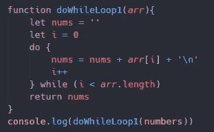

返回

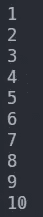

正如你所看到的，这两者之间没有太大的区别，只是书写方式不同。

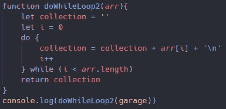

返回

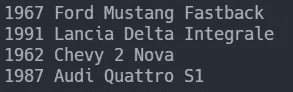

**脱离循环**

我觉得我们应该讨论最后一件事是如何打破循环。中断循环的原因有很多，但主要是在通过数组搜索项目时使用。如果那个项目被发现，我们将停止数组，因为我们已经找到了它。我们不需要继续遍历数组，这可能会增加我们代码的运行时间。让我们看看下面的例子。

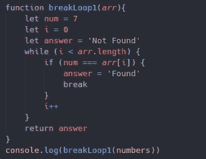

返回

正如你所看到的，我们使用了 while 循环，但是我们增加了一个 if 语句。如果数组索引中的数字与我们选择的数字匹配，我们将重新定义我们的答案为 found，然后中断循环。对于第二个例子，我们也可以这样做。

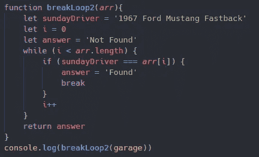

返回

我要感谢你的阅读，并希望你学到了新的东西！请关注未来的更多文章！

如果你想查看这些例子的副本，或者只是作为参考，你可以在这里找到 GitHub 回购[的链接。](https://github.com/TheRealKevBot/JSLoopBlog)