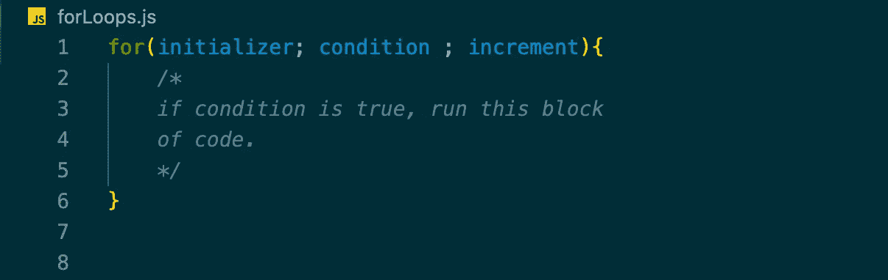
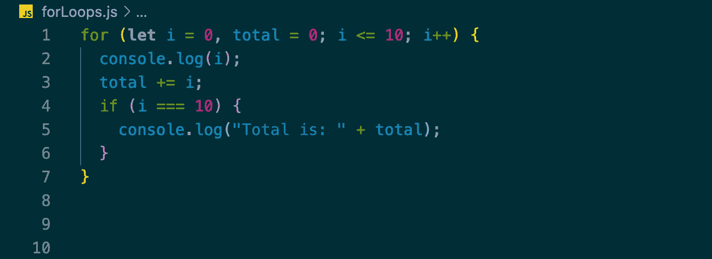
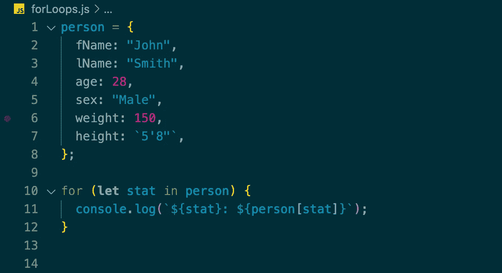
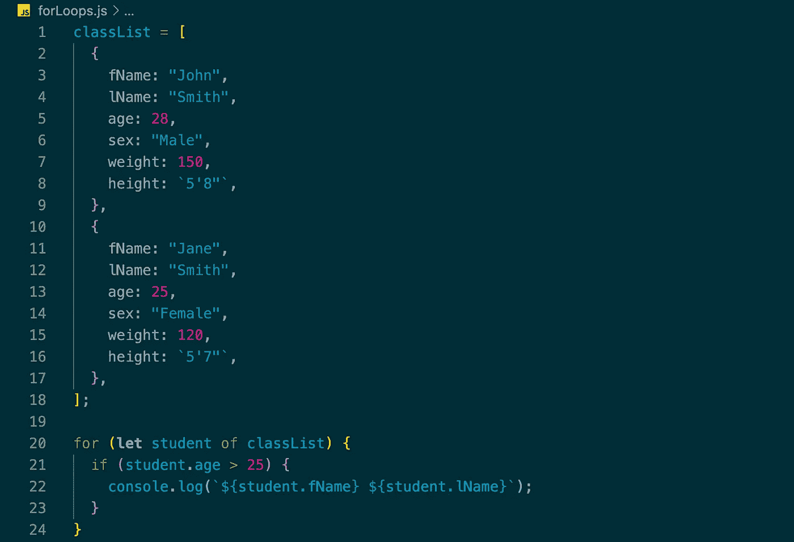

# 循环、循环和更多循环—第 2 部分

> 原文：<https://medium.com/nerd-for-tech/loops-loops-and-more-loops-part-2-cc6e1a6818f7?source=collection_archive---------7----------------------->

> 欢迎回到循环的第二部分！如果你错过了我之前关于 While loops 的博客，可以在这里查看一下 [Loops，Loops and More Loops——第 1 部分](https://davidjkirsch.medium.com/loops-loops-and-more-loops-pt-1-621bab6bdba6)，尽管没有必要继续关注这篇博客。

前进！！

# **For Loops！**

上周我们讨论了 while 循环和不同的类型。本周我们将讨论循环(我最喜欢的循环类型！)

有 3 种不同类型的 for 循环。以及的标准**、**的**、**的**。每一种都有特定的用途，在这篇博客中，我将解释并展示每种类型的例子。如果你完全不熟悉 for 循环，一开始看起来可能有点令人畏惧，但是我向你保证，一旦你理解了它，它就会变得非常简单。那么，让我们开始吧！！**

# **为**

循环的标准是最容易理解的，所以我们将从那里开始。for 循环由 3 条语句组成。初始化语句、条件语句和增量语句。

我们将从初始化式开始。初始化器是你创建一个变量并赋给它一个值的地方(通常你会把它设置为 0，然而并不总是这样)。第二个陈述是条件。这是循环将确定循环中的代码块是否运行的地方。99%的情况下，你会在条件中使用你在初始化式中使用的变量。最后，最后一条语句，即 increment，将在循环中的代码块执行后运行。同样重要的是要记住，所有的语句(初始化式、条件和增量)都是可选的，但是你需要把它放在循环内部的某个地方，或者放在初始化式的外部。

循环示例

上面的代码片段是一个常规 for 循环的例子。我们的初始化器将变量 I 设置为 0，我们也将变量 total 设置为 0*(您可以在初始化器中添加任意数量的变量)。然后我们有我们的条件，即当 I 小于或等于 10 时，运行循环内的代码块。最后，我们说在代码块运行之后，将 I 加 1。*

现在，查看代码片段，我们可以看到，每次 for 循环循环时，我们都会将 I 的当前值打印到控制台，然后将 I 的值添加到 total 中。一旦 I 等于 10，if 语句将运行并打印出“Total is: 55 ”,然后退出 for 循环，因为如果 I 大于 10，我们希望中断。这种类型的 for 循环非常适合多次遍历代码块。

# 赞成/反对

当您有一个具有您想要循环通过的属性的对象时，for/in 循环非常有用。因为对象没有固定的顺序，所以当你遍历对象时，它不会按字母顺序排列。

for/in 循环示例

上面的代码片段显示了一个名为 *person* 的对象。在*人物*中有很多属性(名字，名字，年龄…)。我们不能使用标准的 for 循环来遍历对象，因为对象没有索引，所以我们必须使用 for/in 循环。在第 10 行，我们以单词 for 开始，然后在括号中有一个名为 stat 的变量。这个变量将遍历对象中的每个键。接下来我们说的人，指的是名为人的对象。

当我们运行这个 for 循环时，我们将得到一个输出，这个输出将有一个键名，后跟这个键名的值。例如，它将打印 *fName: Joh* n 作为一个遍历对象的循环。使用 for/in 时要记住的一点是，这仅适用于对象，不能用于数组或字符串。

# 赞成/的

For/of 是 For 循环的最后一种类型。当你想迭代可迭代对象时，使用 For/of。这与 for/in 非常相似，只不过你使用了 of 而不是 in。我发现当我有需要迭代的数组时这很有用，特别是当它是一个对象数组时。这时，您将同时使用 for/of 和嵌套的 for/in，这是我喜欢使用的。

for/of 循环示例

在上面的代码片段中，我们看到了一个名为 classList 的数组。数组内部是对象。如果我们想要浏览班级列表并找到所有超过 25 岁的学生，我们将编写 for/of，因为我们有一个对象数组。当我们遍历一个学生的每个索引时，我们会查看该学生的年龄是否大于 25 岁。当我们发现一个条件为真时，我们在控制台中打印出学生的全名。

你有它！上周的 3 个 for 循环( *for，for/in，for/of* )和 2 个 while 循环( *while，do…while* )。我希望你从这个博客中学到了一些东西，如果你学到了，给这个博客一些掌声吧！谢谢你来看我的博客，下周我会带着一个新的话题和大家见面！