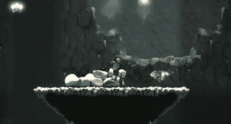
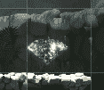
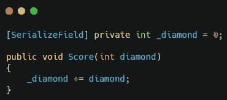
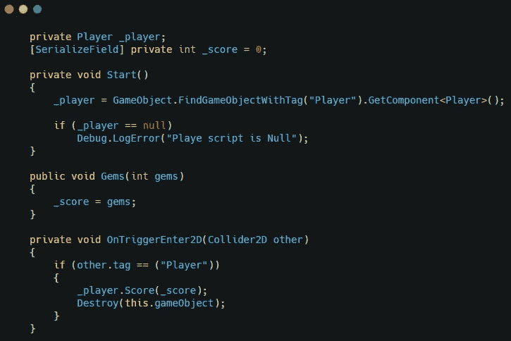
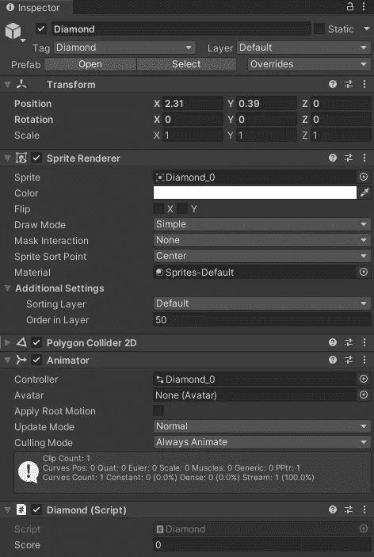
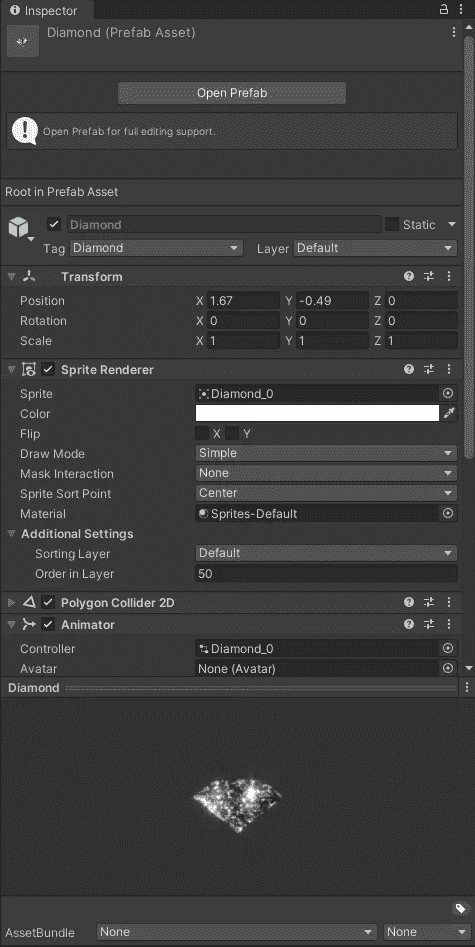
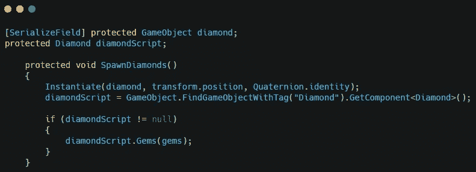
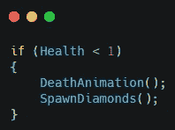
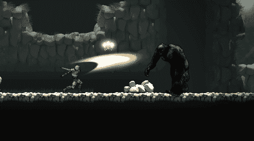

# 统一掠夺系统

> 原文：<https://medium.com/nerd-for-tech/loot-system-in-unity-2aa3d18dfa5e?source=collection_archive---------12----------------------->

我增加了攻击系统，让玩家可以击败敌人。现在是从战败的敌人那里获得战利品的时候了。

首先，我经历了制作将成为战利品的钻石动画的过程。我给场景添加了第一帧，给钻石添加了一个动画师，并制作了钻石的动画。

在玩家脚本中，创建一个变量来保存玩家拥有的方块数。然后创建一个方法，将收集到的钻石数量添加到 diamond 变量中。

创建一个将出现在钻石上的新脚本。这对玩家会有参考作用。一个分数变量，以及一个接受宝石数量并将其添加到分数变量中的方法。该脚本将使用一个 **OnTriggerEnter2D** 方法来检测玩家，并使用分数作为数字来更新玩家的钻石数量。然后脚本将删除钻石。

回到 unity，给菱形添加一个碰撞器，确保菱形脚本也在菱形上。

现在你可以预制钻石了。

在敌方脚本中，创建一个钻石预设的引用。创建对 diamond 脚本的引用。现在创建一个方法实例化钻石，设置钻石脚本的引用，使用敌人的宝石值调用钻石脚本中的方法。

进入每个敌人，并在调用敌人死亡的地方添加 SpawnDiamond()方法。

确保将钻石预置添加到你的敌人中，并给他们正确的宝石值。这将产生钻石，并给玩家正确数量的宝石给被击败的敌人。

