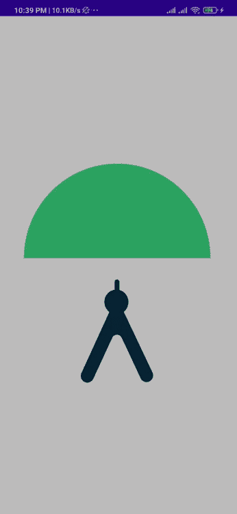

# Jetpack 中的 Lottie 动画合成 Android

> 原文：<https://medium.com/nerd-for-tech/lottie-animations-in-jetpack-compose-android-c471c234288e?source=collection_archive---------4----------------------->


图片复制自[https://airbnb.design/lottie/](https://airbnb.design/lottie/)

在今天的文章中，我将向您展示如何在 android jetpack compose 中使用 Lottie 动画，而不使用任何布局 xml 标签。要在 android 中使用 Lottie 动画，我们必须在 xml 标签中声明它。但是在 jetpack compose 中我们不创建 xml 标签，我们在@Composable 函数中声明动画。

首先，你必须在应用程序级别的 gradle 文件中添加 Lottie 库

```
*implementation* ("com.airbnb.android:lottie-compose:1.0.0-beta07-1")
```

之后，你需要在项目级梯度文件中添加以下行

```
maven **{** *url*=uri("https://oss.sonatype.org/content/repositories/snapshots/") **}**
```

我想你会让。当你创建你的项目时，你将面临在 gradle 文件中声明上述行的错误。

在这之后，你需要在 settings.gradle 文件中添加下面一行，否则你将面临编译时错误

```
maven **{** *url*=uri("https://oss.sonatype.org/content/repositories/snapshots/") **}**
```

已修改 settings.gradle.kts 文件

现在你已经成功地集成了洛蒂库，现在你需要在 res 下创建一个新目录，命名为 raw，并在这个目录下添加洛蒂动画文件，你可以从这里下载洛蒂动画:【https://lottiefiles.com/


现在，您需要在活动的@Composable 函数中声明以下代码。

我已经创建了一个变量 animationSpecs，它将负责在屏幕上创建动画

为了让它重复和自动播放，我创建了一个名为 animationState 的新变量，并将这两个变量传递给 LottieAnimation()函数。

最后是输出:

