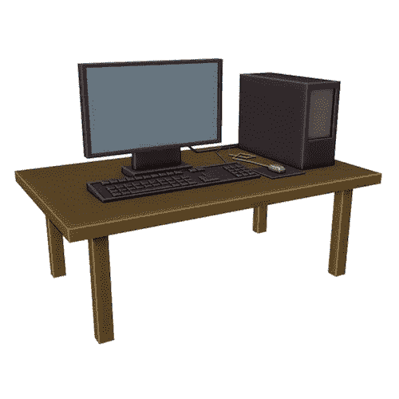

# Blender 中的低聚模型:带电脑的台式机

> 原文：<https://medium.com/nerd-for-tech/low-poly-model-in-blender-a-desktop-with-a-computer-8bd347c9d390?source=collection_archive---------20----------------------->

[*搅拌机中的⬅️低聚模型:石桥*](/nerd-for-tech/low-poly-model-in-blender-a-stone-bridge-716555e149d5)*|*[*TOC*](https://mina-pecheux.medium.com/low-poly-models-1-timelapses-dce93654fff3)*|*[*搅拌机中的低聚模型:百宝箱*](https://mina-pecheux.medium.com/low-poly-model-in-blender-a-treasure-chest-35003a7a8b49)

我最近的低利润模型是关于 RPG 和环境资产的；今天，我想用一台简单的台式电脑回到更多的**【日常用品】**。模拟键盘和鼠标也很有趣！:)

一个简单的低聚桌面电脑！