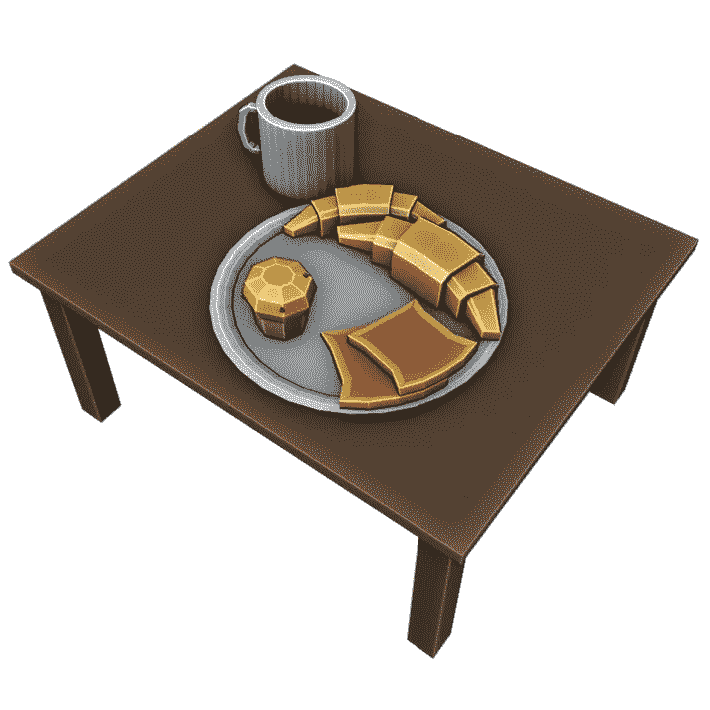

# 搅拌机中的低聚模型:清淡的早餐

> 原文：<https://medium.com/nerd-for-tech/low-poly-model-in-blender-a-light-breakfast-4c7cf7d584c1?source=collection_archive---------4----------------------->

[*搅拌机里的⬅️低聚模型:玩具火车*](/nerd-for-tech/low-poly-model-in-blender-a-toy-train-f12f992990eb)*|*[*TOC*](https://mina-pecheux.medium.com/low-poly-models-1-timelapses-dce93654fff3)

为了继续我在[搅拌机](https://www.blender.org/)中的低聚模型系列，我决定继续研究日常生活中的物体。谁不喜欢丰盛的早餐呢？；)

嗯，好吧，它有点轻，你可能会在中间塞进一些额外的*羊角面包*…

清淡的早餐低聚模型！