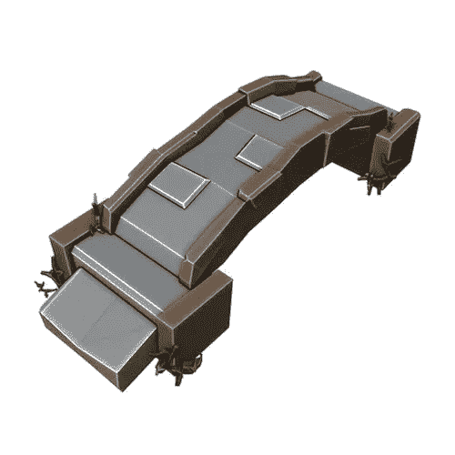

# 搅拌机中的低聚模型:一座石桥

> 原文：<https://medium.com/nerd-for-tech/low-poly-model-in-blender-a-stone-bridge-716555e149d5?source=collection_archive---------14----------------------->

[*搅拌机中的⬅️低聚模型:一个木箱*](/nerd-for-tech/low-poly-model-in-blender-a-wooden-crate-a087684ec3eb)*|*[*TOC*](https://mina-pecheux.medium.com/low-poly-models-1-timelapses-dce93654fff3)*|*[*搅拌机中的低聚模型:一个桌面上有一台电脑*](https://mina-pecheux.medium.com/low-poly-model-in-blender-a-desktop-with-a-computer-8bd347c9d390)

我最新的低聚是一个普通的游戏资产:[一个木箱](/nerd-for-tech/low-poly-model-in-blender-a-wooden-crate-a087684ec3eb)。这启发我创造了另一个经常用来填充游戏场景的物体——一座石桥。

一座低聚石桥！

它与我以前的车型有些不同，因为它不是一个小尺寸的物体或车辆，但是…