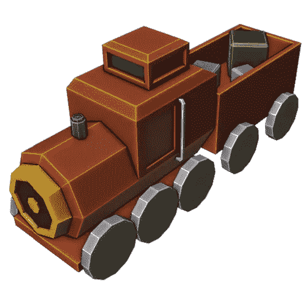

# 搅拌机中的低聚模型:玩具火车

> 原文：<https://medium.com/nerd-for-tech/low-poly-model-in-blender-a-toy-train-f12f992990eb?source=collection_archive---------3----------------------->

[*搅拌机里的⬅️低聚模特:一间小屋*](/geekculture/low-poly-model-in-blender-a-small-cabin-2bd5a8e2c2e6)*|*[*TOC*](https://mina-pecheux.medium.com/low-poly-models-1-timelapses-dce93654fff3)*|*[*搅拌机里的低聚模特:一份清淡的早餐➡️*](https://mina-pecheux.medium.com/low-poly-model-in-blender-a-light-breakfast-4c7cf7d584c1)

为了在[搅拌机](https://www.blender.org/)中制作这个新的低聚模型，我回到了日常生活中的小物件。这一次，它是一个基本的玩具火车，后面的车厢里有一些彩色的立方体；)

一个简单的玩具火车低聚模型！

对于这个模型，我使用了“**循环工具**”插件(更确切地说是它的“圆”工具)来快速转动…