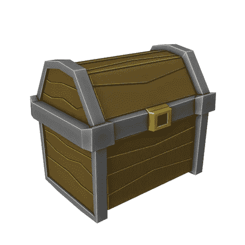

# 搅拌机中的低聚模型:一个百宝箱

> 原文：<https://medium.com/nerd-for-tech/low-poly-model-in-blender-a-treasure-chest-35003a7a8b49?source=collection_archive---------13----------------------->

[*搅拌机中的⬅️低聚模型:一个带电脑的桌面*](/nerd-for-tech/low-poly-model-in-blender-a-desktop-with-a-computer-8bd347c9d390)*|*[*TOC*](https://mina-pecheux.medium.com/low-poly-models-1-timelapses-dce93654fff3)*|*[*搅拌机中的低聚模型:一个简单的低音➡️*](https://mina-pecheux.medium.com/low-poly-model-in-blender-a-simple-bass-d7cd5a9941ce)

在这个**低聚造型**系列的前几集，我谈到了我如何制作[一个小木箱](/nerd-for-tech/low-poly-model-in-blender-a-wooden-crate-a087684ec3eb)和[一座石桥](https://mina-pecheux.medium.com/low-poly-model-in-blender-a-stone-bridge-716555e149d5)。但是，当然，在任何 RPG 中另一个绝对重要的东西是**一个很好的旧宝箱**来获得金币！

简单的低聚 RPG 百宝箱！