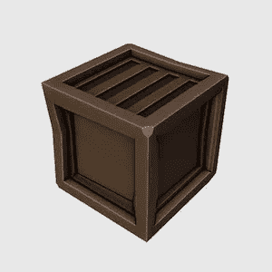

# 搅拌机中的低聚模型:一个木箱

> 原文：<https://medium.com/nerd-for-tech/low-poly-model-in-blender-a-wooden-crate-a087684ec3eb?source=collection_archive---------21----------------------->

[*搅拌机中的⬅️低聚模型:一张基本榻*](/nerd-for-tech/low-poly-model-in-blender-a-basic-couch-7992b0cb24b)*|*[*TOC*](https://mina-pecheux.medium.com/low-poly-models-1-timelapses-dce93654fff3)*|*[*搅拌机中的低聚模型:一座石桥*](https://mina-pecheux.medium.com/low-poly-model-in-blender-a-stone-bridge-716555e149d5)

在我以前的低聚合度文章中，我用了相当大的物体:一棵[树](/nerd-for-tech/low-poly-modelling-in-blender-aaf132ef3124)、一辆[卡车](/nerd-for-tech/low-poly-model-in-blender-the-pickup-12f5e2dbcecd)、一张[沙发](/nerd-for-tech/low-poly-model-in-blender-a-basic-couch-7992b0cb24b)……对于这个新的低聚合度模型，我决定**回到基本的**并制作一个类似 **RPG 风格**的小**木箱**。

一个低聚合度的木箱！