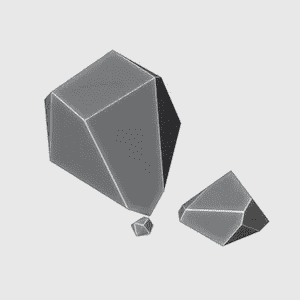

# 搅拌机中的低聚模型:一些岩石

> 原文：<https://medium.com/nerd-for-tech/low-poly-model-in-blender-some-rocks-d5d7bbca3700?source=collection_archive---------20----------------------->

[*搅拌机中的⬅️低聚模型:【皮卡】*](/nerd-for-tech/low-poly-model-in-blender-the-pickup-12f5e2dbcecd)*|*[*TOC*](https://mina-pecheux.medium.com/low-poly-models-1-timelapses-dce93654fff3)*|*[*搅拌机中的低聚模型:一个小机器人➡️*](/nerd-for-tech/low-poly-model-in-blender-a-little-robot-753ae35779b1)

在[最近的](/nerd-for-tech/low-poly-modelling-in-blender-aaf132ef3124) [文章](/nerd-for-tech/low-poly-model-in-blender-the-pickup-12f5e2dbcecd)中，我谈到了**低聚造型**以及我是如何在看了 [Imphenzia](https://www.youtube.com/imphenzia) 的一些视频后爱上这个过程的。自从上周日我展示了一棵小树，我决定做一些石头来配合它！

我现在还在用开源的 3d 软 [Blender](https://www.blender.org/) ，当然；)

一些在搅拌机里做的低聚岩石！