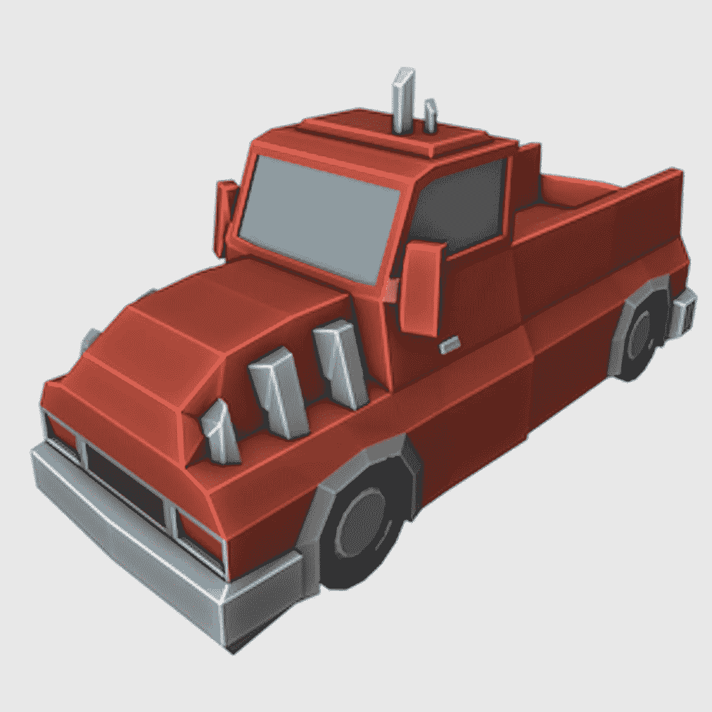

# 搅拌机中的低聚模型:“皮卡”

> 原文：<https://medium.com/nerd-for-tech/low-poly-model-in-blender-the-pickup-12f5e2dbcecd?source=collection_archive---------24----------------------->

[*⬅️搅拌机中的低聚造型*](/nerd-for-tech/low-poly-modelling-in-blender-aaf132ef3124)*|*[*TOC*](https://mina-pecheux.medium.com/low-poly-models-1-timelapses-dce93654fff3)*|*[*搅拌机中的低聚造型:一些石头➡️*](/nerd-for-tech/low-poly-model-in-blender-some-rocks-d5d7bbca3700)

[几天前](/nerd-for-tech/low-poly-modelling-in-blender-aaf132ef3124)，我谈到了低多边形建模，我把我的第一个低多边形模型，一棵树，联系了起来。我真的很喜欢制作它，所以我决定继续下去，并张贴更多！

我最新的低聚模型:皮卡！

在看了更多的 Imphenzia 的 Youtube 频道和他的教程[“如何创造一辆完美的汽车](https://www.youtube.com/watch?v=AL_CQNHoWe0) …