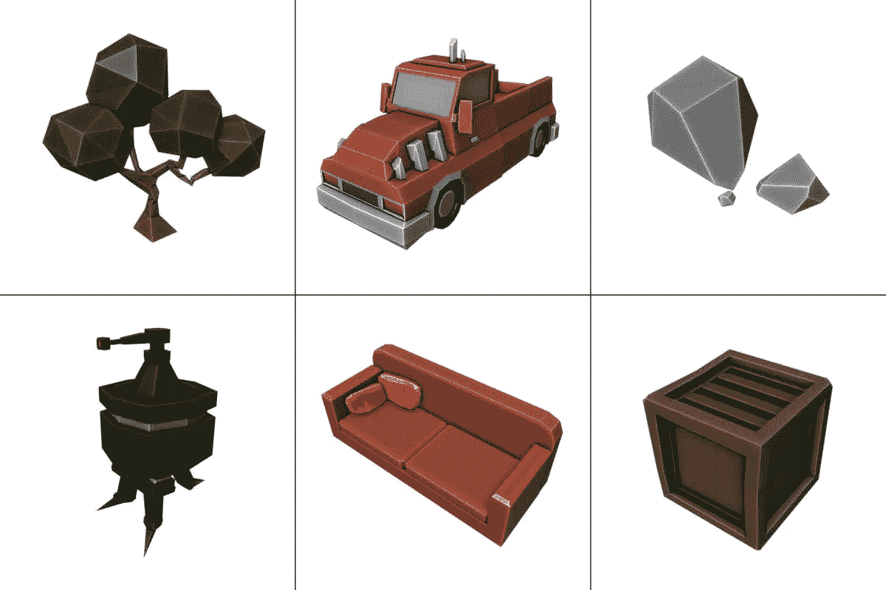

# 低聚模型:1 '时间间隔

> 原文：<https://medium.com/nerd-for-tech/low-poly-models-1-timelapses-dce93654fff3?source=collection_archive---------9----------------------->

## 目录

先睹为快，在我的第一个搅拌机 6 低聚模型！

除了作为专业自由职业者的全栈开发项目，我还喜欢 3D 和 CGI！因此，在发现斯蒂芬·佩尔松的 Youtube 频道后，我决定在 T4 的 Blender 开始一个关于低聚模特的系列。每集都有一个 1 分钟的延时建模视频，以及一些关于我如何制作模型的技巧和诀窍。