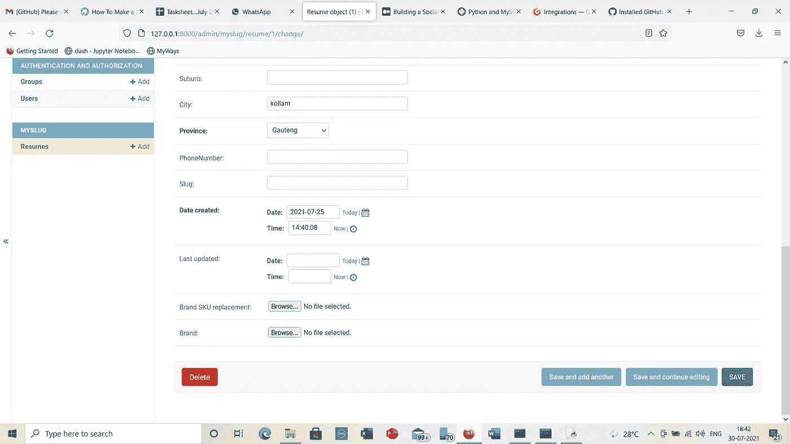
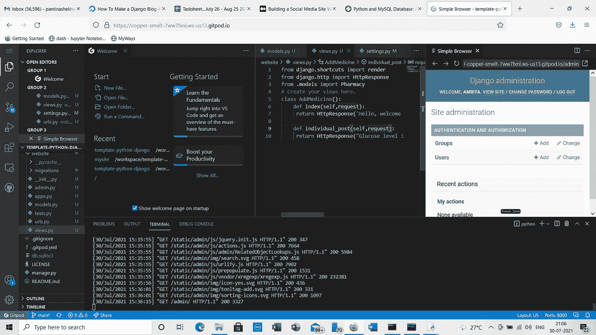
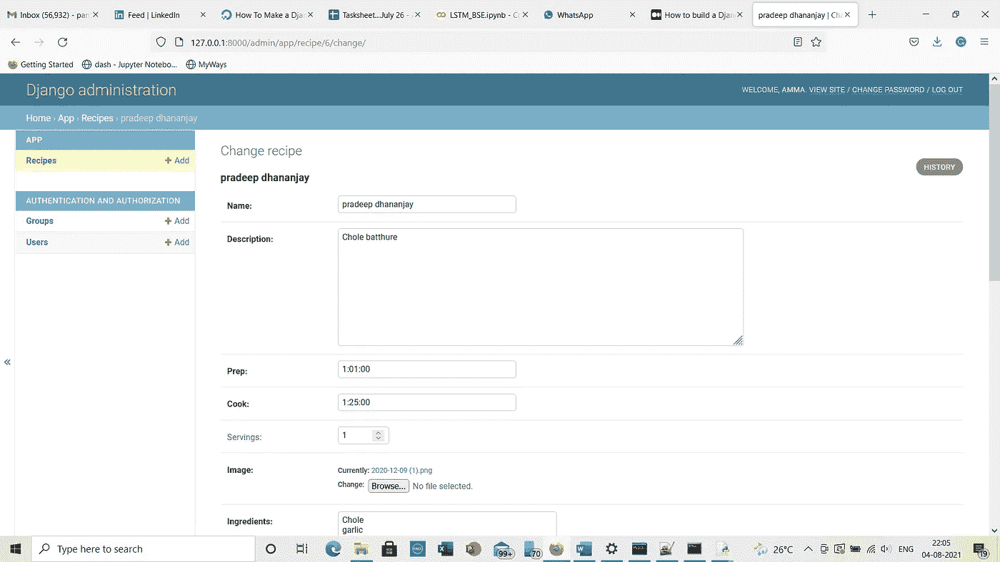
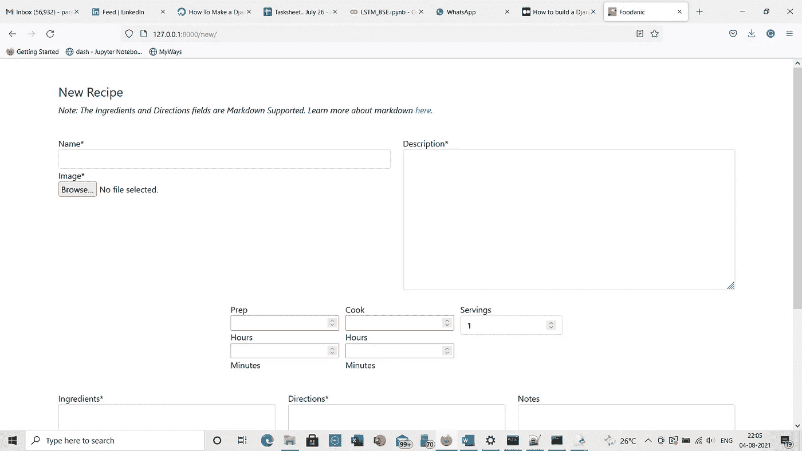
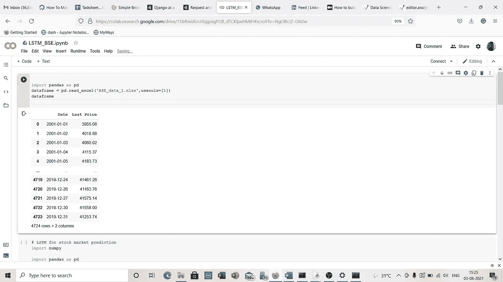

# LSTM 和姜戈

> 原文：<https://medium.com/nerd-for-tech/lstm-and-django-4be550c84853?source=collection_archive---------14----------------------->

我想先说说在 Django 设计一个网站。

如何在姜戈游玩

例如，在 Django 中，如果你想写一段代码，首先你必须创建一个文件夹。然后进入虚拟环境。现在，什么是虚拟环境？嗯，虚拟环境可以比作一个安装了所有库的私有空间。所以你要做的就是在桌面上安装 python 3.9 后‘pip 3 install virtualenv’。

应遵循以下步骤:-

第一步。python3 -m venv 环境

第二步。如果你在 Linux 中，那么 source env/bin/activate。

第 3 步:-如果你在 windows 中，然后。\ env \脚本\激活。

步骤 4:-进入虚拟环境后，使用以下命令安装 Django

皮普安装姜戈的。

第 5 步:-在这个 Django-admin 开始项目<projectname></projectname>

第 6 步:-在这之后，使用 cd 进入项目文件夹。然后

django-admin startapp

第 7 步:-进入 settings.py，设置已安装的应用程序=['【T4]'，]以及其他给定的字段。

步骤 8:-转到 settings.py 并设置允许的主机= ['localhost/127.0.0.1']

步骤 9:-转到 urls.py 并在主项目文件夹中设置 URL patterns = [path /admin ]。

第 10 步:-在 app 文件夹的 models.py 中，设置 MySQL 启动所需的字段。所以你要做的就是首先使用 pip install mysqlclient 安装 mysqlclient。

步骤 11:-创建字符字段，整数字段，或任何你想包括上传按钮使用文件字段留空=真。

步骤 12:-models.py 完成后，转到 app 文件夹中的 admin.py，并将 admin.site.urls 设置为 models . py 中创建的类的路径。

第 13 步:-在你的应用程序文件夹中创建一个单独的 urls.py，并包含一个 index，' '，Resume，或者任何类名。

步骤 14:-一旦所有这些都完成了，进入终端并设置 python manage.py makemigrations。

步骤 15:-之后使用 python manage . py SQL migrate<appname><migration name="">将你的 mysql 8.0 或 5.7 以上链接到 Django。</migration></appname>

步骤 16:-一旦数据库被链接。使用 python manage.py migrate，然后使用 python manage . py runserver 0 . 0 . 0 . 0:8000。

步骤 17:-在浏览器或 VS 代码中检查是否一切正常。如果一切正常，您可以进行更改并签入 [http://127.0.0.1:8000](http://127.0.0.1:8000) ，这同样会反映在 MYSQL DB 中。这是 Django 成功项目需要遵循的 17 个步骤。

姜戈一号。

VS 代码 Django 2。

姜戈 3。

姜戈 4。

**LSTM 股市预测**

现在我将带你穿越 LSTM。长短期记忆是一种深度学习技术。为了理解这个神经网络，我们需要理解什么是神经网络。神经网络具有输入状态、反馈状态、遗忘状态和前馈状态。所以这一切都将有助于开发神经网络来判断问题的性质。所以我们把它用于股票市场价格预测。它看起来像这样:-

> # LSTM 股票市场预测
> 
> 进口数量
> 
> 进口熊猫作为 pd
> 
> 导入数学
> 
> 从 keras.models 导入序列
> 
> 从 keras.layers 导入密集
> 
> 从 LSTM 进口层
> 
> 从 sklearn .预处理导入 MinMaxScaler
> 
> 从 sklearn.metrics 导入均方误差
> 
> 代码的上面部分处理了要包含在项目中的库。
> 
> def create_dataset(dataset，back=1):
> 
> dataX，dataY = []，[]
> 
> 对于范围内的 I(len(dataset)-back-1):
> 
> a =数据集[i:(i+look_back)，0]
> 
> dataX.append(a)
> 
> dataY.append(dataset[i + back，0])
> 
> 返回 numpy.array(dataX)，numpy.array(dataY)
> 
> 上面的代码部分将给定的值数组转换成数据矩阵。
> 
> 数字随机种子(10)
> 
> 为了重现性，我们将随机种子固定为 10。
> 
> data frame = PD . read _ excel(' BSE _ data _ 1 . xlsx '，usecols=[1])
> 
> 数据集=数据帧.值
> 
> dataset = dataset . astype(' float 32 ')
> 
> data frame
> 
> 上面的部分处理数据集的加载。
> 
> scaler = minmax scaler(feature _ range =(0，1))
> 
> dataset = scaler . fit _ transform(dataset)
> 
> 代码的上述部分处理数据的规范化。
> 
> train _ size = int(len(dataset)* 0.67)
> 
> 测试大小=长度(数据集)-训练大小
> 
> train，test = dataset[0:train_size，:]，dataset[train_size:len(dataset)，:]
> 
> 代码的上面部分处理将数据分成训练集和测试集。
> 
> 回望= 1
> 
> trainX，trainY = create_dataset(train，back)
> 
> testX，testY = create_dataset(test，back)
> 
> 上面的代码部分处理将数据重新整形为 X=t，Y= t+1。
> 
> trainX = numpy . shape(trainX，(trainX.shape[0]，1，trainX.shape[1])
> 
> testX = numpy . shape(testX，(testX.shape[0]，1，testX.shape[1])
> 
> 代码的上述部分处理对样本、时间步长和特征输入的整形。
> 
> 模型=顺序()
> 
> model.add(LSTM(4，输入形状=(1，回看)))
> 
> model.add(Dense(1))
> 
> model.compile(loss= '均方误差'，optimizer= '亚当')
> 
> model.fit(trainX，trainY，epochs=10，batch_size=1，verbose=2)
> 
> 上面的代码部分创建并适合 LSTM 网络。
> 
> trainPredict = model.predict
> 
> testPredict =模型.预测(testX)
> 
> 然后我们进行训练和测试预测。
> 
> train predict = scaler . inverse _ transform(train predict)
> 
> trany = scaler . inverse _ transform([trany])
> 
> test predict = scaler . inverse _ transform(test predict)
> 
> testY = scaler . inverse _ transform([testY])
> 
> 然后我们将预测转化为 2D 输入数组。
> 
> train score = math . sqrt(mean _ squared _ error(trainY[0]，trainPredict[:，0])
> 
> 打印('训练分数:%.2f RMSE' %(训练分数))
> 
> test score = math . sqrt(mean _ squared _ error(testY[0]，testPredict[:，0]))
> 
> 打印('测试分数:%.2f RMSE' % (testScore))

LSTM 1 号。

然后，我们计算训练和测试预测的均方根误差。

上述代码使用 BSE Sensex 数据，并评估股票市场预测和均方差。

首先，我们将一组值转换成一个数据矩阵。然后，我们加载数据集，并将其标准化，分成训练和测试数据集，大约 70%用于训练，30%用于测试。我们甚至尝试了 90%的训练和 10%的测试，这给出了更好的结果，因为 LSTM 在更多的训练数据中表现良好，特别是在 2020-2021 年的 covid 期间。

因此，简而言之，我想得出的结论是，如果我们在日常自动化中使用 python，将会有很多应用领域。让我想起的一个项目是 Tkinter 的上传程序。value()并将其转换为可显示的小部件。这就是我们的展示如何很好地让其他人看到。

深度学习的成功秘诀

首先，识别某个特定项目是否可以作为深度学习项目。为此，你需要了解如何着手神经网络。所以总是从反馈或直接输出网络的要求来考虑。假设它是机器学习，那么只有直接监督或无监督学习才能获得连续或数字输出。但是如果你想按照人脑的方式训练数据，那就是人工智能。所以总是使用神经网络。它可以是用于图像的 CNN(卷积神经网络)或用于股票市场预测的 LSTM(长短期记忆)。但是要明白，你需要一个输入到输出的正确映射，不像机器学习中的数据标注。这是一个重要的提示。希望你喜欢这篇文章。

问候

潘蒂娜·钱德拉谢哈尔

Amrita 技术公司的软件开发人员

喀拉拉邦科尔兰

请在下面找到我的关于 python 的 udemy 课程学习 python 基础知识。

[https://www.udemy.com/course/learn-python-basics-o/](https://www.udemy.com/course/learn-python-basics-o/)