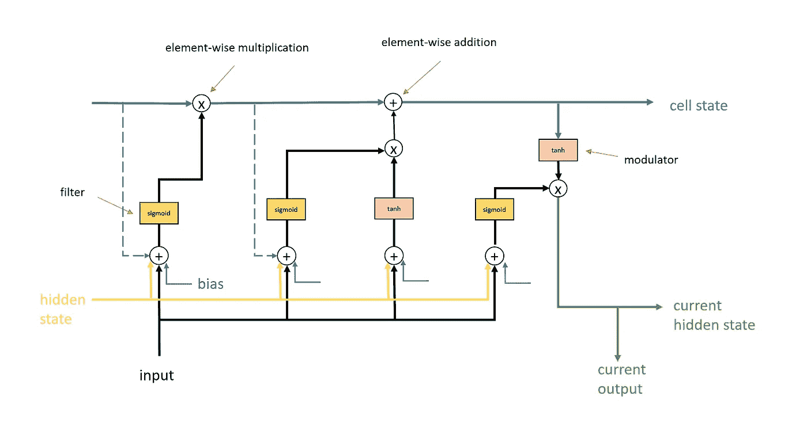
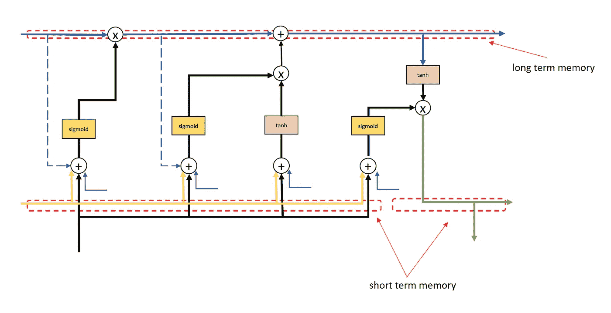
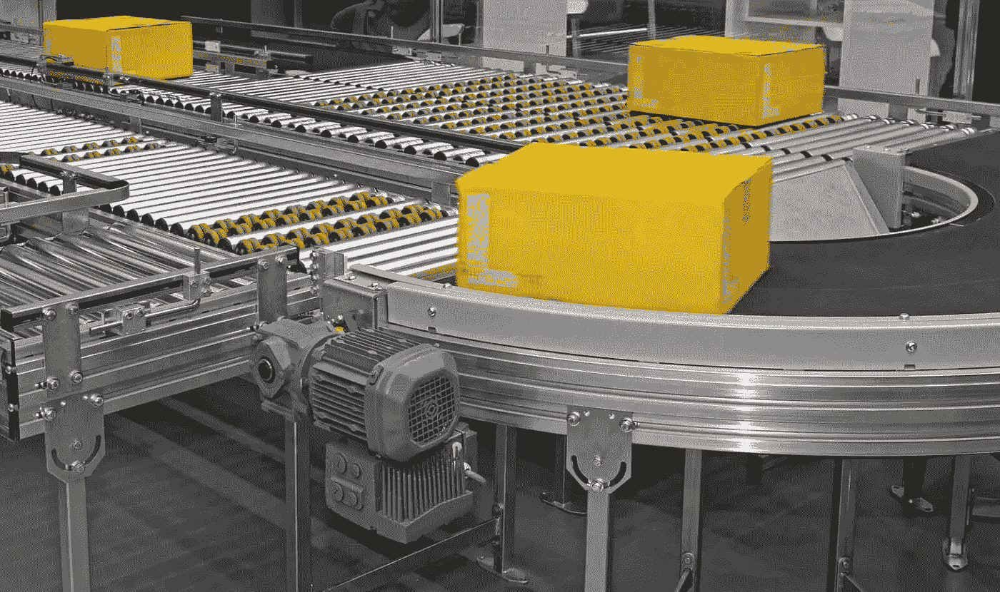
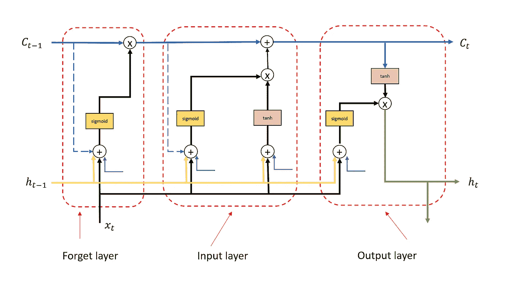
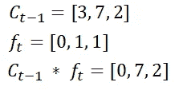
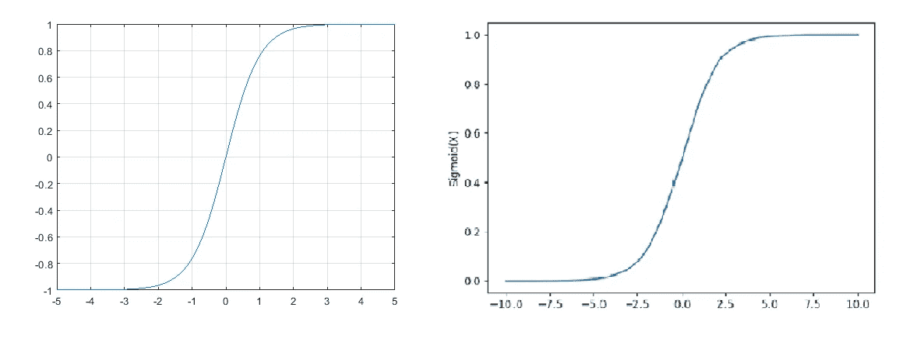
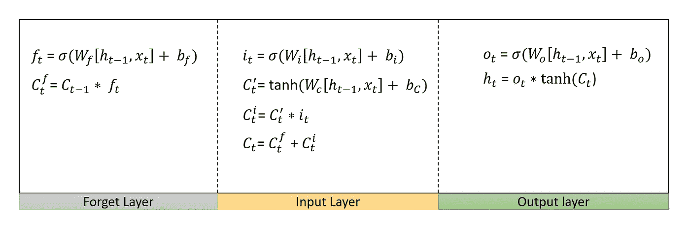

# LSTM——用简单的语言介绍

> 原文：<https://medium.com/nerd-for-tech/lstm-introduction-in-simple-words-fe544a45f1e7?source=collection_archive---------0----------------------->

图片来源 google.com

steps 长短期记忆是对递归神经网络的一种改进，旨在解决 RNN 在相关输入事件和目标信号之间超过 5-10 个离散时间步长的过去观察中学习失败的问题(消失/爆炸梯度问题)。LSTM 通过引入一种叫做“细胞状态”的记忆单位来做到这一点。让我们看下面的图表来理解 LSTM 的基本构建模块。

LSTM 简体

在上图中，具有隐藏状态和输入的中央双曲正切激活函数构成了一个基本的 RNN 单元。LSTM 增加其他层作为改进。在下图中，单元格状态是贯穿顶部的水平线。这种细胞状态就是 LSTM 语中“长”的含义。这种单元状态在更长的离散步骤(高达数百步)上携带信息或上下文。

LSTM 的长期和短期记忆

长期记忆“细胞状态”的行为类似于自动分拣机中的传送带，包裹被添加和移除。

图片来源 Misumi 博客

注意“单元状态”仅发生两次更新。这减少了计算量。因此提供了稳定性并减少了爆炸下降的机会。

在下图中，我们可以看到一个 LSTM 是如何被分解成层的，以便更好地理解。我们有三层。

LSTM 的不同层次

**忘记层:**该层根据当前输入和先前隐藏状态过滤或删除先前单元格状态的信息/内存。这是通过 sigmoid 激活函数完成的。该函数的输入结果只有 0 和 1。一旦它被乘以某个值，它要么会下降(与零相乘)得到零，要么完全通过(任何乘以 1 的值都是一样的)

导致过滤的逐元素乘法

**输入层:**这又有一个遗忘逻辑，从当前输入中删除任何不想要的信息。我们还有一个调制器，它将值保持在-1 和 1 之间。这是通过使用双曲正切函数实现的。

激活函数 tanh 和 Sigmoid

**输出层:**该层取当前输入和当前单元格状态，然后输出隐藏状态和单元格输出。我们再次对单元状态使用缩放(tanh ),以将值保持在-1 到 1 的范围内。

*注意:我们也在不同的层引入不同的偏差。*

从数学上讲，每一层都可以用下面图表中提到的等式来概括。

每一层的方程式

如果你对 LSTM 的实现感兴趣，那么你可能想看看这个博客。

快乐学习！