# 针对 Windows 交换机的 Mac 提示

> 原文：<https://medium.com/nerd-for-tech/mac-tips-for-windows-switchers-532241f0766d?source=collection_archive---------1----------------------->

## 很简单。去做吧！

无论你购买 MacBook 是因为你需要更多的计算能力、更好的性能，还是出于社会不安全感，被推进一个陌生的操作系统都是一种可怕的经历。刚刚使用过空前好用的 Windows 的人可能会觉得许多基本功能似乎都不见了。

在这篇博客中，让我带你了解一些**差异**、**技巧**和**窍门**，它们会让你在 macOS 上的体验高效而流畅。

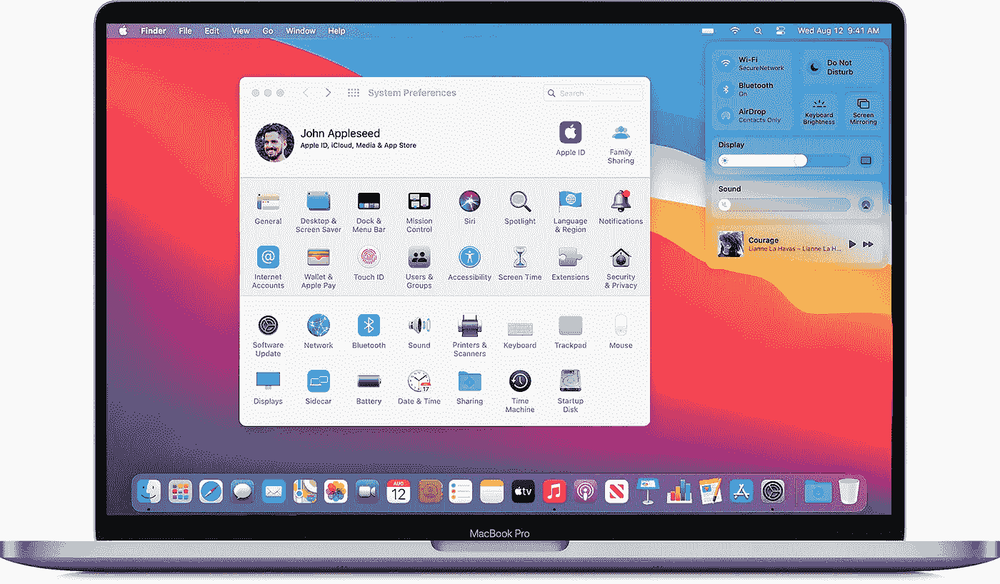

使用 macOS 很容易——它介于 Linux 和 Windows 之间

我倾向于把 macOS 看作是介于 Linux 这个庞然大物和可爱的小窗口之间的东西。

> 如果你想熟悉键盘和快捷键，从博客的结尾开始，倒着读。JK。头到底！

# 开始菜单在哪里？

Windows 用户倾向于从开始菜单开始他们的大部分活动。Mac 上没有类似的东西。首先，单击桌面上的图标，使用 **Spotlight** 搜索找到您想要开始做的事情，从顶部菜单栏中选择一个选项，通过图标或快捷键调用 **Launchpad** ，或者轻触 **Dock** 图标。

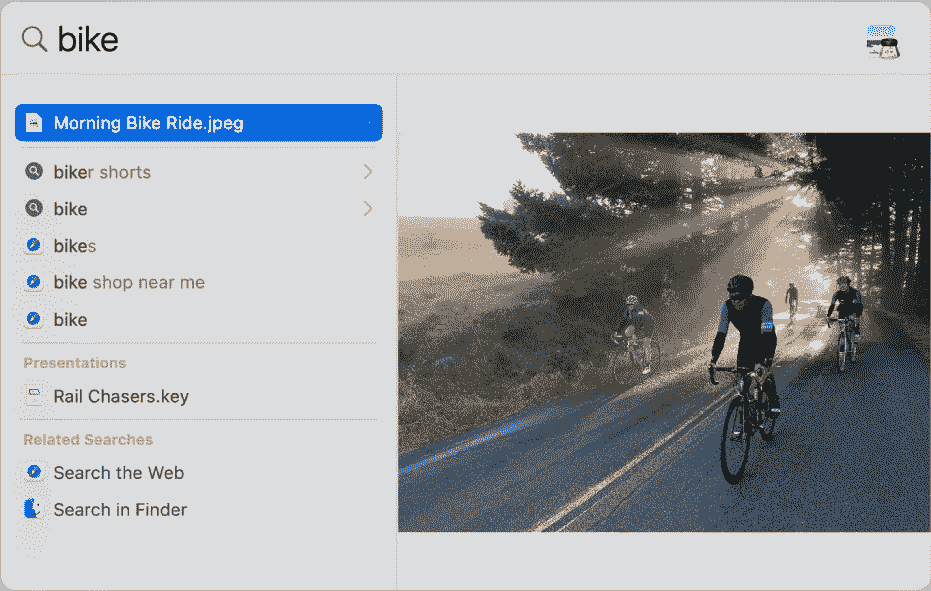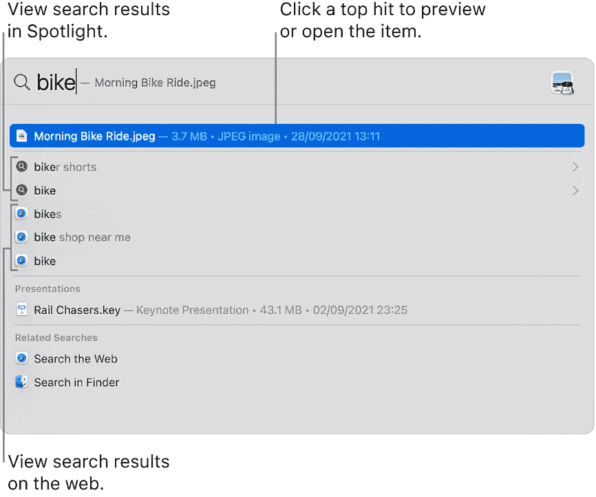

一些用户更喜欢 Spotlight 的替代品— [Alfred](https://www.alfredapp.com) ，它甚至可以适应您的使用！

# 菜单图标在哪里？

Windows 上的应用程序通常在程序窗口的顶部有一个菜单。对于 macOS 来说，这是操作系统的一部分，出现在桌面的上边— **菜单栏**。

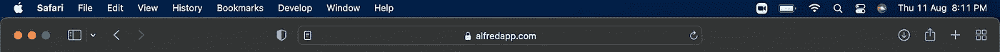

窗口的最大化和最小化选项通常在窗口的左边。甚至有更多的选择供你探索。

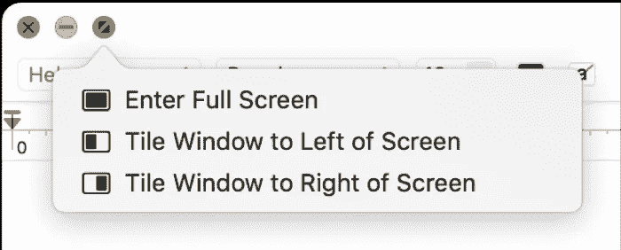

从经验来说，你不想进入全屏。

> 进入全屏通常*隐藏底部*的 Dock，所以我不太喜欢。相反，您可以双击应用程序栏来扩展和填充可用的高度。

# 任务栏在哪里？

在 Mac 屏幕的底部，您会看到一排类似 Windows 任务栏的图标。事实上，它的功能确实相似，只是有一些关键的不同。

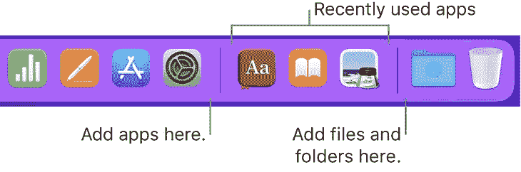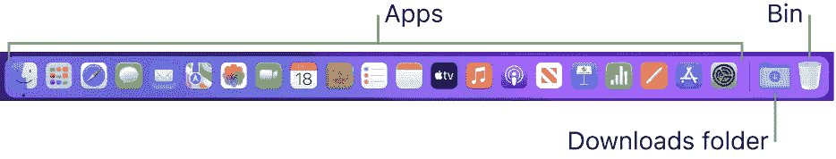

**船坞**分为两个主要部分。它的大部分是专用于应用程序和系统实用程序的快捷方式在它的左侧。在右边，越过一条细线，是文档图标。您必须定制 dock 以满足您的日常需求。右键点击 dock 中的图标会显示一些额外的选项，包括从 dock 中移除它，或者强制退出正在运行的应用程序。

# Windows 资源管理器在哪里？

macOS 上的 Finder 让你。它实际上非常相似，除了主左侧边栏不像 Windows 那样显示文件夹树。它确实有一些只是快捷方式或收藏夹的项目。Finder 可让您按颜色代码和关键词标签来整理文件。

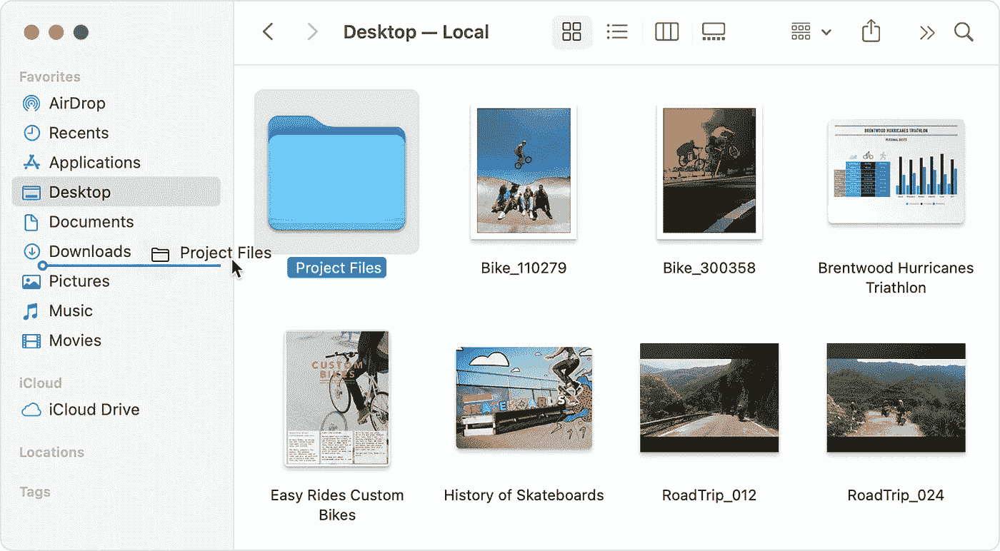

您可以将文件夹拖放到收藏夹部分

# 行动中心在哪里？

和 Windows 一样，macOS 也提供了一个通知中心。除了通知，你还可以访问日历、股票价格、屏幕时间等。点击系统日期时间打开。

在菜单栏的右端，我们也有在后台运行的应用程序，电池，wifi(系统状态)，以及控制中心——如蓝牙，亮度，甚至是*对焦模式*！

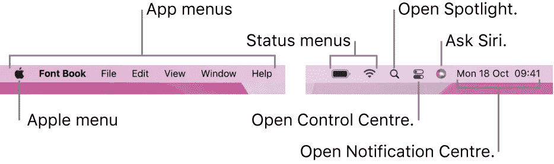

# 我想念 Cortana，我该怎么办？

嗯，你可能知道这个。苹果的 **Siri** 是一款超强的个人助理，可以做笔记等小任务，也可以为播放音乐、上网冲浪、甚至代表你发微博等复杂任务添加提醒。

只需说， ***嘿 Siri*** 就能看到神奇的事情发生了！

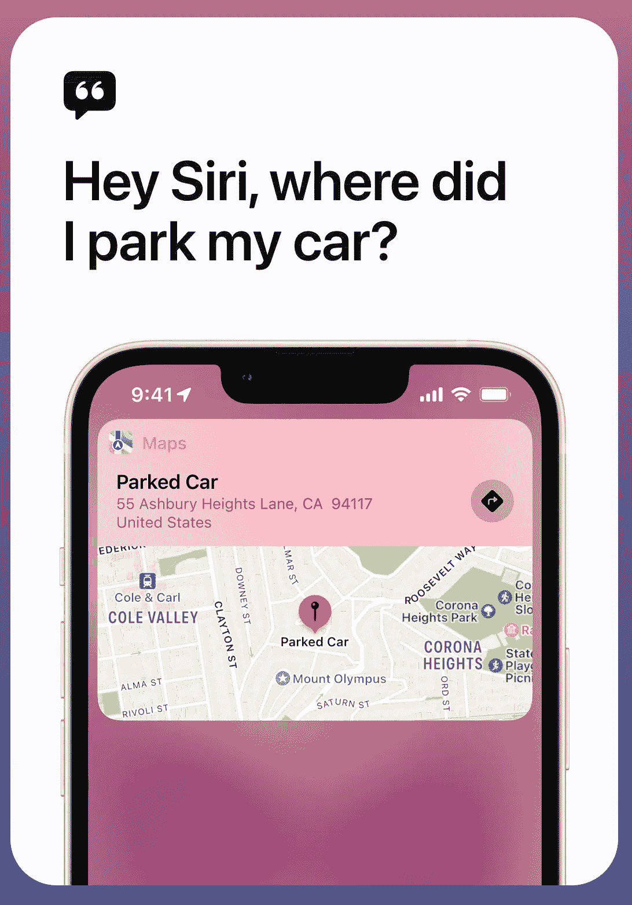

# 我如何安装应用程序？在哪里？exe 文件？

在 macOS 中，典型的应用程序安装需要安装。dmg 文件(磁盘映像的缩写)并将应用程序图标拖到“应用程序”文件夹中。在某些情况下，您实际上会获得安装指南，这与 Windows 的体验类似。

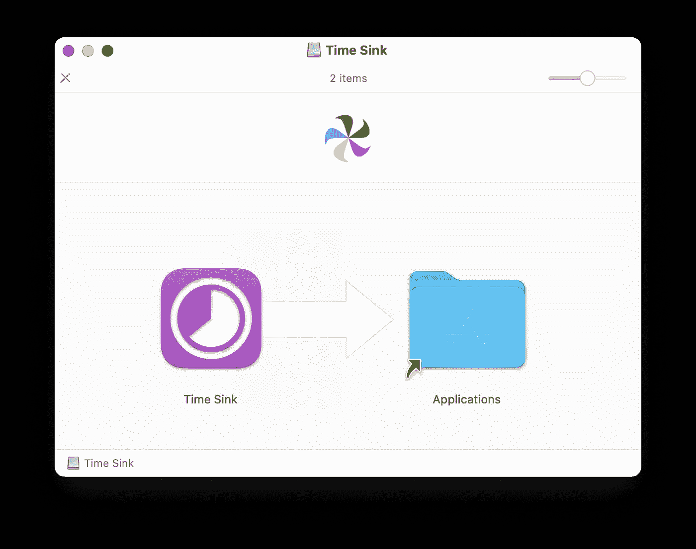

完成此过程后，您可能会在桌面和 Finder 上看到已装载的磁盘。您可以卸载它们。

此外，如果您需要任何可用的应用程序，App Store 会为您提供服务。这和 Windows store 差不多！

# 我如何右击？什么是触控板手势？

若要点按右键，请点按 Apple 鼠标的右上角，或者用两个手指在 Apple 触控板上点按。您可以在“鼠标”偏好设置和“触控板”偏好设置中对此进行更改。滚动方向、滑动手势和按钮分配的设置也在这里。

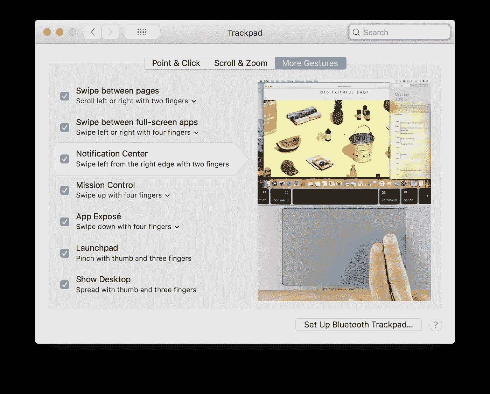

这些可能非常有用。例如，你可以用 3 个手指拖放，用 4 个手指查看所有打开的应用，甚至用 5 个手指打开 launchpad！随着时间的推移，你会发现更多的手势。

# 控制面板在哪里？

为此，只需转到**系统偏好**即可。Mac 的选项被组织到偏好设置中。例如，您可以为 Spotlight 设定的选项位于 Spotlight 偏好设置中。

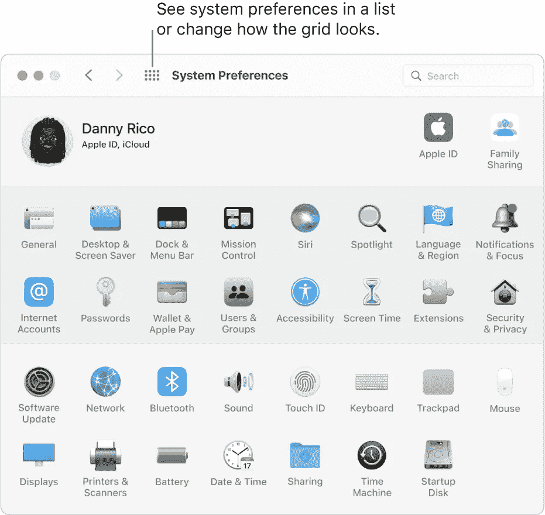

首选项显示为图标网格；根据您的 Mac 和您安装的应用程序，显示的图标可能会有所不同。点按图标以打开偏好设置面板并显示选项。

# 还有什么好知道的？

*   MacOS 有各种免费的内置应用程序。其中包括生产力应用程序，如— **keynote** 、 **numbers** 、 **pages** (类似于微软 Office 套件)，甚至音乐和视频编辑应用程序，如 **iMovie** 。
*   macOS 上的大多数项目都可以使用**预览**应用进行预览。从图像编辑器到 PDF 阅读器，这是您的一站式解决方案。

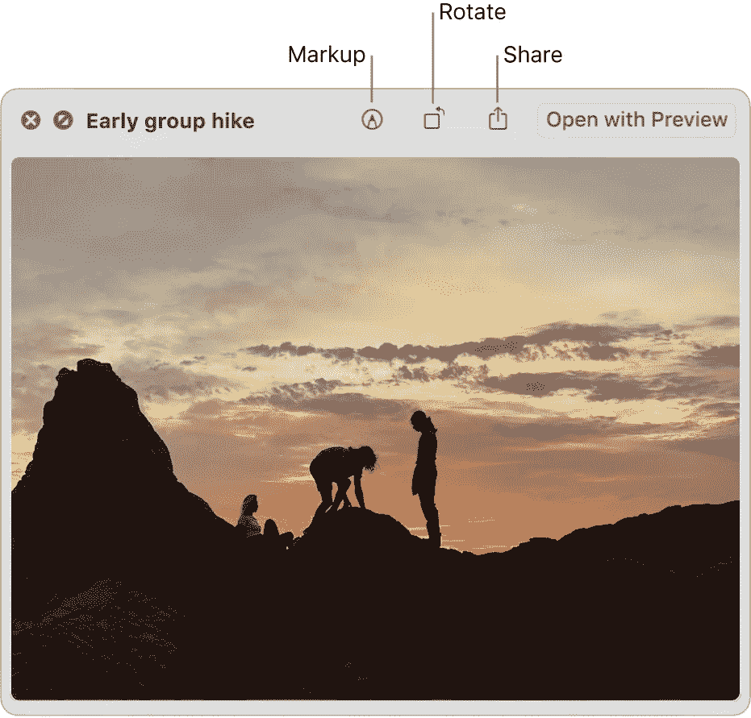

*   要删除文件、卸载应用程序或删除任何东西，你只需将它拖放到 dock 最末端的 **Bin** 图标中。这相当于你的回收站，最终可以清空。
*   在 macOS 上截图和 ABC 一样简单。只需使用 **Command + Shift + 3** 抓取整个屏幕，或者 **Command + Shift + 4** 抓取部分屏幕。

# 键盘一点都不像我以前见过的！

看这个键盘。是不是很可爱？除了对一个 Windows 人来说这一切都很陌生。有一堆奇怪的符号，钥匙和许多丢失的钥匙。那么这是怎么回事？

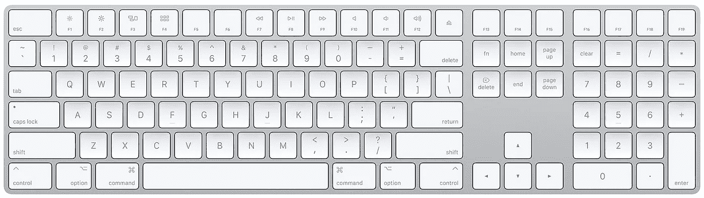

典型的魔法键盘，带数字键盘。MacBooks 上没有数字键盘。

Mac 菜单和键盘通常对某些键使用符号。以下是主要的几种(通常在键盘快捷键中充当修饰键)。

*   ⌘司令部
*   转移⇧
*   选项(或备选)⌥
*   控制⌃
*   大写锁定⇪
*   【数学】函数

若要使用键盘快捷键，请按住一个或多个修饰键，然后按快捷键的最后一个键。例如，若要使用 Command-C(拷贝)，请按住 Command 键，然后按住 C 键，然后松开这两个键。

某些 apple 键盘上的某些键具有特殊的符号和功能，例如显示亮度、键盘亮度、音量、播放暂停等。

> 按下🌐 **Fn 键**只打开一个表情菜单，相当有用。

macOS 有很多快捷方式，我不会在这里用它们来烦你。在 Apple 的支持网站上可以找到详尽的列表。

 [## Mac 键盘快捷键

### 通过按下某些组合键，您可以执行通常需要鼠标、触控板或其他输入设备才能执行的操作。

support.apple.com](https://support.apple.com/en-in/HT201236) 

# 结论

我希望这篇博客真的有用，尤其是如果你是新手，刚刚开始使用 Mac。随着时间的推移，您会发现所有这些，并且随着您逐渐熟悉操作系统和硬件，您会发现更多。

Btw，你是一个讨厌默认 macOS 终端沉闷观感的开发者吗？这是我的终端看起来有多酷—

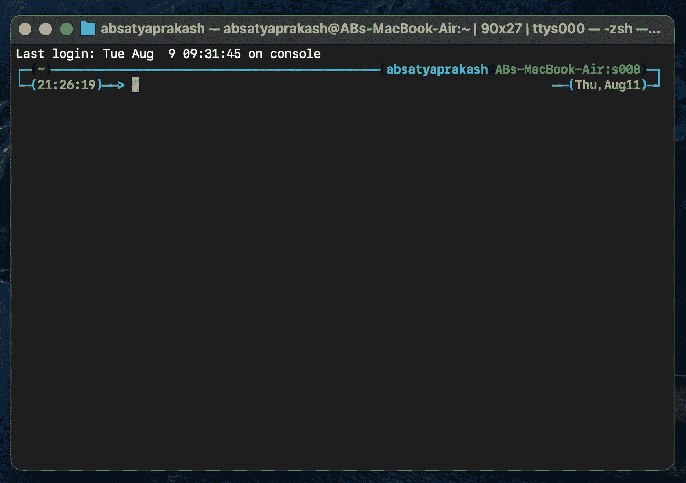

想学学怎么做吗？我会在下一篇博客中展示给你看😇

如果您有任何问题或建议，请随时联系我。您可以在这些社交媒体平台上关注我— [LinkedIn](https://www.linkedin.com/in/ab-satyaprakash/) 、 [YouTube](https://www.youtube.com/channel/UCJ6D0HS8c9Il-eX5lGbAyGg) 、 [Twitter](https://twitter.com/AbSatyaprakash) 、 [Instagram](https://www.instagram.com/absatyaprakash/) 了解更多更新内容！

**一如既往！黑客快乐！😇**

[加入我的电子邮件列表，获得更多精彩的教程和编程博客](https://absatyaprakash01.medium.com/subscribe) ❤️