# 机器学习

> 原文：<https://medium.com/nerd-for-tech/machine-learning-9dea1697e7f6?source=collection_archive---------14----------------------->

k 均值

**什么是机器学习？**

"机器完成某些由人完成的任务的能力，而不需要明确的编程来完成这项任务。"

**传统计算 vs 机器学习**

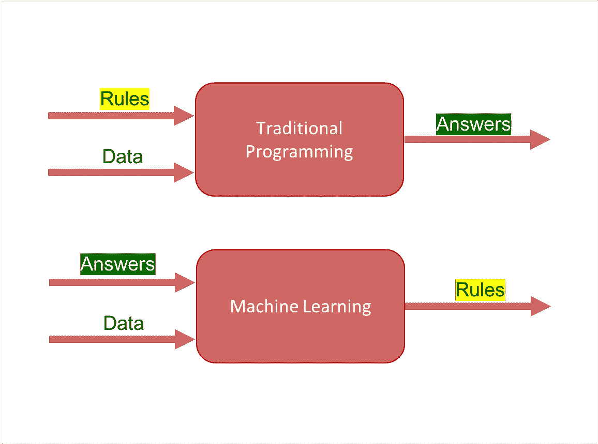

传统计算与机器学习

**机器学习还是没有机器学习？**

传统编程是指任何使用输入数据并在计算机上运行以产生输出的手动创建的程序。在机器学习中，也称为增强分析，输入数据和输出被馈送给算法以创建程序。这产生了强大的洞察力，可以用来预测未来的结果。

**机器学习**

*   预测房价
*   情感分析
*   根据购买行为细分客户
*   信用评分
*   垃圾邮件过滤

**没有机器学习**

*   得到一个班级学生的平均身高
*   不回复电子邮件

**机器学习实现**

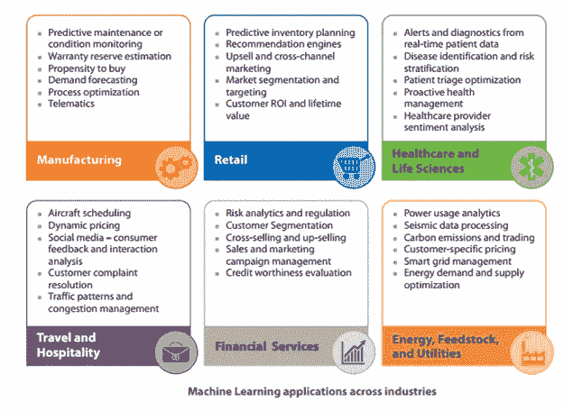

机器学习实现

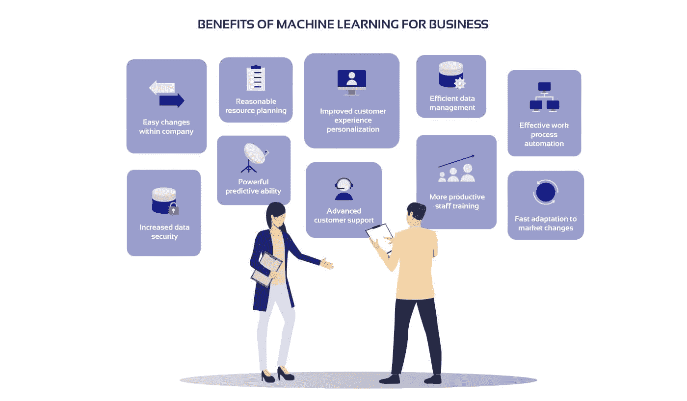

利益

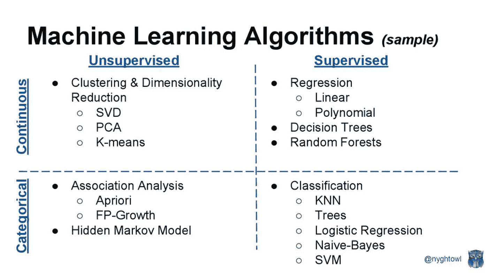

机器学习算法

**一般步骤**

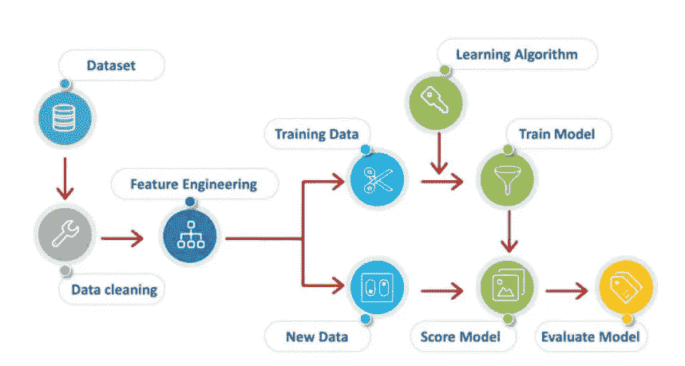

一般步骤

**数据清理**

数据清理是从记录集、表或数据库中检测和纠正(或删除)损坏或不准确记录的过程，指的是识别数据中不完整、不正确、不准确或不相关的部分，然后替换、修改或删除脏数据或粗糙数据。

*   重复数据集
*   缺失数据
*   极端值
*   数据类型

**特征工程**

特征工程是利用领域知识通过数据挖掘技术从原始数据中提取特征的过程。这些特征可以用来提高机器学习算法的性能。特征工程可以被认为是应用机器学习本身。

*   创建一个新变量
*   将所有变量改为数字
*   缩放变量(取决于算法)
*   可变缩拍
*   不平衡目标类别

**数据分析**

数据分析是检查来自现有信息源(例如数据库或文件)的可用数据并收集关于该数据的统计数据或信息摘要的过程。

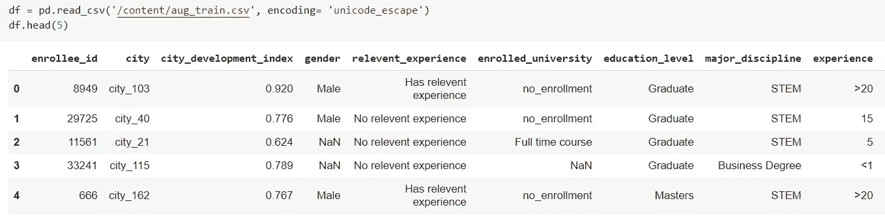

加载数据

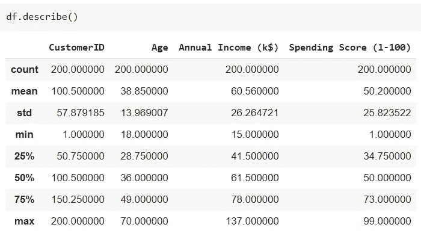

形容

**数据探索**

数据探索是一种类似于初始数据分析的方法，通过这种方法，数据分析师使用可视化探索来了解数据集中的内容和数据的特征，而不是通过传统的数据管理系统。

缺失值检查和插补

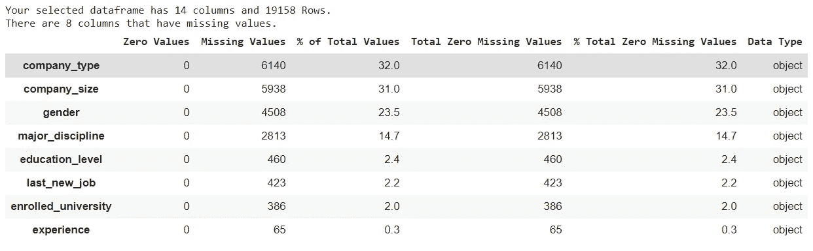

缺失值检查

异常/异常值检测

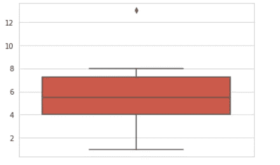

异常/异常值检测

相关热图

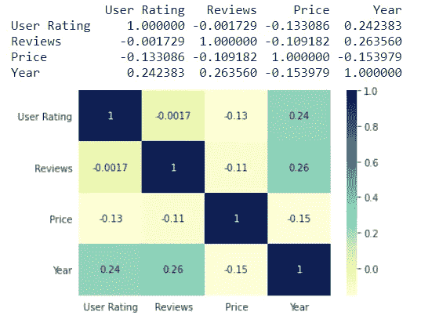

相关热图

**特色工程**

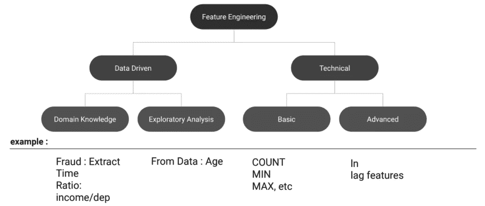

特征工程

**造型**

系统模型化

**评估**

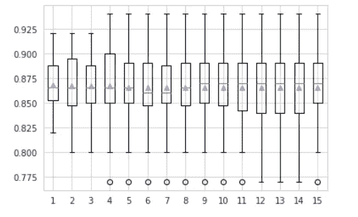

估价

**监督学习**

监督学习是基于示例输入-输出对学习将输入映射到输出的函数的机器学习任务。它从由一组训练样本组成的带标签的训练数据中推断出一个函数。

在监督学习中，每个示例都是由输入对象(通常是向量)和所需输出值(也称为监督信号)组成的一对。监督学习算法分析训练数据并产生推断的函数，该函数可用于映射新的示例。最佳方案将允许算法正确地确定不可见实例的类别标签。这需要学习算法以一种“合理”的方式从训练数据归纳到看不见的情况。算法的这种统计质量是通过所谓的泛化误差来衡量的。

监督学习的实现:

回归-该模型查找真实变量(可以有小数的数字)的输出。)

*   分类-模型查找放置其输入的类。

**分类 vs 回归**

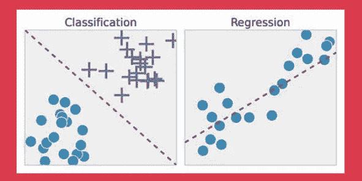

分类与回归

**回归**

回归是一种统计方法，用于金融、投资和其他学科，试图确定一个因变量(通常用 Y 表示)和一系列其他变量(称为自变量)之间关系的强度和特征。

建立回归模型，即寻找一个或多个自变量或预测值(X)与因变量或响应(Y)之间的关系。

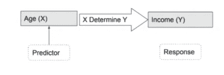

回归

**简单线性回归**

简单线性回归是一种回归分析，其中自变量的数量为 1，自变量(x)和因变量(y)之间存在线性关系

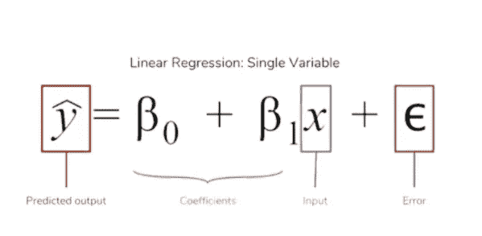

简单线性回归

**多元线性回归**

作为一种预测性分析，多元线性回归用于解释一个连续因变量与两个或多个自变量之间的关系。自变量可以是连续的，也可以是分类的

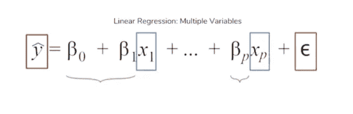

多元线性回归

**普通最小二乘法**

在统计学中，普通最小二乘法(OLS)是一种用于估计线性回归模型中未知参数的线性最小二乘法。

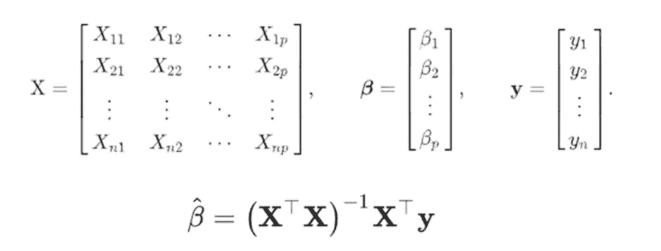

普通最小二乘法

**线性度**

线性几乎不需要解释。毕竟，如果您选择进行线性回归，您就假设基础数据呈现线性关系，特别是以下线性关系:

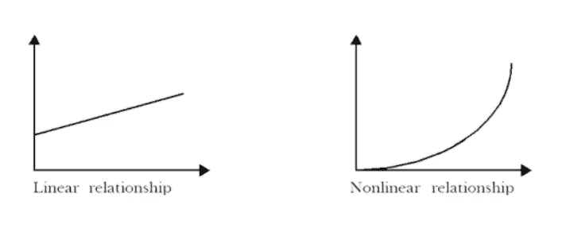

线性

**误差的正态分布**

*   通常告诉你的是，你的模型的大多数预测误差是零或接近零，大误差比小误差少得多。
*   如果回归的残差不是 N(0，σ2)，那么依赖于具有 N(0，σ2)分布的误差的显著性的统计检验就停止工作。

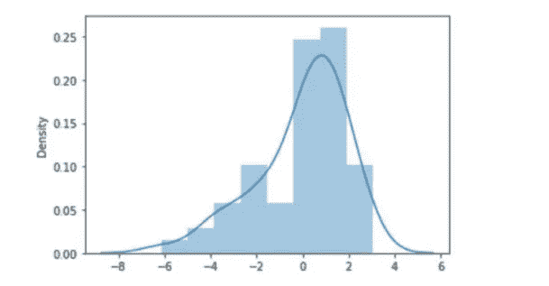

误差的正态分布

**同方差**

方差σ2 应该是常数。特别是，σ2 不应该是响应变量 y 的函数，因此也不应该是解释变量 x 的函数。

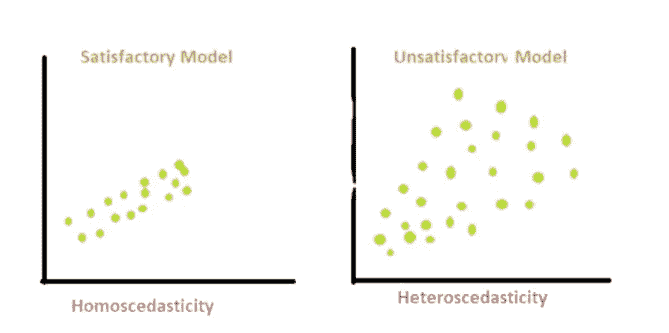

同方差性

**自相关**

第四，线性回归分析要求数据中很少或没有自相关。当残差彼此不独立时，自相关就会发生。

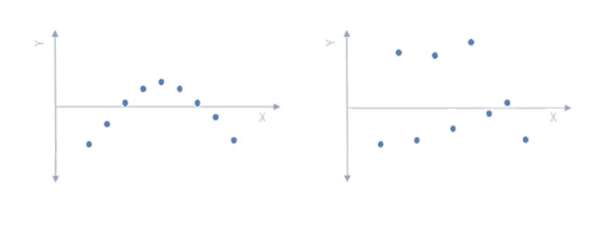

自相关

**多重共线性**

多重共线性是一个统计概念，其中模型中的独立变量是相关的。独立变量之间的多重共线性将导致不太可靠的统计推断。

*   除了必须满足所有线性回归假设之外，在这个多元回归模型中，还有一个多重共线性形式的附加假设。
*   多重共线性是指多元回归模型中两个以上的解释变量高度线性相关的情况

**分类概念**

*   分类是学习目标函数 f 的任务，目标函数 f 将每个属性集 x 映射到预定义的类别标签 y 之一
*   分类是将对象分配到几个预定义类别之一的任务。
*   分类是一种数据分析形式，它提取描述重要数据类别的模型。
*   这种模型称为分类器，预测分类(离散的、无序的)类别标签。
*   分类有许多应用，包括欺诈检测、客户流失、贷款批准预测、销售预测

**分类算法**

机器学习中的几种分类算法

*   逻辑回归。
*   朴素贝叶斯分类器。
*   k-最近邻居。
*   决策树。
*   随机森林。
*   支持向量机。
*   等等

**决策树概念**

决策树学习是统计学、数据挖掘和机器学习中使用的预测建模方法之一。它使用决策树(作为预测模型)从对某个项目的观察(用树枝表示)到对该项目的目标值的结论(用树叶表示)。

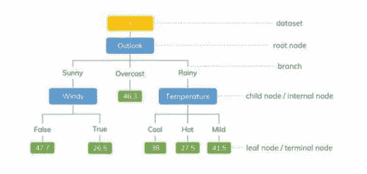

决策树概念

**决策树建模**

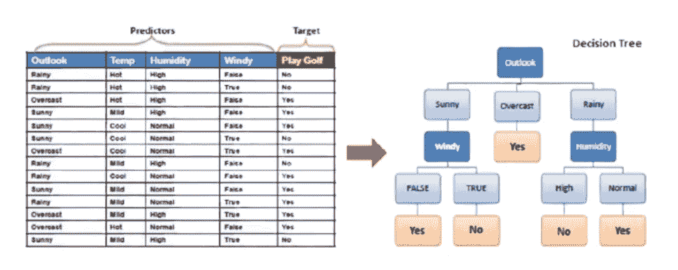

决策树建模

**决策树优点&缺点**

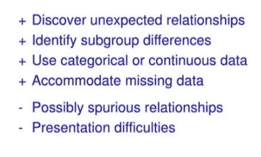

决策树的优点和缺点

**推车**

这是大多数决策树算法最简单的方法。该树将以自上而下的方式构建，如下所示:

*   从所有训练实例的根节点开始
*   根据分离标准(增益比或其他杂质指标，如下所述)选择属性
*   根据所选属性递归划分实例

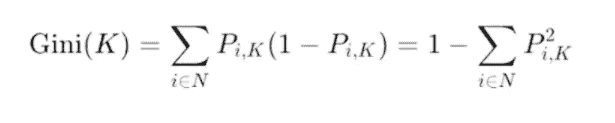

手推车

**列车—测试分离**

在数据集中，训练集用于构建模型，而测试(或验证)集用于验证所构建的模型。训练集中的数据点从测试(验证)集中排除。

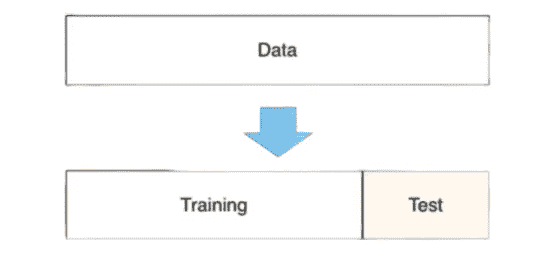

列车-测试分离

**过拟合**

过度拟合是指“产生的分析过于接近或精确地对应于一组特定的数据，因此可能无法拟合额外的数据或可靠地预测未来的观察结果”。过度拟合模型是一种统计模型，它包含的参数比数据所能证明的要多。

过度拟合

**K-折叠交叉验证**

k 倍交叉验证。交叉验证是一种重采样过程，用于在有限的数据样本上评估机器学习模型。该过程有一个称为 k 的参数，它指的是给定数据样本要被分成的组的数量。

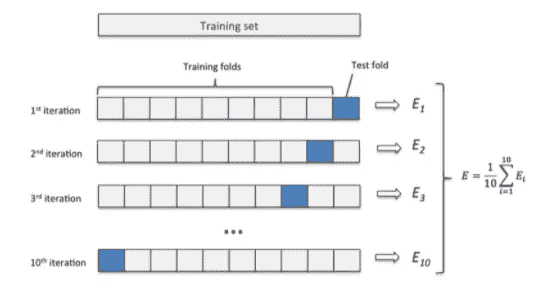

k-折叠交叉验证

**集成学习**

在统计学和机器学习中，集成方法使用多种学习算法来获得比单独从任何组成学习算法获得的性能更好的预测性能。与统计力学中的统计集成(通常是无限的)不同，机器学习集成仅由一组具体的有限备选模型组成，但通常允许在这些备选模型中存在更加灵活的结构。

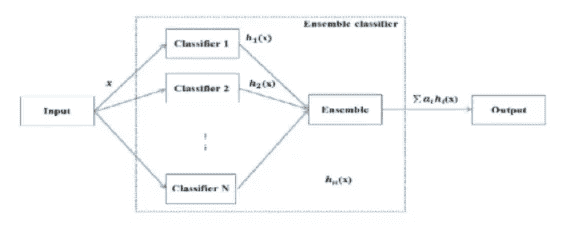

集成学习

**装袋**

Bagging 也称为 bootstrap aggregating，是用原始数据集的自举样本训练同一学习算法的多个模型的过程。然后，像上面的随机森林示例一样，对所有模型的输出进行投票。

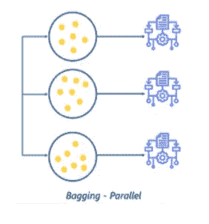

**增压**

Boosting 是 bagging 的一种变体，其中每个单独的模型都是按顺序构建的，并迭代上一个模型。具体来说，任何被前一个模型错误分类的数据点都会在后一个模型中得到强调。这样做是为了提高模型的整体准确性。

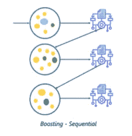

**随机森林**

随机森林是一种基于决策树的集成学习技术。随机森林涉及使用原始数据的自举数据集创建多个决策树。然后，该模型选择每个决策树的所有预测的模式(大多数)。这有什么意义？依靠“多数获胜”模型，它降低了单个树出错的风险。

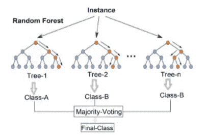

随机森林

**随机森林的优缺点**

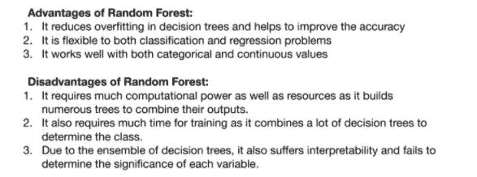

**不平衡数据集**

不平衡数据集是分类问题的一种特殊情况，在这种情况下，类之间的类分布不均匀。通常，它们由两类组成:多数(消极)类和少数(积极)类。

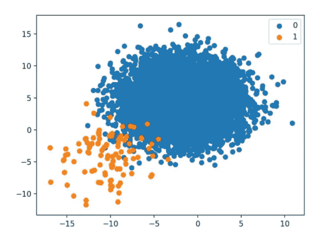

不平衡数据集

**欠采样—过采样**

一种被广泛采用并且可能是最直接的处理高度不平衡数据集的方法叫做重采样。它包括从多数类中移除样本(欠采样)和/或从少数类中添加更多样本(过采样)。

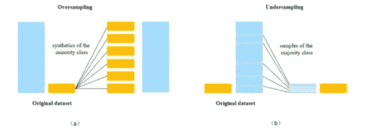

欠采样—过采样

**击杀**

合成少数过采样技术(SMOTE)是一种统计技术，用于以平衡的方式增加数据集中的事例数。该模块通过从您作为输入提供的现有少数案例生成新实例来工作。SMOTE 的这种实现不会改变多数情况的数量。

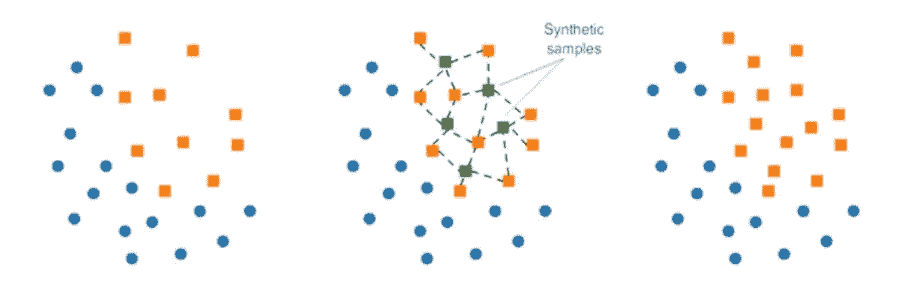

重击

**无监督学习**

无监督学习(UL)是一种从未标记数据中学习模式的算法。希望通过模仿，机器被迫建立一个其世界的紧凑的内部表示。与监督学习(SL)不同，在监督学习中，数据由人标记，例如“汽车”或“鱼”等，UL 表现出自组织能力，可以捕捉神经元偏好或概率密度等模式。

无监督学习中使用的一些最常见的算法包括:(1)聚类，(2)异常检测，(3)神经网络，以及(4)学习潜在变量模型的方法。

**两种基本的无监督学习技术**

**聚类**

目标是在数据中找到同质的子群；分组是基于观测值之间的距离。

例如:k-means 聚类和层次聚类。

**降维**

目标是识别数据特征中的模式。这通常用于促进数据的可视化，也是监督学习之前的预处理方法。

例如:PCA。

**K 均值聚类**

k 均值聚类是一种矢量量化方法，最初来自信号处理，旨在将观测值划分为 k 个聚类，其中每个观测值属于具有最近均值(聚类中心或聚类质心)的聚类，用作聚类的原型。这导致将数据空间划分成 Voronoi 单元。k-means 聚类最小化类内方差(平方欧几里得距离)，但不是常规欧几里得距离，这将是更困难的韦伯问题:平均值优化平方误差，而只有几何中值最小化欧几里得距离。例如，使用 k-中值和 k-中值可以找到更好的欧几里得解。

k 均值聚类

**主成分分析**

功能性主成分分析(FPCA)是一种统计方法，用于研究功能性数据的主要变异模式。使用该方法，随机函数被表示在特征基中，该特征基是由自协方差算子的特征函数组成的希尔伯特空间 L2 的正交基。FPCA 以最简洁的方式表示函数数据，在某种意义上，当使用固定数量的基函数时，本征函数基比任何其他基展开解释了更多的变化。FPCA 可用于表示随机函数，或用于函数回归和分类。

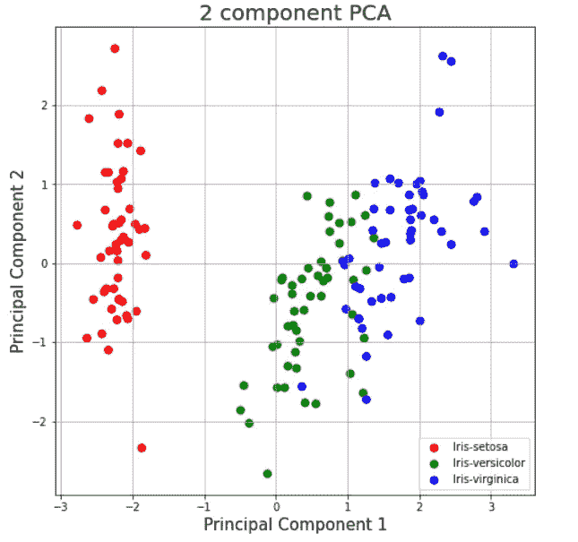

主成分分析

**文字的数值表示**

统计向量:统计每个文档/句子中出现的单词

计数向量的问题

1.  非唯一的结果向量，参见 cat 和 hat。
2.  当你有这么多文件时会发生什么？向量大小线性增长。

**TF-IDF 矢量**

TF–IDF、TF*IDF 或 TFIDF 是术语频率–逆文档频率的缩写，是一种数字统计，旨在反映一个词对集合或语料库中的文档有多重要。

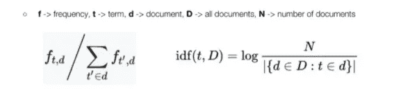

TF-IDF 载体

**文字嵌入**

单词嵌入是用于文本分析的单词表示的术语，通常以实值向量的形式，该向量对单词的含义进行编码，使得在向量空间中更接近的单词在含义上是相似的。

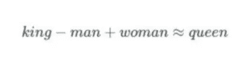

单词嵌入

**Word2Vec (CBOW 和 Skip-gram)**

Word2vec 是一种自然语言处理技术。word2vec 算法使用神经网络模型从大型文本语料库中学习单词关联。一旦经过训练，这种模型可以检测同义词或为部分句子建议额外的单词。

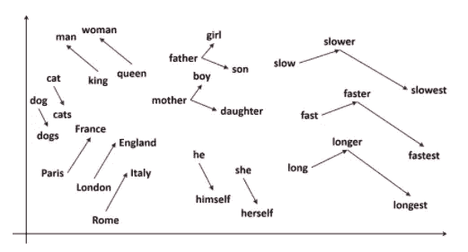

Word2Vec

**ML 生命周期**

ML 生命周期

**ML 部署**

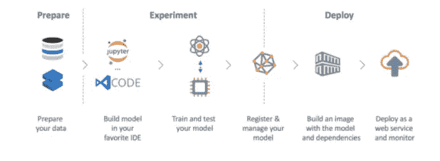

ML 部署

参考

[处理缺失属性、离群值和重复值—执行初始数据分析— OpenClassrooms](https://openclassrooms.com/en/courses/6037301-perform-an-initial-data-analysis/6051486-deal-with-missing-attributes-outliers-and-duplicates)

[类不平衡|使用 Python 处理不平衡数据(analyticsvidhya.com)](https://www.analyticsvidhya.com/blog/2017/03/imbalanced-data-classification/)

 [## 机器学习与传统编程

### 传统的计算机编程已经存在了一个多世纪，第一个已知的计算机程序可以追溯到…

www.logianalytics.com](https://www.logianalytics.com/predictive-analytics/machine-learning-vs-traditional-programming/) 

[数据清理—维基百科](https://en.wikipedia.org/wiki/Data_cleansing)

[特征工程—维基百科](https://en.wikipedia.org/wiki/Feature_engineering)

[数据剖析—维基百科](https://en.wikipedia.org/wiki/Data_profiling)

[数据探索—维基百科](https://en.wikipedia.org/wiki/Data_exploration)

[监督学习—维基百科](https://en.wikipedia.org/wiki/Supervised_learning)

[线性回归。在这篇博客中，我将写关于……的文章](/analytics-vidhya/linear-regression-15f2aecf689e)

[洞察机器学习中的线性回归| Muskan Trisal | Analytics vid hya | Medium](/analytics-vidhya/an-insight-to-linear-regression-in-machine-learning-a9a1585ae0b2)

[普通最小二乘法—维基百科](https://en.wikipedia.org/wiki/Ordinary_least_squares)

[线性回归的假设。以及如何使用 Python 测试它们。|按 Sachin 日期|走向数据科学](https://towardsdatascience.com/assumptions-of-linear-regression-5d87c347140)

[线性回归的假设—统计解决方案](https://www.statisticssolutions.com/assumptions-of-linear-regression/)

[多重共线性定义(investopedia.com)](https://www.investopedia.com/terms/m/multicollinearity.asp)

[决策树学习—维基百科](https://en.wikipedia.org/wiki/Decision_tree_learning)

[分类回归树(CART)算法(opengenus.org)](https://iq.opengenus.org/cart-algorithm/)

[训练和测试数据集有什么区别？|作者赛义德·赫萨尼|维迪亚分析| 2021 年 1 月| Medium](/analytics-vidhya/what-is-the-difference-between-training-and-test-dataset-d20820e5f632)

[过拟合— HandWiki](https://handwiki.org/wiki/Overfitting)

[对 k 倍交叉验证的温和介绍(machinelearningmastery.com)](https://machinelearningmastery.com/k-fold-cross-validation/)

 [## 集成学习

### 在统计学和机器学习中，集成方法使用多种学习算法来获得更好的预测…

en.wikipedia.org](https://en.wikipedia.org/wiki/Ensemble_learning)  [## 在 3 分钟内解释集成学习、打包和增强

### 直观的解释和揭开基本概念的神秘面纱

towardsdatascience.com](https://towardsdatascience.com/ensemble-learning-bagging-and-boosting-explained-in-3-minutes-2e6d2240ae21)  [## 处理不平衡数据集的 5 种最有用的技术

### 如果您还没有遇到不平衡的数据集，您将会

towardsdatascience.com](https://towardsdatascience.com/the-5-most-useful-techniques-to-handle-imbalanced-datasets-6cdba096d55a)  [## 信用卡欺诈检测

### 如今，我们大部分的金融交易都是虚拟的。自然，信用卡诈骗是一个大问题[琼·韦伯]…

vitorgabo.medium.com](https://vitorgabo.medium.com/credit-card-fraud-detection-34935dda1a4d)  [## 无监督学习

### 无监督学习(UL)是一种从未标记数据中学习模式的算法。希望通过…

en.wikipedia.org](https://en.wikipedia.org/wiki/Unsupervised_learning)  [## k 均值聚类

### k-means 聚类是一种矢量量化的方法，它起源于信号处理，目的是划分 n。

en.wikipedia.org](https://en.wikipedia.org/wiki/K-means_clustering)  [## tf-idf

### 在信息检索中，tf-idf，TF*IDF，或 TFIDF，是词频-逆文献频率的缩写，是一个数字…

en.wikipedia.org](https://en.wikipedia.org/wiki/TFIDF)  [## 单词嵌入

### 在自然语言处理(NLP)中，单词嵌入是用于文本分析的单词表示的术语

en.wikipedia.org](https://en.wikipedia.org/wiki/Word_embedding)  [## Word2vec

### Word2vec 是一种自然语言处理技术。word2vec 算法使用神经网络模型来学习…

en.wikipedia.org](https://en.wikipedia.org/wiki/Word2vec)