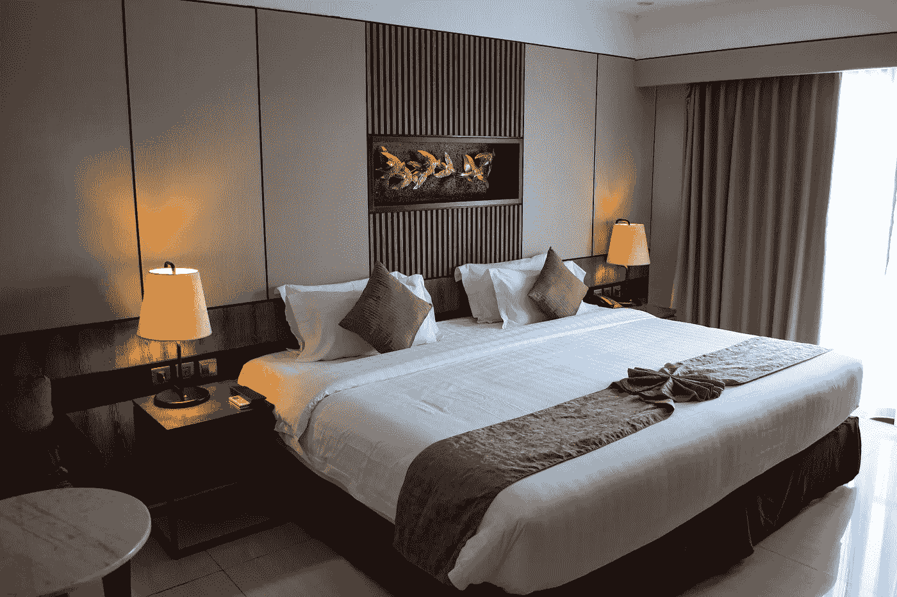

# 旅行中的机器学习和人工智能——第一部分

> 原文：<https://medium.com/nerd-for-tech/machine-learning-and-artificial-intelligence-in-travel-part1-fcc74ec61f81?source=collection_archive---------4----------------------->

想象你正在计划一次旅行。几年前，你需要花费大量的时间和精力研究目的地和住宿选择，预订航班和酒店，租车和进行一系列其他与旅行相关的活动。今天，在机器学习和人工智能的帮助下，你可以使用一站式旅行平台来计划和预订你需要的一切。

我们来看看 ML 和 AI 在旅行中的使用，以及它们给领域业务带来的变化。

## 聊天机器人

数字助理或聊天机器人是人工智能应用在旅游业中最突出的例子之一。根据谷歌提供的统计数据，三分之一的国际旅行者有兴趣使用聊天机器人来计划和预订他们的旅行。

虚拟旅行助理的服务范围从简单地建议旅行目的地到提供当地天气预报，甚至预订房间/航班或租车。旅游聊天机器人通常集成了 Skype、Facebook Messenger、Telegram、Slack 等即时通讯平台。

例如，全球领先的在线旅行社之一 Expedia 推出了一款 Facebook Messenger 机器人，帮助旅行者选择合适的酒店并进行预订。只需在对话字段中输入@Expedia，就可以开始使用机器人及其指导为特定城市和日期选择合适的酒店。你可能需要连续几次回答同一个问题，但机器人会在最后帮助预订和管理行程。

Eddy Travels 是 AI 驱动的旅行聊天机器人的另一个例子，它可以帮助搜索航班交易，寻找住宿，并获得 24/7 的旅行灵感。该机器人拥有超过 2 亿活跃用户，可以在专门的网站和电报上使用。

旅游公司通过集成各种智能助手，不断改进服务。一些旅游聊天机器人甚至可以识别和回答模糊的查询，如“欧洲浪漫的寒假”。此外，他们的功能可以远远超出研究和预订。一些聊天机器人可以作为移动旅行指南或同伴，在旅行中解决问题或提供信息。

尽管有这些好处，值得注意的是聊天机器人不能完全取代人类互动。

## **支持语音的虚拟助理**

人工智能解决方案将无缝酒店住宿体验的概念提升到了一个全新的水平。一种被称为语音虚拟助理的新技术已经进入世界各地的许多酒店。

客人可以使用亚马逊 Alexa 等工具控制酒店房间内的各种设施。想法如下:房间里配备了各种连接到中央集线器的物联网设备。语音助手控制这些设备。因此，客人可以通过简单地发出语音命令来管理许多房间服务，如调节卧室灯或打开电视。

酒店行业正变得更加物联网友好和数字化。在最近的一份报告中，甲骨文收集了 150 家酒店运营商的观点，其中 78%的受访者同意大规模使用语音助手来控制房间设备、灯光和空调。

## 人工智能对高质量数据的依赖

人工智能行业有一个重要共识:

训练数据的质量直接决定了最终 AI 模型的性能。数据的可伸缩性和准确性越高，算法就越稳健。

随着 AI 商业化进程的加快，以及辅助驾驶、客服聊天机器人等 AI 技术在各行各业的应用，人们对特殊场景下数据质量的期望越来越高。高质量的标签数据将是人工智能公司的核心竞争力之一。

如果说之前的算法模型使用的一般数据集是粗粮，那么算法模型目前需要的是定制的营养餐。如果公司想要进一步提高某些模型的商业化，他们必须逐步从通用数据集向前发展，以创建独特的数据集。

## NLP 服务

我们在电子商务、零售、搜索引擎、社交媒体等领域提供不同类型的自然语言处理。我们的服务包括语音分类、情感分析、文本识别和文本分类(聊天机器人相关性)。

ByteBridge 与全球 30 多个不同的语言社区合作，现在提供[数据收集和文本注释服务](https://tinyurl.com/bdcwtx3r)，涵盖语言包括**英语、中文、西班牙语、韩语、孟加拉语、越南语、印度尼西亚语、土耳其语、阿拉伯语、俄语等**。

# 结束

将您的数据标注任务外包给[字节桥](https://tinyurl.com/bdcwtx3r)，您可以更便宜、更快速地获得高质量的 ML 训练数据集！

*   无需信用卡的免费试用:您可以快速获得样品结果，检查输出，并直接向我们的项目经理反馈。
*   100%人工验证
*   透明和标准定价:[有明确的定价](https://www.bytebridge.io/#/?module=price)(包含人工成本)

为什么不试一试呢？

资料来源:https://www.robot-china.com/news/202110/12/67650.html