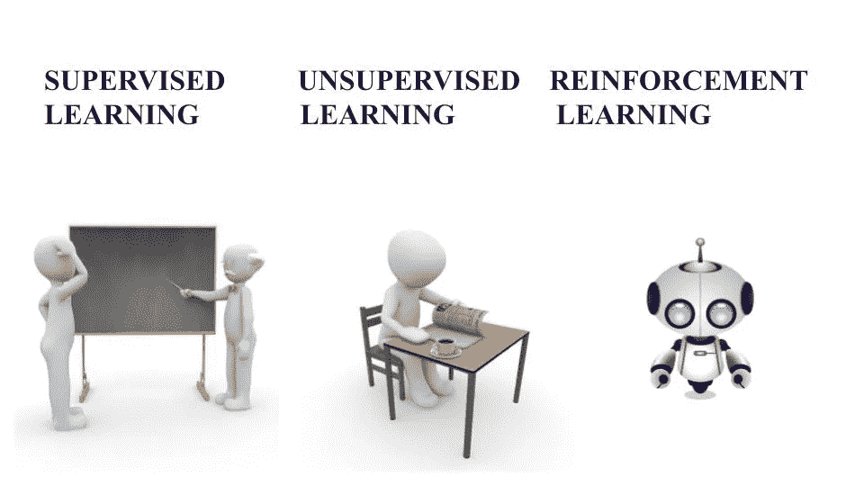

# 机器学习

> 原文：<https://medium.com/nerd-for-tech/machine-learning-c1a09efe6833?source=collection_archive---------17----------------------->

## 5 分钟内学会

## 什么是机器学习？

教导或训练机器执行和预测结果。

**机器学习的类型**

*   监督学习:由特征和标签组成
*   无监督学习:仅由特征组成

## 监督学习

采用训练数据集中的特征和标签来学习和预测结果。

*   分类
*   回归

## 无监督学习

仅包含特征，并使用特征和图案提取标签。

*   减少
*   使聚集



**机器学习的类型**

# 机器学习算法

1.  线性回归
2.  逻辑回归
3.  朴素贝叶斯
4.  决策图表
5.  支持向量机
6.  k 倍交叉验证
7.  随机森林
8.  k 均值聚类
9.  k-最近邻
10.  分层聚类
11.  主成分分析

# 线性回归

```
from sklearn.linear_model import LinearRegression
model = Linear_Regression()
```

# 逻辑回归

```
from sklearn.linear_model import LogisticRegression
model = LogisticRegression()
```

# 朴素贝叶斯

```
from sklearn.naive_bayes import GaussianNB,MultinomialNB
model = GaussianNB()
model = MultinomialNB()
```

# 决策图表

```
from sklearn.tree import DecisionTreeclassifier
model = DecisionTreeClassifier()
```

# 支持向量机

```
from sklearn.svm import SVC
model = SVC(gamma=10)
```

# k 倍交叉验证

```
from sklearn.model_selection import cross_val_score
```

# 随机森林

```
from sklearn.ensemble import RandomForestClassifier
model = RandomForestClassifier(n_estimators=10)
```


你准备好了吗？

机器已经准备好预测数据，现在轮到你开始研究上面和下面提供的这些算法了。

让我们深入研究人工智能，让机器变得更有趣。

认识一下我的机器人:)狮子座！！

每种算法在预测结果方面都有其独特的作用。大多数机器学习算法需要不同的方法和策略来处理问题。以我的情况来说，我曾经用不合适的算法玩不一致的问题来理解深度。

# 详细算法:

## 线性回归

这是一种模型的线性方法，通过将数据分为两类，在数据中形成一条线性线。最有效的是，线性模型很好地用于基于分类的问题。它用数据中的输入和目标来陈述模型。

## 逻辑回归

它是建立在二元因变量逻辑函数基础上的统计模型。它非常类似于线性回归，用于预测分类相关变量。

## 朴素贝叶斯

这是一种监督学习算法，可以更准确、更快速地做出最佳预测。除了(我的 fav 算法)它有两种类型的模型高斯 NB，多项式 NB。

## 决策图表

在决策树中，数据按照一定的参数被连续分割。它有决策节点和树叶等实体。基于这些实体，算法将做出决定。主要用于分类和回归问题。

## 支持向量机

支持向量机(SVM)处理特征和标签的两个数据点之间的超平面。超平面状态作为两个不同数据点的决策边界，用红色和蓝色开始它们。

## k 倍交叉验证

交叉验证评估机器学习算法的性能。它将数据分成“K”个点，例如 k=2，k=4。这些分裂点在验证算法中称为折叠。

## 随机森林

随机森林更简单，类似于决策树，而在随机森林中，它是决策树的组合，以获得更高的准确性和工作速度。它在决策树的数量上有估计器。它比单棵树预测的结果更好。

## k 均值聚类

这是一种无监督的学习，它对数据进行分组而没有标签。使用聚类，该算法在数据点中的“K”的帮助下基于三个特征划分成组。

## k-最近邻

它是 ML 中处理分类和回归问题的最好算法。KNN 根据数据中的相似性特征，使用数据对最新数据进行分类。简而言之，它将以前的数据存储为一条记录，每当新数据出现时，它就开始搜索其数据的旧记录。

## **层次聚类**

这是一种带有聚类分析的无监督学习，它将未标记的数据分成聚类。从某种意义上来说，聚类将相关数据点及其属性挑选成组。

## 主成分分析

PCA 是一种无监督学习，用于对大型数据集进行降维，以将它们缩减为较小的数据集，但仍然由大型数据集中的相似特征组成。最常见的是，它用于过滤图像的噪声数据集，如分辨率、压缩。

# 梯度下降

> *它是以最速下降的形式通过反方向移动使一个函数的代价最小化的优化算法* ***全局损失最小。***

*   它是机器学习的核心&深度学习。
*   w = w-alpha *梯度
*   梯度=σ损失/σw
*   阿尔法=学习率

在梯度下降中，还有其他三种类型:

1.  随机梯度下降(SGD):这是一种简单但非常有效的方法，通过随机向前拾取来拟合线性分类器和回归器。它用于大型训练数据集。
2.  批量梯度下降:它采用所有的训练样本，然后调整权重。它用于小型训练数据集。
3.  小批量梯度下降:类似于 SGD 使用的批量。

[](https://www.linkedin.com/in/akshithkumar-05/) [## Akshith Kumar - Andhra Pradesh，印度|职业简介| LinkedIn

### 我从事过许多与机器学习中的数据科学相关的不同项目。我的主要兴趣领域是…

www.linkedin.com](https://www.linkedin.com/in/akshithkumar-05/)