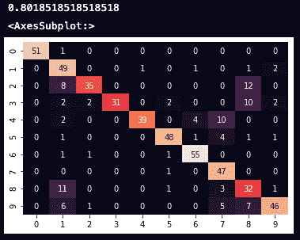
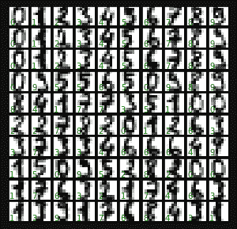
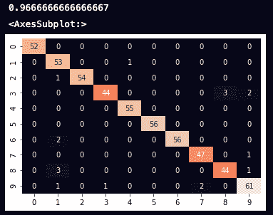
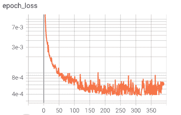
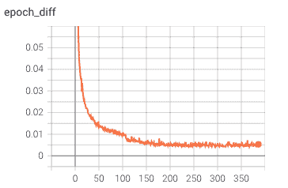
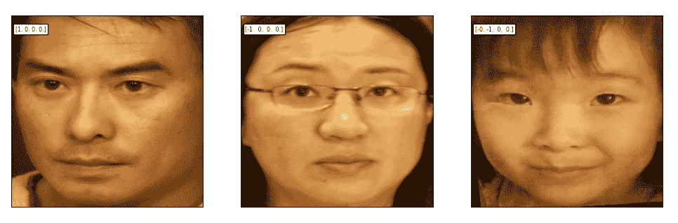
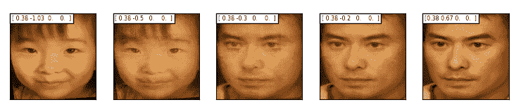

# 机器学习:特征选择和提取及实例

> 原文：<https://medium.com/nerd-for-tech/machine-learning-feature-selection-and-extraction-with-examples-80e3e2c2e1a1?source=collection_archive---------9----------------------->

**简介**

花更多的时间和精力去理解你正在处理的数据集总是值得的。在没有深入理解数据集的情况下选择机器学习算法是盲目的，并且很可能以沮丧和浪费时间而告终。

数据集清洗、特征选择和特征提取是实现这种理解的步骤。

**功能选择**

机器学习是从给定的特征集中提取目标相关信息。在给定特征数据集和目标的情况下，只有那些特征可以对机器学习过程中相关的目标做出贡献。无关特征不仅浪费计算资源，而且引入不必要的噪声。[本文描述了一个特征选择的例子。](https://justinzads.medium.com/data-engineering-a-feature-selection-example-with-the-iris-dataset-11f0554e4b00)

相关性分析是消除不相关特征的关键。以下是标准:

*   要素数据集不应是常数，也不应具有特定的变量级别。
*   特征应该与目标相关联，否则它对目标估计没有任何贡献
*   特征不应该高度相关，或者其中一个特征不能提供比其他特征更多的信息。它只能在这一点上增加采样噪声。

sklearn 模块中有几个工具可用于此，请参考本文了解更多详细信息:

[https://sci kit-learn . org/stable/modules/feature _ selection . html](https://scikit-learn.org/stable/modules/feature_selection.html)

此外，Lasso 回归还可以在模型训练过程中消除不相关的特征，但它仅限于线性估计。

**特征提取**

这离特征选择又进了一步。为了使机器学习有效和响应，我们期望更小的特征维空间，并且每个特征维空间对估计目标有更多的贡献。特征提取是具有新特征集的变换，其中新的特征集

*   尺寸较小
*   与目标有最大相关性

对于线性系统，PCA、ICA、Maniford 是典型的算法。对于非线性系统，各种基于 Maniford 的算法，核心 ICA。对于文本、图像数据集，它们通常具有大的特征维数，并且特征高度相关，其中基于深度学习的嵌入或基于 CNN、RNN 的算法非常适合。

值得一提的是，在大多数情况下，特征提取是核心机器学习本身的一部分。是否在单独的处理管道中进行特征提取取决于数据收集、存储和处理基础设施，也取决于工程和商业要求。

流形示例

在这个例子中，我们使用了来自 sklearn 模块的著名数字数据集。

```
from sklearn import datasets
digits = datasets.load_digits()
plt.hist(digits.target, histtype = 'barstacked', rwidth=0.8)for key in digits.keys():print(key)
print(digits.data.shape)
print(digits.feature_names)
```

让我们对其进行归一化，并应用高斯神经网络估计量。

```
from sklearn.preprocessing import MinMaxScaler
from sklearn.model_selection import train_test_split
from sklearn.naive_bayes import GaussianNB
from sklearn.metrics import accuracy_score, confusion_matrix
import matplotlib.pyplot as plt
import seaborn as snsnorm_model = MinMaxScaler()
data_norm = norm_model.fit_transform(digits.data)X_train, X_test, y_train, y_test = train_test_split(data_norm, digits.target, train_size = 0.7, random_state = 41)bay = GaussianNB()
bay.fit(X_train, y_train)
y_model1 = bay.predict(X_test)print(accuracy_score(y_test, y_model1))
mat1 = confusion_matrix(y_test, y_model1)
sns.heatmap(mat1, annot=True, cbar = False)
```



我们有 80%的准确率，这对于这个简单而快速的高斯来说已经不错了。

在这里，我们要添加特征提取，以降低特征维数并提高准确性。让我们先查看可视化数据集。

```
fig, axes = plt.subplots(10, 10, figsize=(5, 5),
                         subplot_kw={'xticks':[], 'yticks':[]},
                         gridspec_kw=dict(hspace=0.1, wspace=0.1))for i, ax in enumerate(axes.flat):
    ax.imshow(digits.images[i], cmap='binary', interpolation='nearest')
    ax.text(0.05, 0.05, str(digits.target[i]), transform=ax.transAxes, color='green')
```



正如我们从数字图像中看到的，点聚集在一起形成一个数字。流形似乎很适合这种情况。让我们使用 Isomap 将特征维数降低到 15。

```
from sklearn.manifold import Isomap
from sklearn.pipeline import make_pipeline
from sklearn.metrics import accuracy_score, confusion_matrixmodel = make_pipeline(Isomap(n_components = 15), GaussianNB())
model.fit(X_train, y_train)
y_model = model.predict(X_test)print(accuracy_score(y_test, y_model))mat = confusion_matrix(y_test, y_model)
sns.heatmap(mat, annot=True, cbar = False)
```



我们可以看到，特征维数从 48 下降到 15，同时估计精度从 80%提高到 97%。

注意，超参数 n_components = 15 是用 GridSearchCV()选择的。代码如下:

```
from sklearn.model_selection import GridSearchCVmodel = make_pipeline(Isomap(), GaussianNB())
grid = GridSearchCV(model, param_grid = {'isomap__n_components':[2,5,7,9,10,12,15,20,30]}, cv = 7)
grid.fit(X_train, y_train)print(grid.best_params_){'isomap__n_components': 15}
```


图表显示，在过度拟合之前，15 是一个最佳数字。

**VAE 例子**

深度学习模型对线性和非线性数据都有效。对于高度相关的特征集(如文本、图像), RNN 可以通过学习特征之间的模式来显著降低特征维数。

在这个例子中，3 张肖像照片被压缩成 4-D 矢量，然后被精确地恢复成图像。为了使它更有趣，我用 VAE 模型代替。VAEM 模型不是输出 AEM 模型中的向量，而是输出高斯分布，可以从该分布中对向量进行采样。通过从输出分布中采样矢量，并将矢量解码回图像，我们可以看到图像从一个到另一个的过渡。

下面是张量板标量的训练曲线:



经过训练，我们有以下矢量解码成图像。

原始图像→矢量→解码图像:



由于模型是基于相同的 3 幅图像训练的，这种极端的结果没有实用价值。它只是在这里展示了深度学习在特征减少领域可以走多远。

有趣的是，我们可以对(z_mean，z_log_var)分布上的向量进行采样，以获得一些混合图像:



项目笔记本可在[这里](https://github.com/justinzh/AIPortraits/blob/main/Jmodel.ipynb)获得