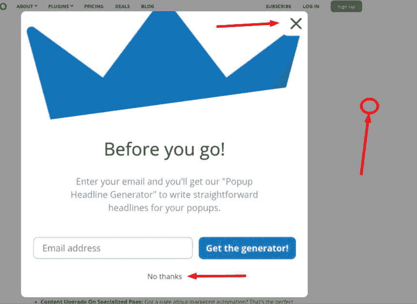
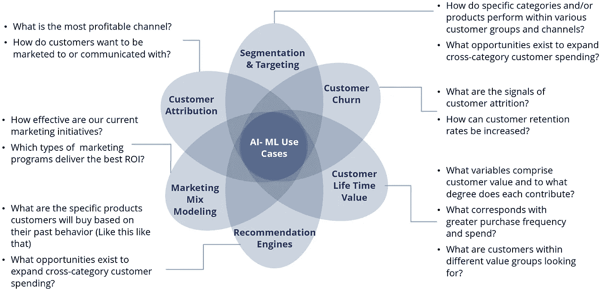

# 市场营销中的机器学习！！

> 原文：<https://medium.com/nerd-for-tech/machine-learning-in-marketing-2de0554f3b9d?source=collection_archive---------9----------------------->

资料来源:联合国人类住区规划署

> “Everage 的一项研究表明，40%的营销人员采用机器学习个性化，使用算法和预测分析来动态呈现为个人受众量身定制的建议和体验”

我们只是谈论诸如**【人工智能】** & **【机器学习】等时髦词汇的日子已经一去不复返了。**

如今，我们有意无意地使用这项技术，

无论是从电子商务网站获得推荐，还是从家里获得你最喜欢的菜的预计到达时间！

通过为现有技术添加**“预测触摸”**，机器学习有可能解决和改善人类生活

但是这种“预测性接触”是如何在营销领域发挥作用的呢？

ML 基本上有助于发现网站或应用程序上用户活动的模式。这些数据共同帮助预测用户的未来行为，并优化进一步的广告和优惠。

“Owox 博客”中的一个例子可以帮助我们理解，

资料来源:Owox

假设网站上的用户看到了上面的弹出窗口，

用户有三种选择:

*   >**点击【关闭(X)】**(可为真或假)
*   >**点击【不谢】**(可对可错)
*   >**点击过去弹出**(可为真或假)

如此相似，有许多数据点是从网站或应用程序收集的。一旦积累了大量的数据，就获得了一些价值！

而且，在处理这些大数据时，ML 可以处理这些数据，并根据需求做出预测！

这个数据可以根据用例的需要来使用，

它可以是细分、定位、客户终身价值等等。

资料来源:YASIM KOLATHAYIL (YAS)

让我们举一些例子，在这些例子中，营销中 ML 的实时用例在公司的业务中发挥了重要作用，

医疗保健巨头葛兰素史克(GlaxoSmithKline，GSK)意识到，很少有父母在接种疫苗时面临一些问题。因此，GSK 找到了一个名为 Luminoso 的合作伙伴，他将 ML 和文本分析应用于所有的在线客户聊天。根据关键词，如**“安全”、“舒适”、“幸福”、“不幸福”，**葛兰素史克了解了父母为什么避免接种疫苗。

后来，他们想出了一个沟通策略来解决这些问题

GSK 与 Luminoso 合作，将机器学习和文本分析应用于在线对话。基于“安全和舒适”、“快乐”或“不快乐”等关键词，葛兰素史克了解了父母推迟接种疫苗的原因。因此，设计了有针对性的传播战略来解决这些问题。

许多营销人员在他们优化营销活动的实践中引入了 ML & AI，他们得到了乐观的结果！

> “机器学习将提高整个供应链的生产率。”—戴夫·沃特斯