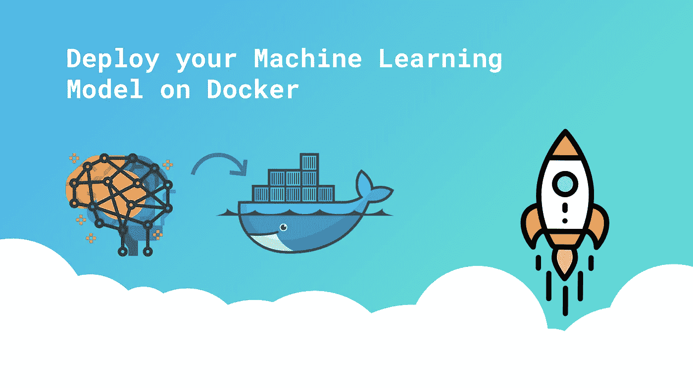
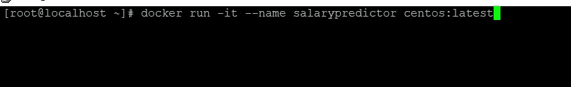
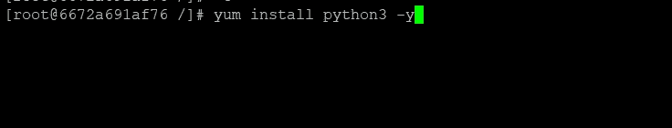
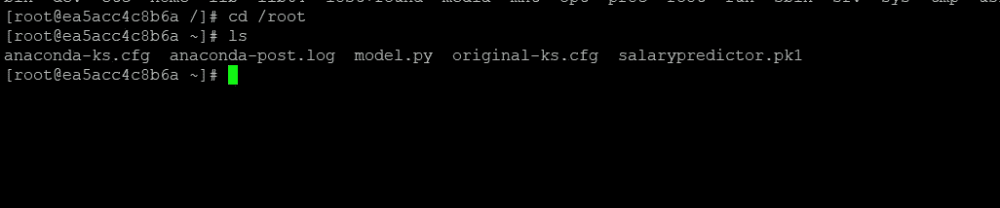
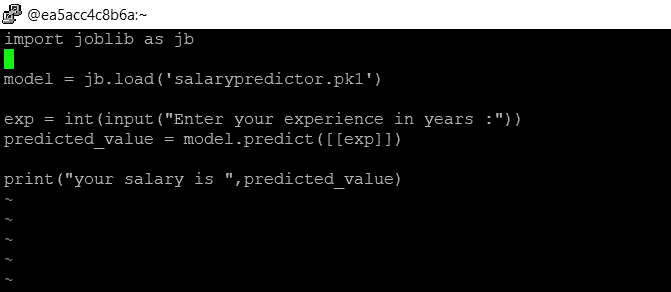
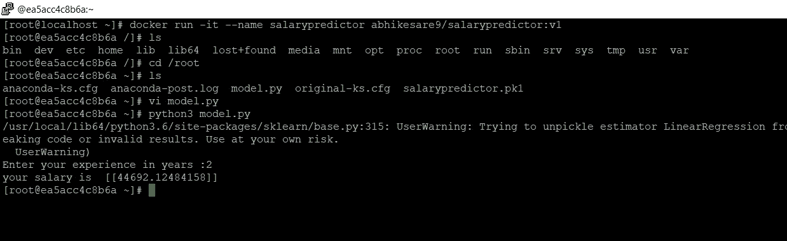

# 容器内的机器学习

> 原文：<https://medium.com/nerd-for-tech/machine-learning-inside-containers-591c662b086?source=collection_archive---------26----------------------->

很多时候，ML 工程师面临着由于各种版本的库而导致的环境冲突问题。



大家好，如果你是一名 ML 工程师或相关领域的工程师，你至少曾经在不同版本的 python 库中面临过环境冲突的问题。在机器学习中，我们有各种版本的库，但有些版本只是兼容的。但是这个东西可能是你装了之后才知道的。

因此，为了克服这一点，我有一个想法，**我们可以在容器内训练我们的模型，答案是肯定的**

## 容器是什么？

集装箱或集装箱化是在过去十年中在 IT 领域中突然和极端增长的技术。容器化与虚拟化非常相似。我们可以在容器上以 CLI 形式启动任何操作系统。这意味着在容器之上，我们通常不启动 GUI 应用程序。在 VirtualBox 或任何其他工具上启动任何操作系统都需要几个小时，但在容器中却不需要。我们可以在几秒钟内发射任何容器。

## 如何在容器中运行 ML 应用程序？

当我们训练我们的模型时，将模型保存在一个文件中，并且只将该文件转移到容器中。这样我们就可以直接用它来预测。此外，您可以下载相关的库，以便它们能够更好地工作

## 让我们开始练习吧

步骤 1:在你的系统上安装 [docker-ce](https://www.docker.com/products/docker-desktop)

步骤 2:安装 docker 后，启动并启用 docker

```
**systemctl start docker
systemctl enable docker**
```

第三步:你需要一个操作系统映像来启动容器，以拉取/下载映像使用下面的命令我在这里使用 centos 映像来给你演示

```
**docker pull {osname:version}/ docker pull centos**
```

第四步:我们需要启动容器。

```
**docker run -it --name myos centos:latest**
```



**这将为您提供一个名为 salarypredictor 的新 centos 图像的终端**

第五步:我们必须在容器中安装包和 python3

```
**yum install python3 -y
pip3 install numpy
pip3 install pandas
pip3 install sklearn** 
```



步骤 6:将训练好的模型文件复制到容器中

```
**docker cp filename containername:/foldername**
```



salarypredictor.pk1 是我们现在必须加载和使用的模型文件

步骤 7:编写一个 python 程序，该程序将加载并使用模型来预测值。



出于演示的目的，我在上面的程序中使用了一个简单的线性回归模型，该模型将多年的经验作为输入，并预测员工的工资。

第八步:运行程序文件并查看输出



今天我们将在另一篇文章中再见。

如果你想要 ml 模型的代码，你可以在 [GitHub](https://github.com/abhikesare9/Salarypredictor) 上找到

你可以在 [Linkedin](http://www.linkedin.com/in/abhishek-kesare) 上联系我