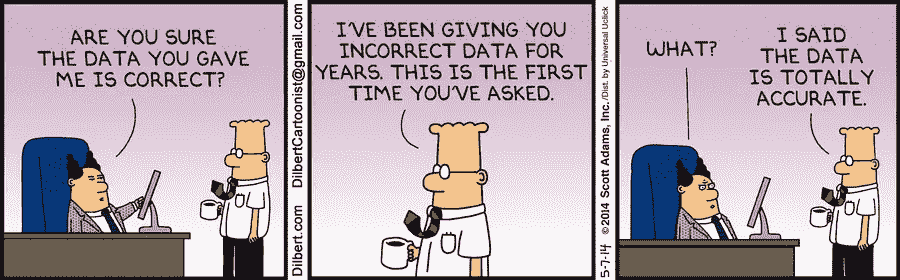
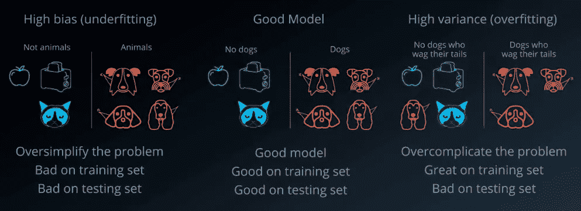
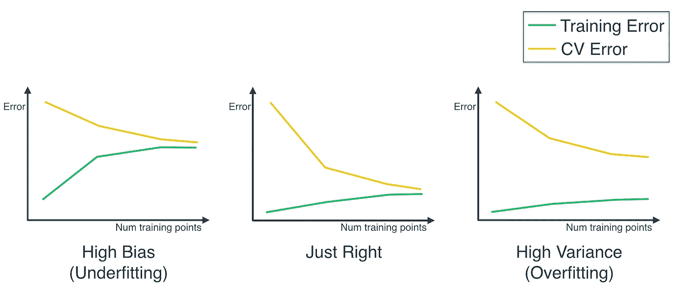
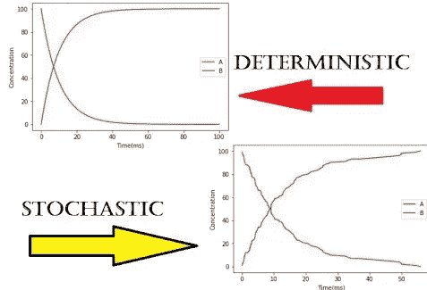
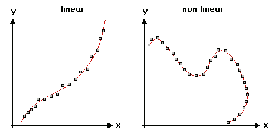
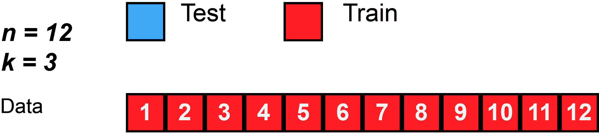
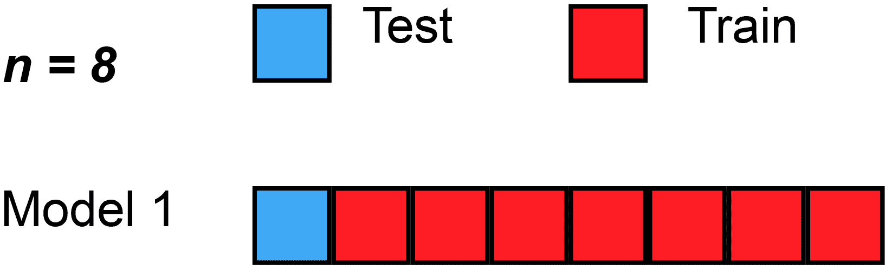
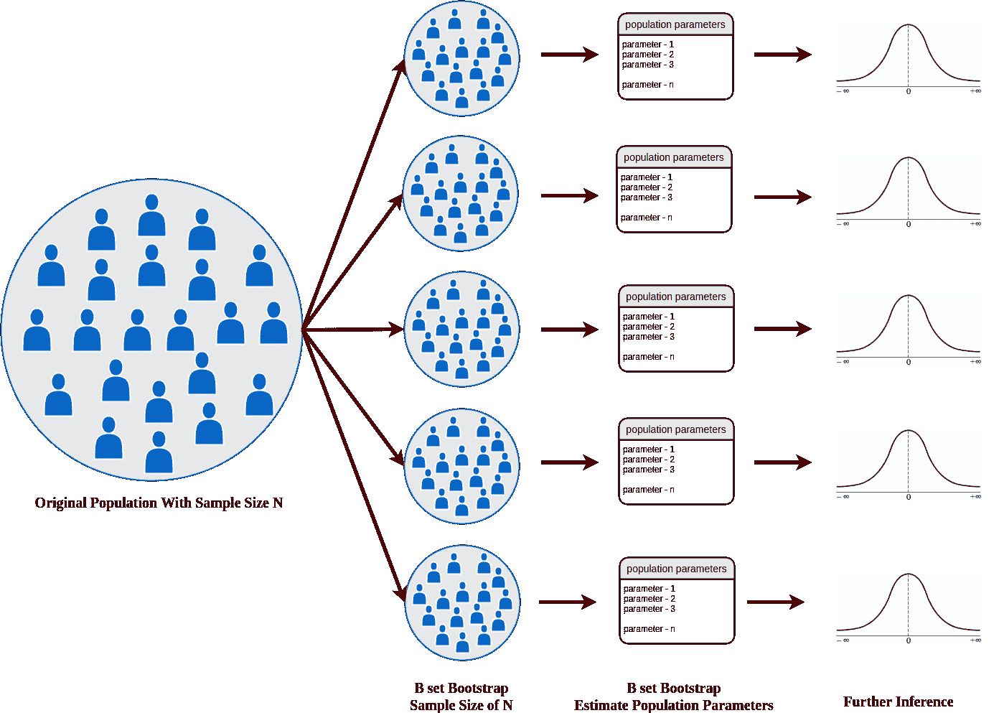

# 机器学习—建模介绍#2

> 原文：<https://medium.com/nerd-for-tech/machine-learning-introduction-to-modeling-2-9bc441c3a2b8?source=collection_archive---------11----------------------->

在上一篇文章中，我对机器学习有一个大概的介绍。我检查了关于数据、*使用区域*和*常用概念*的*信息。在本文中，我将继续使用常用的概念。然后，我将检查*模型验证方法*。*

## ***模特培训***

在机器学习模型的开发中，经过训练的模型应该在新的或未知的数据上表现良好。我们将现有数据分为 2 个作为训练和测试数据集，以模拟新的/看不见的数据。具体来说，第一部分是用作训练集的数据的较大数据子集(例如考虑到原始数据的 80%)，第二部分是较小的子集并用作测试集(剩余的 20%数据)。

比如我们给算法数据，通过这个数据，算法学习一个结构(比如房价预测模型)。换句话说，它学习因素的影响以及这些影响的方面。我们将我们的数据集分成 2 份，以测试我们通过教学创建的这些算法是否成功。假设我们有一个 1000 个观察值的数据集，我们分配 800 个来训练和测试剩余的 200 个，看看他们是否训练了模型。

## **变量选择**

在建模研究过程中，根据数据集的大小，我们可能有 5 个、10 个甚至 100 个独立变量。我们将尝试用这些自变量来估计因变量 Y。在建模研究中，我们不试图在模型中保留所有变量，目的是试图用最少的变量获得最多的解释。

## ***型号选择***

两种方法脱颖而出。

*   尽量确保在用可能出现的变量组合创建的模型中选择最佳模型。
*   尝试在安装的不同型号中选择一个型号。

## ***如何选择型号？***

对于回归问题，使用解释比率和 RMSE(误差测量度量)导数值。
对于分类问题，使用正确分类率的导数值(用于评估模型成功的度量)。

## ***过拟合***

该模型学习了特定于训练数据的模式，但它不能很好地预测新的、看不见的数据。

换句话说，我们把数据一分为二，作为测试和训练。它很好地学习了算法训练集。但是，当我们尝试使用它看不到的数据集来预测模型时，预测性能开始下降。这种情况称为过度拟合。

## ***确定性模型 vs 随机模型***

*在确定性模型*中，模型假设变量之间存在确定的关系。这两个变量之间的关系用一条线表示。换句话说，模型的输出完全由参数值决定。

*随机模型*是概率模型。这里有一个随机误差。

从上图中我们可以看到，在随机模型中，当我们试图预测 X 和 Y 之间的关系时，我们不能线性地表达它。有一个误差范围。

## ***线性 vs 非线性***

如果用直线表示，X 和 Y 之间的关系是线性的。如果变量之间的关系使用曲线、基于树的方法或其他方法而不是直线来建模，这被称为非线性方法。

> 机器学习简单来说就是从数学过渡到统计学的过程。数学包括精确性，统计学包括概率。统计学中没有确定性，总会有误差和猜测。

# **模型验证方法**

我们建立一个模型来寻找因变量和自变量之间的关系。例如，我们要预测的因变量是房屋的价格，我们的自变量是房屋的大小、位置、楼层等。在拟合模型之后，我们需要评估模型的结果。这些研究被称为模型验证方法。回归模型和分类模型使用不同的方法。

## ***维持方式***

假设你有一个原始数据集。我们将具有 1000 个观察值的数据集划分为 80% — 20%作为训练集和测试集。我们用 800 个观察值进行训练，用 200 个观察值进行测试。例如，我们通过训练集学习房价预测模型中的系数，然后我们通过 200 次观察来测试这种预测有多好。

在维持方法中，如果观察值很少，我们可能无法将数据集分为训练集和测试集。例如，当我们有 50 个观察值时，我们可能不会划分数据来训练和测试它。

## ***K 折交叉验证方法***

数据集被分成 k 个部分。在第一次迭代中，第一次折叠用于测试模型，然后其余的用于训练模型。在第二次迭代中，第二个折叠用作测试集，而其余折叠用作训练集。重复这个过程，直到所有的折叠都被用作测试集。

当获得的误差被平均时，这将是我们的验证(训练)误差。然后，我们用研究开始时划分的测试集来测试我们的模型。

我们总是需要将我们拥有的数据集分成测试集和训练集。在这种分离之后，我们总是需要对训练集进行 K 折叠方法。我们需要在训练集上计算一个正确的训练误差，将其放在一边，并在测试集上测试我们创建的模型。

简而言之，我们有一个原始数据集。我们将这个数据集一分为二作为测试训练，80% -20%。我们使用这 80%的训练数据进行验证。我们这样做 5 或 10 倍，并从这里建立一个模型。利用得到的模型中的训练误差，对测试数据进行测试。

## ***留一个出来的方法***

这是 K 倍法的一个特殊版本。在 K 中，我们将数据集分成 5-10 个部分，在每次迭代中排除一个折叠，并使用我们遗漏的部分来建立和测试具有其他折叠的模型。这里，数据集中样本的数量等于聚类数量的 n 倍。也就是说，假设有 n 个集群。和 K 一样，都是分别测试。

例如，我们有 1000 个观察值。每次，一个模型适合 999 个观察单元，然后测试一个观察单元。在第二次迭代中，排除另一个观察单元，并用所有其他观察值拟合模型，然后测试排除的观察单元。这样就分析了整个数据集。

虽然这种方法在理论上可以应用，但随着数据集的增长，很难使用。

## ***自举法***

与其他方法类似，它基于这样的方法，例如以某种方式将数据集一分为二，让我们用一部分来训练模型，用另一部分来测试。除了其他方法所做的之外，Bootstrap 以一种重新采样的方式工作。

例如，我们有原始数据集。从这个数据集中，创建引导样本，使得数据集少于观察的数量。比如 Bootstrap1，Bootstrap2，Bootstrap3 等 10 个。该模型根据这 10 个数据进行拟合。用测试集方法测试拟合的模型，并且通过分别取训练和测试的平均值来评估结果。

总而言之，它是用来以替代的方式从一个数据集中导出数据的。对创建的每个新数据拟合一个模型。对这些模型进行测试，并对结果进行相应的评估。

因此，上述方法中最常见的是 K 倍交叉验证法。当我们考虑一个新的数据集时，首先会把它一分为二作为测试和训练。我们将在这里的训练/训练集上使用 K-Fold 交叉验证方法来评估它，我们将已经创建了我们的最终模型并获得了我们的测试误差。

在下一篇文章中，我们将看到评估模型预测成功的方法…