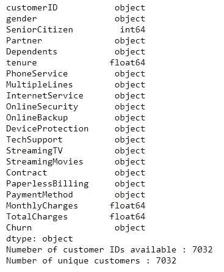
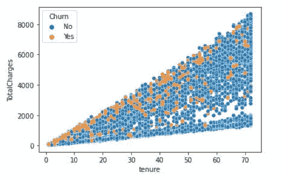
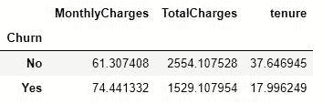
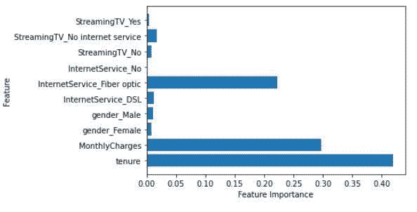
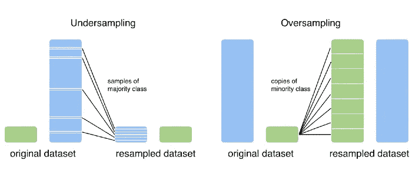
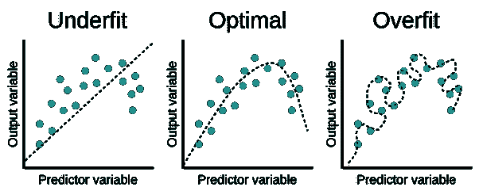

# 机器学习生命周期解释

> 原文：<https://medium.com/nerd-for-tech/machine-learning-life-cycle-explained-bbd176a7a469?source=collection_archive---------37----------------------->

这个博客主要讲述机器学习生命周期的故事，从一个商业问题开始，到找到解决方案和部署模型。这有助于初学者和中级从业者将点连接起来，建立一个端到端的 ML 模型。

以下是 ML 模型生命周期中涉及的步骤。

**第一步:业务背景和定义问题**

**第二步:转化为人工智能问题和方法**

**第三步:里程碑和规划**

**第四步:数据收集和理解**

**第五步:数据准备**

**第六步:数据清理**

**第七步:探索性数据分析**

**步骤 8:特征工程和选择**

**步骤 9: ML 模型假设检查**

**步骤 10:建模数据准备**

**第十一步:模型制作**

**步骤 12:模型验证&评估**

**第十三步:预测&模型部署**

下面用简单的话解释一下上面提到的所有步骤。为了简单起见，整个博客以电信客户流失的用例为例。

# 步骤 1:业务背景和定义问题

了解您正在处理的业务和用例，并定义适当的问题陈述。向业务人员提出正确的问题以获得所需的信息起着重要的作用。

对什么是电信业及其运作方式有基本的了解。在客户流失用例中，问题陈述是识别取消订阅的驱动因素，并且预测在不久的将来具有取消订阅高风险的现有客户。以便可以计划保留策略。

# **第二步:转化为人工智能问题和方法**

这一步是所有后续步骤的基础。如果问题没有转化成一个适当的人工智能问题，那么最终的模型对于业务用例来说是不可部署的。从人工智能的角度来看，商业问题需要翻译。由于方法可能很多，找到正确的方法需要技巧。该方法的端到端框架需要在这一步中进行规划。

**例子:**流失模型可以看作是一个基于机器学习的分类问题。具有相似行为模式的用户需要被分组，这有助于制定保留策略。

# 步骤 3:里程碑和规划

保存里程碑和计划时间表有助于理解项目的进度、资源计划和可交付成果。

如果数据太大而无法处理，本地机器的计算时间会更多。这种情况需要计划，期限也需要计划

# 步骤 4:数据收集和理解

数据并不总是以适当的格式容易获得，也不具有建立模型所需的特征。需要从业务人员那里收集所需的数据。数据理解包括对数据中涉及的特征、它们确切表示的内容以及它们是如何得到的有很好的了解。

**举例:**“Cus _ Intenet”是提供的功能之一，光看功能名并不清楚。这就需要从业务上搞清楚，这意味着什么。

# 第五步:数据准备

从客户端获取的数据包含所需的功能，但可能不在单个表中。在处理大型数据集时，需要将不同数据库中的数据进行合并。实体关系图(ERD)有助于理解原始数据，并以所需的格式准备数据。

**例如:**互联网用户和非互联网用户的数据可以在不同的数据库中。一个用户的互联网余额和主余额的数据可以在不同的文件中，需要根据 UserID 进行分组。

# 步骤 6:数据清理

以下是此步骤中需要解决的要点:

1.  复制
2.  数据有效性检查
3.  缺少值
4.  极端值

## 1.复制

数据可能包含重复条目，在大多数应用程序中需要删除这些重复条目。

**示例:**相同的客户数据可能会在条目中重复，这可以使用客户 ID 来标识。

## **2。数据有效性检查**

基于特征，需要验证数据。

**例:**客户账单包含负值。

## 3.缺少值

根据业务，需要选择缺失值估算。

**举例:**如果数据呈正态分布，可以进行均值插补。如果平均值和中位数差异巨大，则首选中位数插补。

## 4.极端值

异常值可以是有效的异常值或数据输入错误。需要了解数据包含哪种异常值。根据异常值类型，需要解决这个问题。

**例:**客户年龄不能是 500。这是一个数据输入错误。

# 步骤 7:探索性数据分析

这一步提供了对数据以及数据如何与目标变量相关的更多见解。这一步骤主要包括:

1.  单变量分析
2.  双变量/多变量分析
3.  中心
4.  可视化和数据洞察

## 1.单变量分析

使用频率分布表、条形图、直方图、箱线图

**示例:**月度费用分布、搅拌者和非搅拌者数量

## **2。双变量/多变量分析**

通过使用散点图、相关系数和进行回归分析，可以知道基于独立特征的目标变量的行为。

**举例**:根据用户保有期和总费用识别流失。

## **3。枢轴**

枢纽让我们能够在短时间内从数据中获得洞察力。

## **4。可视化和数据洞察**

基于步骤 2 和 3 中的数据可视化，需要观察和记录对数据的洞察。这些数据见解是第 4 步的要点。

**示例:**识别搅拌者的性别和年龄组。

# 步骤 8:特征工程和选择

特征工程包括确定影响目标变量的正确驱动因素/特征，以及基于现有特征衍生新特征。根据要素的重要性，可以从数据中移除一些要素，这有助于减少数据大小。例如，可以通过计算相关性、信息增益(IG)以及随机森林模型来了解特征重要性。

**示例:**如果数据不包含重要的“客户保有期”，则需要根据订阅开始日期和当前日期导出。

# 步骤 9: ML 模型假设检查

一些 ML 模型具有假设检查，这需要在进行模型建立之前完成。

线性回归模型假设

1.  数据呈正态分布
2.  因变量和自变量之间的关系是线性的。
3.  假设残差具有恒定的方差。(同质性)
4.  数据中没有多重共线性

# 步骤 10:建模的数据准备

以下是这一步可以涵盖的主题:

1.  创建虚拟变量
2.  过采样和欠采样(如果数据不平衡)
3.  将数据分为训练和测试

## **1。创建虚拟变量**

数据的特征可以是分类的，也可以是连续的。对于线性回归模型，分类数据需要通过创建虚拟变量来处理。

**例:**如果是女性，客户的性别为 0；如果是男性，客户的性别为 1。在回归中，这种分类数据需要通过创建虚拟变量(Customer_0，Customer_1)来处理。

## **2。过采样和欠采样**

过采样和欠采样是当数据不平衡时使用的技术。

**示例:**数据可能包含 95:5 的流失与非流失比率。在这种情况下，模型不能正确地学习非搅拌者的行为。

## **3。将数据分成训练和测试**

为了检查模型的准确性，需要分离测试数据。最常见的模型训练与测试比率为 70:30、80:20。步骤 11:模型建立模型建立是开发一个概率模型的过程，该模型最好地描述了自变量和因变量之间的关系。各种 ML 模型将基于问题陈述建立。

**示例:**可以使用决策树、随机森林分类器、朴素贝叶斯模型等等来进行客户分类。

# 步骤 12:模型验证和评估

这一步包括

1.  测试模型
2.  调整模型
3.  交叉验证
4.  模型评估指标权衡
5.  模型欠拟合/过拟合

## 1.测试模型

基于测试数据运行模型，并使用基于业务用例的正确度量来评估模型性能。

## 2.调整模型

模型调整包括通过在模型建立期间迭代参数值来提高模型性能。微调后，模型需要重新构建。要了解更多关于超参数调整的信息，请参考[超参数调整](https://towardsdatascience.com/hyperparameter-tuning-for-machine-learning-models-1b80d783b946)

**例如:**sk learn 中的“Gridsearchcv”有助于找到超参数值的最佳组合

## 3.交叉验证

交叉验证用于评估模型在独立测试数据集上的表现。一些交叉验证技术包括:

1.k 倍交叉验证

2.分层 k 倍交叉验证。

要了解更多关于交叉验证技术的信息，请参考[交叉验证技术](https://towardsdatascience.com/understanding-8-types-of-cross-validation-80c935a4976d)

## **4。模型评估指标权衡:**

权衡总是帮助我们找到甜蜜点或中间地带。机器学习主要处理两种权衡:

1.  偏差-方差权衡
2.  精确-召回权衡了解更多关于权衡的信息，请参考[偏差-方差&精确-召回权衡](https://towardsdatascience.com/tradeoffs-how-to-aim-for-the-sweet-spot-c20b40d5e6b6)

## 5.模型欠拟合和过拟合:

过度拟合就是这种情况，模型试图捕获训练数据中的所有模式，但在测试数据中却无法执行。

# 步骤 13:预测和模型部署

在步骤 12 中对模型进行微调后，预测并检查输出。

这一步包括模型部署和实时使用的生产模型。在这最后一步中，将涵盖以下主题。

1.缩放模型

2.模型部署

3.业务采用和消费

4.A/B 测试

5.业务 KPI

6.衡量绩效和监控

7.反馈回路

模型部署超出了本文讨论的范围。有关模型部署的更多信息，请查看“[部署机器学习模型](/data-for-ai/deploying-machine-learning-models-to-production-inference-service-architecture-patterns-bc8051f70080)”。

至此，我们结束了这篇文章，希望这篇文章能帮助你理解 ML 的生命周期。感谢阿克谢·库拉卡尔尼先生的指导。

**参考文献:**

1.作为 REVA 大学 M.Tech 项目**的一部分，**阿克谢·库拉卡尼**先生关于机器学习的演讲。**

***本文中显示的媒体不归 Analytics Vidhya 所有，由作者自行决定使用。***

*原载于 2021 年 5 月 21 日 https://www.analyticsvidhya.com***。**