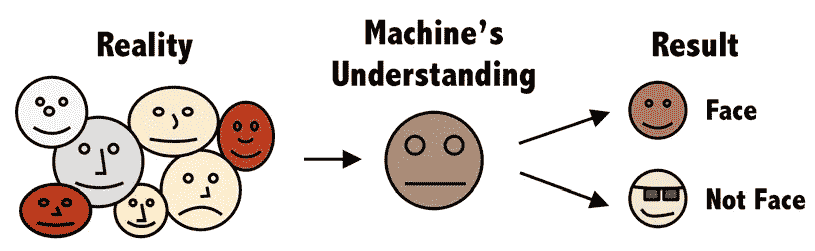
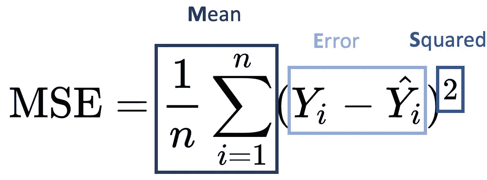
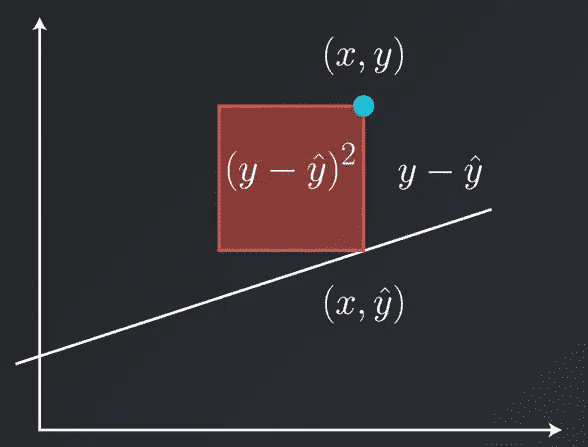
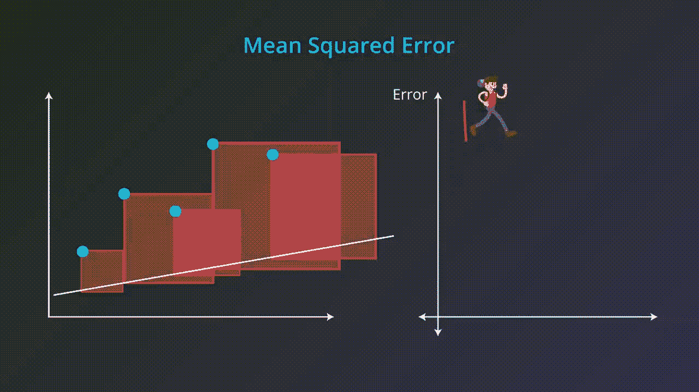
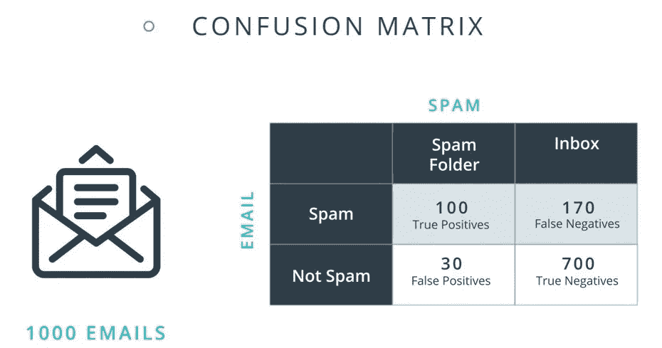
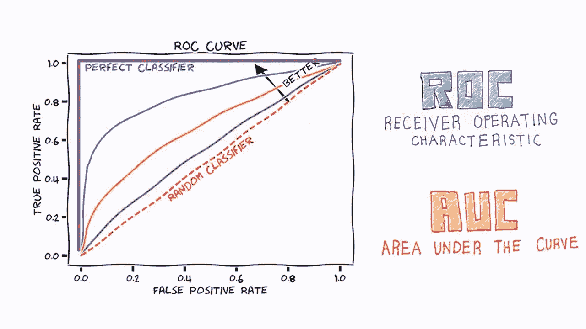
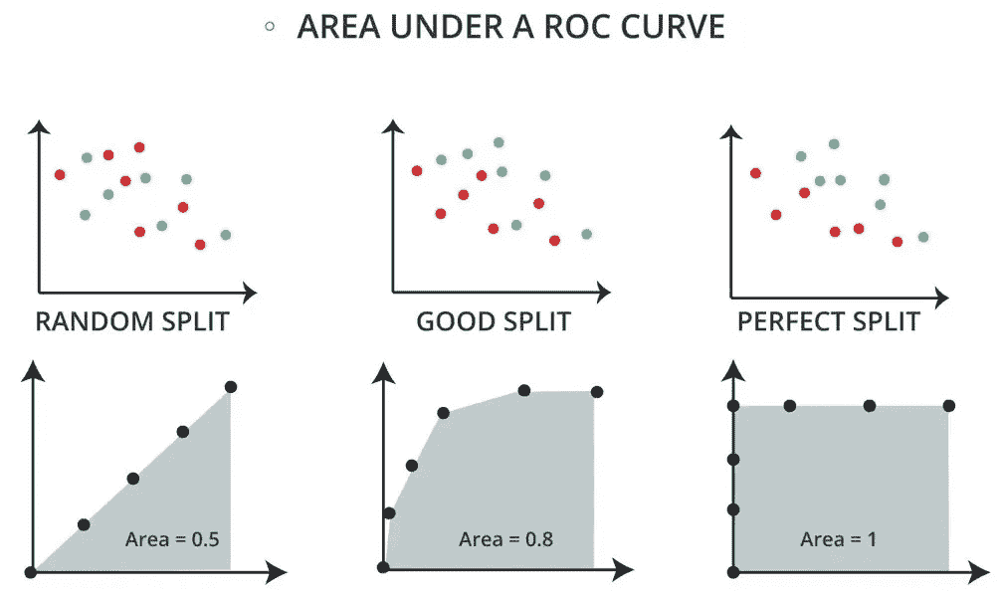

# 机器学习—模型评估指标#3

> 原文：<https://medium.com/nerd-for-tech/machine-learning-model-evaluation-metrics-3-d9ea3404a4da?source=collection_archive---------10----------------------->

[在我之前的文章](/nerd-for-tech/machine-learning-introduction-to-modeling-2-9bc441c3a2b8)中，我对建模做了一个简短的介绍，并检查了模型验证方法。在本文中，我将看看我们在评估已建立模型的成功时使用的度量标准。

机器学习模型有回归和分类两类问题。让我们看看如何使用指标来衡量这些模型的成功。

## 回归模型的模型评估指标

## 均方误差

它是回归模型的误差评估应用程序之一。当我们构建一个模型时，这个模型的目的将是预测因变量的值。我们使用下面的公式来检测我们在预测时犯的错误。

当我们检查公式时。

*   观察次数
*   y 实际值
*   ŷ表示估计值。

从因变量 Y 的实际值中，我们减去从它预测的 Y1 值，然后平方它。我们的目标是发现我们所犯的错误。

例如，让我们假设一所房子的价格是 60 万美元一个观察单位。作为我们建立的模型的结果，我们发现这栋房子的价格在第一次估价中是 61 万美元。在这里，我们将对第一个观察单元犯$10K 错误。我们可以在另一个估算中观察到 2 万美元的误差，在另一个估算中观察到 5 万美元的误差。

我们使用**均方差**方法来找出一天结束时我们平均犯了多少错误。

## 分类模型的模型评估度量

让我们从一个通常用来理解分类模型中成功标准的例子开始。让我们考虑一下这封邮件是不是垃圾邮件。

使用机器学习模型，我们创建了一个关于邮件是否是垃圾邮件的预测模型。现在我们问这个模型:当我们给出这些参数值时，你认为邮件是垃圾邮件吗？

此时，我们比较模型的预测值和实际值。

*   如果邮件在训练集中是垃圾邮件，但我们猜测是垃圾邮件，则称为**真正(TP)** 。
*   如果邮件在训练集中是垃圾邮件，但我们猜测不是垃圾邮件，则称为**假阴性(FN)** 。
*   如果该邮件在训练集中不是垃圾邮件，但我们猜测是垃圾邮件，则称为**误报(FP)** 。
*   如果邮件在训练集中不是垃圾邮件，但我们猜测不是垃圾邮件，则称为**真否定(TN)** 。

通常我们用准确率来评价模型在分类问题上的成功与否。换句话说，就是正确的分类率。

**精度:** (TP + TN) /所有观测值

我们示例的准确率:(100 + 700) / 1000 = 80%

与之相反的是错误率。1-准确率给出了错误率。

**错误率:** (FN + FP) /所有观测值

**精度:** TP / (TP + FP)

**敏感度:** TP / (TP + FN)

## 受试者工作特征曲线

我们继续使用 ROC 曲线，这是分类模型的成功评估标准之一。我们也可以把它定义为精度的图形化解释。

如果我们看图表，X 轴上有一个*假阳性率*，Y 轴上有一个*真阳性率*。假阳性率显示**假阳性(FP)** 观察值与混淆矩阵中所有阴性值的比率。同样，我们可以将真阳性率视为**真阳性(TP)** 观察值与所有阳性值的比率。

X 轴和 Y 轴上从 0 到 1 的值表示假阳性和真阳性的比率。这条曲线下的面积称为曲线下面积(AUC)。如果这个面积很大，说明模型很好，如果很小，说明模型不成功。

换句话说，这里的连续线越大，模型的预测成功率越高。

这条连续线越靠近中间的虚线，预测成功率越低。

中间的虚线是；如果我们没有建立任何模型，把所有的类都称为 1 或 0，那么随机地，我们将有 50%的机会，换句话说，50%的成功。拟合模型时，蓝色曲线下的面积最好高于这条线。换句话说，当我们创建拟合模型的 ROC 曲线图时，这样的形状出现并给出关于我们模型成功的信息。

下一篇文章，我们将讨论偏差-方差权衡和模型调优方法…