# 容器内的机器学习模型

> 原文：<https://medium.com/nerd-for-tech/machine-learning-model-inside-a-container-a52ecd95fc64?source=collection_archive---------35----------------------->

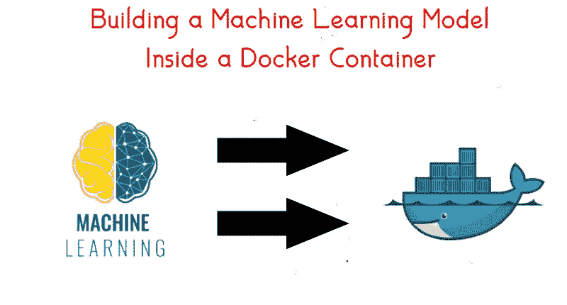

## 在 Docker 容器内训练机器学习模型

问候大家！！！现在我带着另一个博客回来了。

在这篇博客中，我们将讨论如何在 Docker 容器中创建一个机器学习模型，并使用该模型进行一些预测。对于这项任务，我们将创建一个基本的机器学习模型，它可以根据多年的经验预测工资。

所以让我们从博客开始吧！！！

# **实用**

我们可以使用本地系统或 AWS 实例来完成这项任务。因此，无论我们对什么感到舒服，我们都可以使用它。

首先，我们需要在 Linux 操作系统中安装 Docker。这里我使用的是 RedHat Linux，所以我们需要配置 yum 来安装 docker。我们需要创造一个**。回购**文件在我们的 **/etc/yum.repos.d/里面。**我们创建了一个文件 **docker.repo，**，然后在该文件中，我们配置了 repo。你可以看到同样的下图。

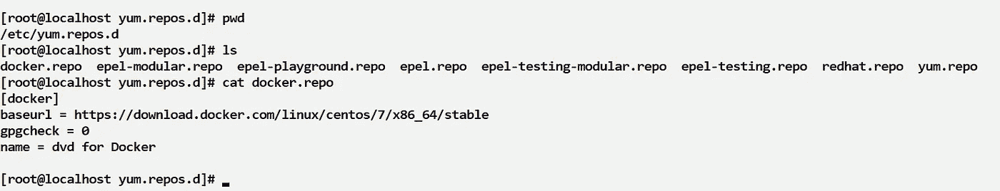

现在，我们可以使用以下命令安装 docker:

```
yum install docker-ce --nobest
```

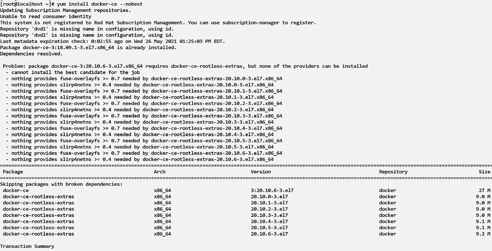

现在检查是否安装了 docker。我们可以使用命令:

```
docker --version
```

之后，应该会启动 docker 服务。我们可以使用命令 **systemctl status docker** 来检查服务状态。如果它没有运行，我们可以使用 **systemctl start docker** 来启动它，并使用 **systemctl enable docker** 在每次启动时启用它。


我们可以使用**“docker PS”**来查看所有正在运行的容器，使用**“docker images”**来查看我们系统中的所有映像，docker 可以使用这些映像来构建容器。在下图中，我们可以看到我有相当多的图像，但没有容器运行。

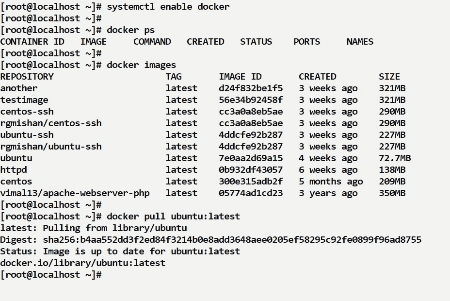

我们将使用 ubuntu 镜像来启动我们的操作系统，并且我们将使用最新版本的 ubuntu。

我们可以使用我在上面用过的命令:

```
docker pull ubuntu:latest
```

上面的命令帮助我们从任何存储库中提取映像，如果我们有映像，它将查看是否有任何更新，并提取最新版本的映像。

现在我们有了 ubuntu 映像，我们可以使用该映像启动一个容器。

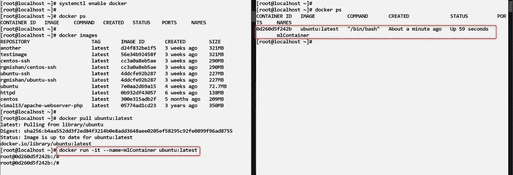

在上图中，我们可以看到我们使用了

```
docker run -it --name=mlContainer ubuntu:latest
```

该命令意味着我们想要运行一个容器，这意味着我们需要一个容器的交互式终端，name 是我们想要的容器的名称，最后是我们想要用来创建容器的图像。**(左边)**

在右边，我打开了另一个终端，我们可以看到当我们使用 **docker ps** 命令时，一个新的容器出现了，这是我们创建的。因此，我们的容器被创建，我们现在在容器内。正如您在右侧看到的，root@localhost 已经更改为 root@0d260d5…也就是容器 id。

# 准备好环境

现在在这个容器中，我们将训练我们的模型。

首先，我们需要一些软件存在于容器中。我们需要 Python 和一些库来训练机器学习模型。我们还需要 Windows 系统中的数据集，并将它转移到 Linux 系统和容器中(我们将讨论这一点)。

首先，让我们看看我们的系统中是否有 Python，或者现在有。如下图所示，我们可以看到 python 不在我们的容器中，因此我们将使用以下命令安装它:

```
$ apt-get update #first update apt-get
$ apt-get install python3-pip -y
```

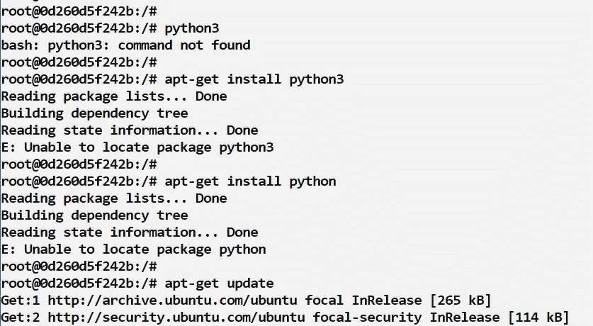

我们已经安装了 python 和 pip，因为我们还需要安装其他库。

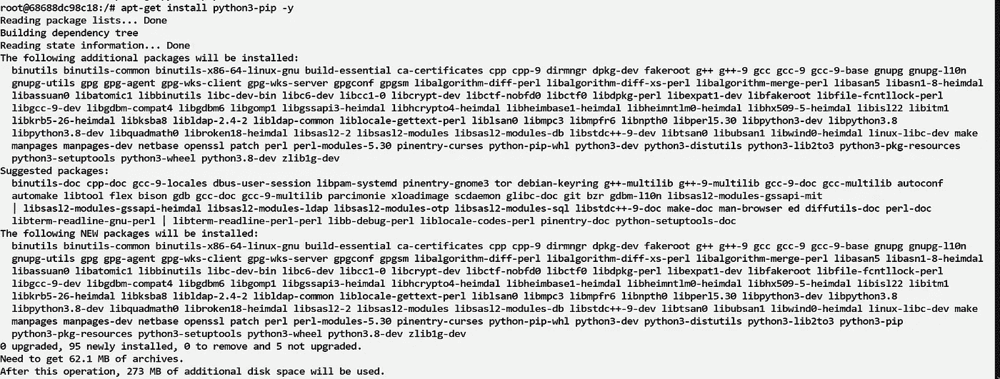

现在我们可以看到 Python 已经安装并在下图中工作。

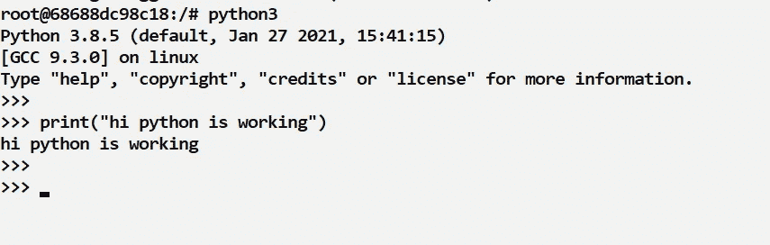

当我们使用机器学习时，我们需要获取或读取数据集文件，这可以通过 **pandas 库来完成。**我们还需要 **numpy，**我们还需要 **sklearn** 使用模型来训练我们的数据，所以我们已经使用 pip 安装了所有东西。

我们可以使用命令检查每个模块是否都在。

```
$ pip list #shows all the modules available$ pip install pandas
$ pip install sklearn
```

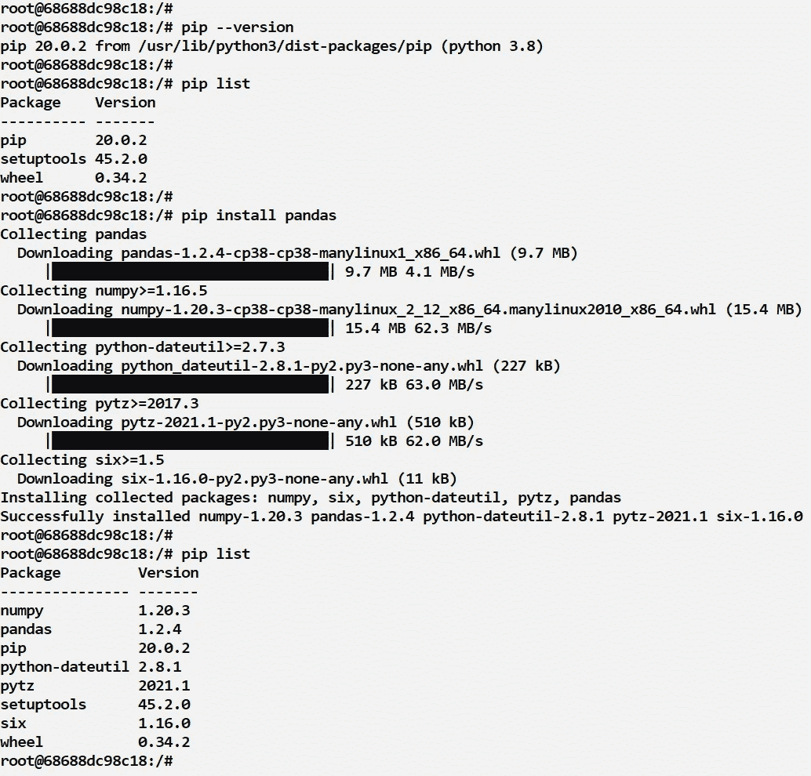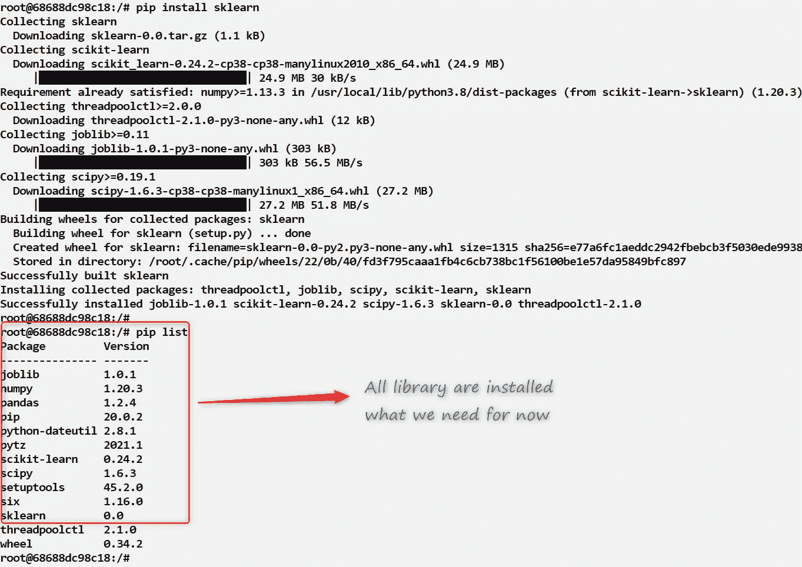

# **码头工人提示**

当我们在 docker 容器中时，我们可以使用" **$ exit** "这将我们带到了容器之外。这意味着容器被停止。要再次启动容器，我们可以使用命令“$ docker start<container name/id>”现在再次进入容器内部，我们可以使用命令:" $ docker attach <容器名称/id >"

# 模特培训

现在我们需要数据集，我们首先需要在我们的系统中有数据集。这里我的数据集在 windows 系统中，所以我将首先把它带到我的 Linux 系统(RedHat)中。

我将使用 WinScp 软件来完成这项工作。我们也可以直接在 Linux 系统中使用 **wget** 从互联网上获取数据集。

我们需要在 Windows 中打开软件，给出我们可以使用的 Linux 系统的 IP 地址用户名，然后通过 work 或 key 进行连接。

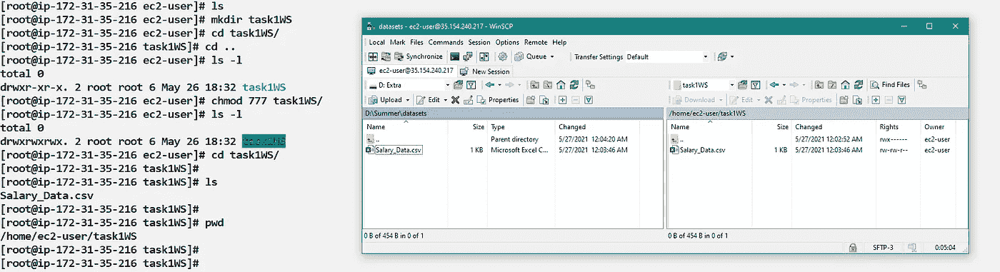

在上图中，我们可以看到我已经使用 WinScp 将“Salary_Data.csv”文件从我的 windows(左侧)传输到我的 Linux 系统(右侧),我们可以看到在终端上有一个名为“task1WS”的文件夹来存储它。

> 记住要让文件完全可读，否则我们可能会面临目录中的读写问题。我已经在上面的图片中展示了我们是如何做到的。

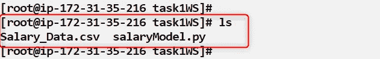

现在，在文件“Salary_Data.csv”中，我们有我们的数据集，在文件“salaryModel.py”中，我们有我们的 Python 代码。

以下是数据集的链接:

[](https://www.kaggle.com/vihansp/salary-data?select=Salary_Data.csv) [## 薪资 _ 数据

### Kaggle 是世界上最大的数据科学社区，拥有强大的工具和资源来帮助您实现您的数据…

www.kaggle.com](https://www.kaggle.com/vihansp/salary-data?select=Salary_Data.csv) 

下面是 **salaryModel.py** 代码:

上面我已经导入了所有需要的库，然后我读取了数据集并将其存储在变量 **data** 中，然后我将训练数据存储在 **x** 中，然后将数据存储在 **y** 中。我还对 x 数据进行了整形，然后将其转换为 2D 数组。然后，我使用模块 LinearRegression()来训练我的数据。我已经用 **model.fit(x，y)** 对数据进行了训练。

现在，当我使用以下命令运行这个程序时:

```
python3 salaryModel.py
```

它将我的经验作为输入，并以工资的形式给我答案，作为我多年经验输入的输出。


我们可以看到该模型正在工作，并且为了保存该模型，我们不需要再次运行或训练我们已经使用过的模型

```
>> jb.dump(model, 'salaryPredictor.pk1')
```

这有助于我们将模型存储在文件**" salary predictor . pk1 "**中，供以后使用。

# 结论

我们已经在 docker 容器中成功地创建了机器学习模型，并保存了该模型以备后用。我希望我已经解释了一切，如果你有任何疑问或建议，你可以在这个博客上评论或在我的 LinkedIn 上联系我。

[](https://www.linkedin.com/in/mishanregmi/) [## 密山 Regmi -研究实习生- SkillGeek | LinkedIn

### 在世界上最大的职业社区 LinkedIn 上查看米山·雷米的个人资料。密山有一个工作列在他们的…

www.linkedin.com](https://www.linkedin.com/in/mishanregmi/) 

*谢谢你一直呆到博客结束，请给我一些改进的建议。你的建议真的会激励我。*