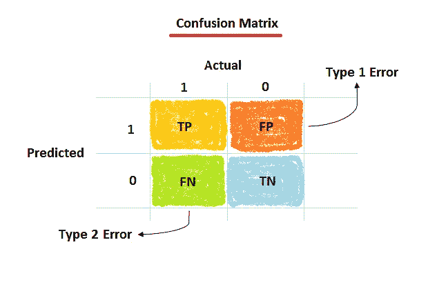
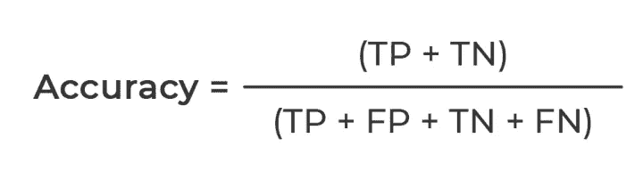
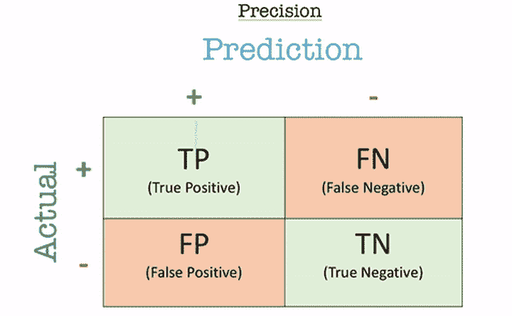
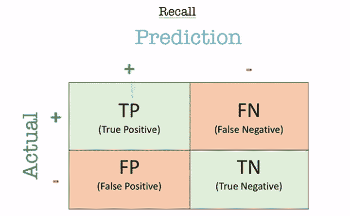
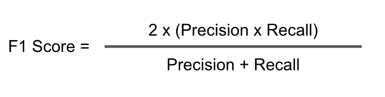
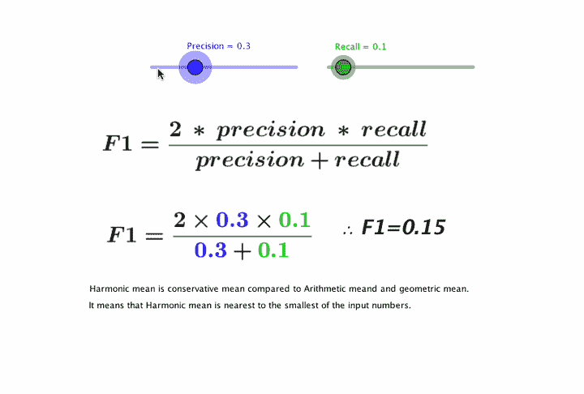
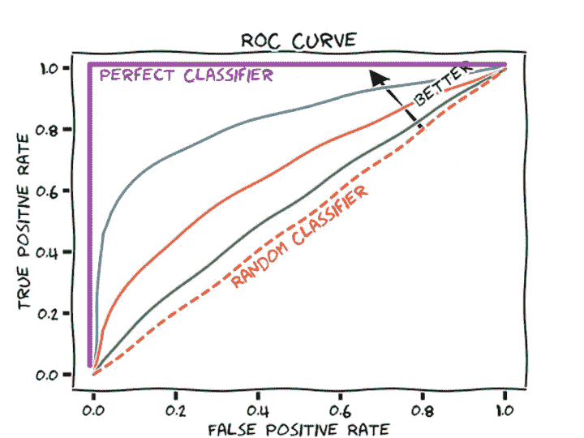
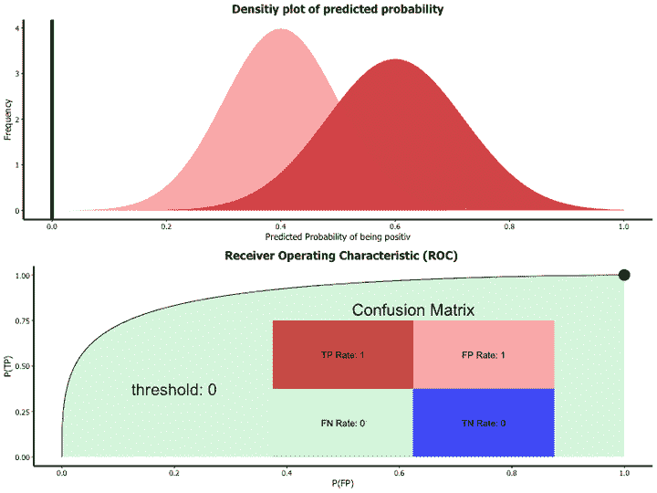

# 机器学习模型性能指标

> 原文：<https://medium.com/nerd-for-tech/machine-learning-model-performance-metrics-84f94d39a92?source=collection_archive---------21----------------------->

分类问题的重要模型评估指标！

构建机器学习模型的想法基于建设性的反馈原则。您建立一个模型，从度量中获得反馈，进行改进，并继续下去，直到达到理想的准确度。顾名思义，性能指标解释了模型的性能。性能指标的一个重要方面是它们区分模型结果的能力。

我见过很多分析师和有抱负的数据科学家甚至懒得检查他们的模型有多稳健。一旦他们完成了一个模型的建立，他们就匆忙地将预测值映射到看不见的数据上。这是不正确的做法！

如果一个模型的输出因变量(标签)始终是准确的，即使一个或多个输入自变量(特征)或假设由于不可预见的情况而发生剧烈变化，该模型也被认为是稳健的。简单地建立一个预测模型不是你的动机。它是关于创建和选择一个对样本外数据给出高精度的模型。因此，在计算预测值之前检查模型的准确性至关重要。

有不同种类的指标来评估我们的模型。完成模型构建后，这 6 个指标将帮助您评估模型的准确性。

# 内容

1.  快速预热:预测模型的类型
2.  举例说明
3.  混淆矩阵
4.  分类准确度
5.  精确
6.  回忆
7.  f1-分数
8.  AUC-ROC

# 快速预热:预测模型的类型

当我们谈论预测模型时，我们谈论的是回归模型(连续输出)或分类模型(名义或二进制输出)。这些模型中使用的评估指标各不相同。在分类问题中，我们使用两种类型的算法(取决于它创建的输出类型):

*   **类输出:**像 SVM 和 KNN 这样的算法创建一个类输出。例如，在二进制分类问题中，输出将是 0 或 1。然而，今天我们有算法可以将这些类输出转换成概率。但是这些算法并没有被统计界很好地接受。
*   **概率输出:**逻辑回归、随机森林、梯度推进、Adaboost 等算法。给出概率输出。将概率输出转换为类输出只是创建一个阈值概率的问题。

在回归问题中，我们在输出中没有这样的不一致。输出在本质上总是连续的，不需要进一步的处理。

对于分类模型评估指标的讨论，我使用了我对 Kaggle 上的一个二元分类问题的预测。这个问题的解决办法不在我们讨论的范围之内。但是，本文使用了对训练集的最终预测进行说明。对这个问题的预测是概率输出，假设阈值为 0.5，已经转换为类输出。

参见上文，数据中有 5 个输入样本，其中 3 个属于负样本(类别 1)，2 个属于正样本(类别 0)。考虑到阈值为 0.5，概率为 0.76 的第 5 个观察值被错误分类为 1 类。

# 混淆矩阵

混淆矩阵是一个 N×N 矩阵，其中 N 是被预测的类的数量。在上面的例子中，我们有 N=2，因此我们得到一个 2×2 的矩阵。

有 6 个重要术语:

*   **真阳性:**我们预测为阳性，实际输出也为阳性的情况。在这里，真阳性是 2。
*   **真阴性:**我们预测为阴性，实际输出为阴性的情况。在这里，真正的负数是 2。
*   **假阴性:**我们预测为阴性而实际输出为阳性的情况。我记得它是错误地预测负面的。这里，假阴性是 1。
*   **假阳性:**我们预测为阳性而实际输出为阴性的情况。我记得这是错误的预测。在这里，没有假阳性，即 0。
*   **I 型误差:**在统计假设检验中，是指当一个零假设为真时，拒绝该假设而产生的误差。它是在本该被接受的假设被拒绝时产生的。它用α (alpha)表示，称为误差，也称为测试的显著性水平。
*   **第二类误差:**是在原假设不成立的情况下接受原假设时出现的误差。简单来说，就是在不该接受的时候接受假设。它用β(β)表示，也称为β误差。

# 分类准确度

当我们使用术语“准确性”时，分类准确性就是我们通常所指的。

准确度是正确预测的数量与输入样本或观测值的总数之比。通俗地说，准确性是我们的模型正确预测的分数。

这里，精度= (2+2)/(2+0+1+2) = 4/5 ie。, 80%

例如，考虑在我们的训练集中有 98%的类 0 样本和 2%的类 1 样本。那么我们的模型通过简单预测属于 0 类的每一个训练样本，就可以轻松获得 98%的训练准确率。

当在测试集上用 60%的类 0 样本和 40%的类 1 样本测试同一个模型时，测试精度会下降到 60%。分类精度很高，但是给了我们达到高精度的错觉。

当小类样本的错误分类成本非常高时，真正的问题就出现了。如果我们处理一种罕见但致命的疾病，未能诊断出患者疾病的成本远远高于将健康人送去进行更多测试的成本。

# 精确

精度是正确的阳性结果数除以分类器预测的阳性结果数。结果是介于 0.0(无精度)和 1.0(完全或完美精度)之间的值。Precision 查看有多少垃圾邮件被混在一起。如果没有坏的肯定(那些 FPs)，那么模型有 100%的精确度。

这里，精度= 2/(2+0) = 1 ie。, 100%

# 回忆

召回率是正确阳性结果的数量除以所有相关样本的数量(所有应被鉴定为阳性的样本)。结果是介于 0.0(无回忆)和 1.0(完全或完全回忆)之间的值。

这里，回忆= 2/(2+1) = 2/3，即 67%

与 precision 只对所有肯定预测中的正确肯定预测进行评论不同，recall 提供了对错过的肯定预测的指示。

# f1-分数

精确度和召回率调和平均值。这是一个既代表精确度又代表召回率的单一分数。

这里，F1-score =(2 * 1 * 0.67)/(1+0.67)= 0.80%

**那么为什么是调和平均数，为什么不是算术平均数呢？**因为它更惩罚极值。

考虑一个简单的方法(例如，总是返回类 0)。有无限个类 1 的数据元素和一个类 0 的元素:

精确度= 0.0，召回率= 1.0

当取算术平均值时，它将有 50%正确。尽管这可能是最坏的结果！但是，对于调和平均值，F1 值为 0。

算术平均值= 0.5，调和平均值= 0.0

**换句话说，要想获得高 F1 分数，你需要同时具备高精确度和高召回率。**

# AUC-ROC(曲线下面积——受试者操作曲线)

曲线下面积(AUC)是最广泛使用的评估指标之一。它用于二进制分类问题。分类器的 AUC 等于分类器将随机选择的正例排序高于随机选择的负例的概率。ROC 曲线是显示分类模型在所有分类阈值下的性能的图表。

ROC 的轴是 TPR(真阳性率)和 FPR(假阳性率)。

*   **真阳性率 TPR(灵敏度)**:真阳性率定义为 TP/ (FN+TP)。真阳性率对应于所有阳性数据点中被正确认为是阳性的阳性数据点的比例。
*   **真阴性率 TNR(特异性)**:真阴性率定义为 TN / (FP+TN)。假阳性率对应于所有阴性数据点中被正确认为是阴性的阴性数据点的比例。
*   **假阳性率 FPR** :假阳性率定义为 FP / (FP+TN)。假阳性率对应于阴性数据点相对于所有阴性数据点被错误地认为是阳性的比例。

假阳性率和真阳性率的值都在范围[0，1]内。FPR 和 TPR 都是在不同的阈值下计算的，例如(0.00，0.02，0.04，…)。1.00)并绘制图表。

AUC 是[0，1]中不同点的假阳性率对真阳性率的曲线下面积。显然， **AUC 的范围是[0，1]。值越大，我们模型的性能越好。**该曲线告诉我们，该模型可以很好地区分这两个类别。更好的模型可以准确区分两者。然而，一个差的模型将很难区分这两者。

就是这样！

_____________________________________________________________

感谢你阅读❤.对于任何建议或疑问，请在下面留下您的评论，并关注更新。

如果你喜欢这篇文章，请点击👏图标来支持它。这将有助于其他媒体用户找到它。分享一下，让别人也能看！

快乐学习！😊