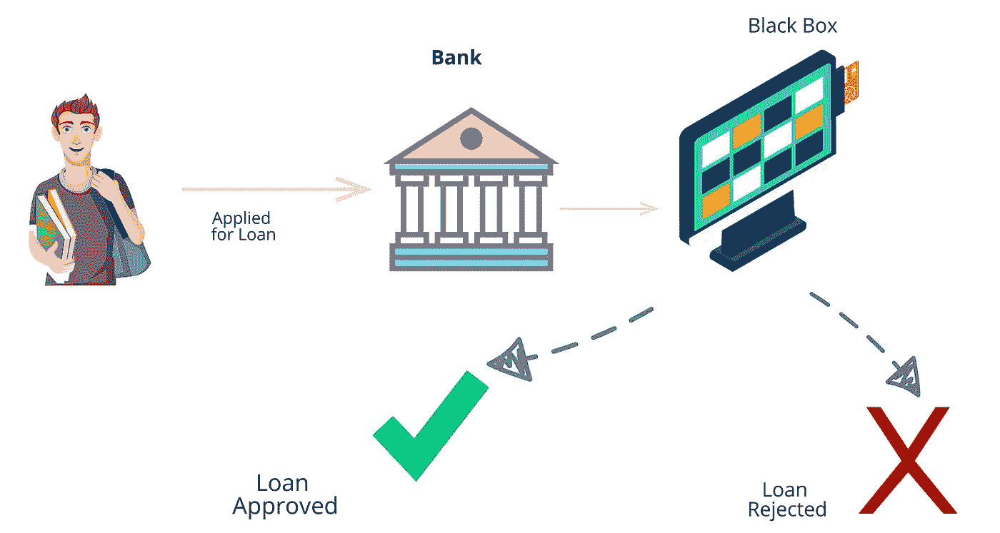
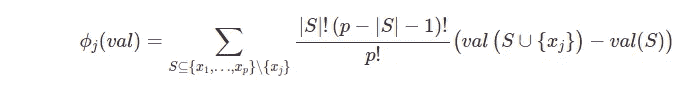
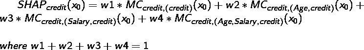
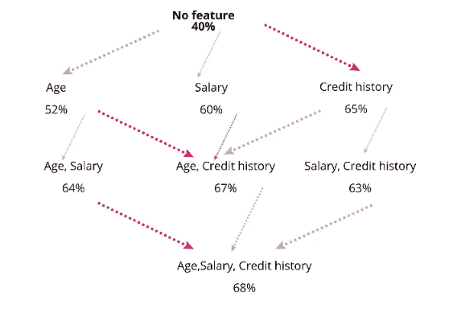
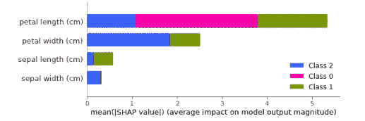
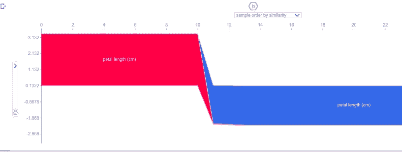
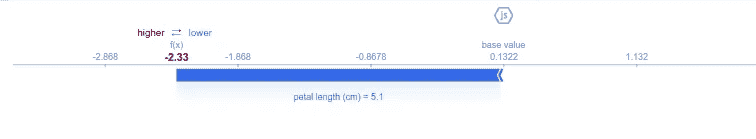

# 如果你听，机器学习模型会说话:可解释性

> 原文：<https://medium.com/nerd-for-tech/machine-learning-model-speaks-if-you-listen-explainability-c026cf25c3d?source=collection_archive---------13----------------------->

在过去的十年中，自动化在不断发展，但即使在今天，做出决定的最终决定仍然依赖于人类。毫无疑问，我们正在做出数据驱动和充分知情的决策。

几乎我们所有人都在有意或无意地使用机器学习和人工智能产品(例如:YouTube 上关于你想要的度假目的地的推荐🏝 🏕，由银行筛选的房屋贷款申请🏦)

## 黑盒模型的问题

现在让我们假设你是一家银行的分行经理，你每周都会收到大量的房屋贷款申请。由于你的帮助，银行的技术团队给了你一个模型。

这是一个黑盒模型，只接受输入，并决定批准或拒绝贷款申请。



银行场景

这个模型有很好的准确性，对企业也有好处，但是这里有两个问题

*   为什么某个贷款申请会被拒绝？要求告知客户。
*   为什么贷款获批？要求证明申请人的可信度。

# 可解释性来拯救

对于内在可解释的模型，如逻辑回归，全局特征的重要性是已知的使用特征的权重。但是对于单个数据点(x_q ),我们需要假设 x_q 遵循全局结构。在现实世界中，我们需要更复杂的模型，比如深度神经网络。这些模型无法计算特征重要性。

**SHAP**——代表**上海**应用 **A** 附加 ex **P** 选择。这是解释和回答“为什么”要做预测的最广泛使用的方法之一。

SHAP 植根于合作博弈理论，其中每个特征被认为是一个“ ***”游戏，模型的表现是“*”。****

*SHAP 是**模型不可知的:**它独立于用于进行预测的底层模型。对于 ***非固有可解释*** (像深度神经网络)的模型来说变得相当有价值。*

***记住一个有用的映射***

*   *玩家对应特征。*
*   *支出与最终的模型性能相对应。*
*   *该游戏对应于单个数据点(单个贷款申请)。*

## ***SH**appley**A**additive 的意思分解*

1.  ***SHapley 值**:特性对支出的贡献，在可能的特性组合上进行加权和求和。*

**

*来源:I[interpretable-ml-book/shapleyl](https://christophm.github.io/interpretable-ml-book/shapley.html)*

*在博客的后面，我将展示如何计算一个特性的 SHAP 值。*

*2.对于给定的观测值 *x₀，*所有特征的 SHAP 值之和将导致 *x₀* 的预测与平均预测之间的差异。*

# *通过例子直观地解释*

*让我们假设预测贷款申请只需要 3 个因素(年龄、工资和信用记录)。*

**

*贷款申请人的特点*

*申请人年龄为 27 岁，年收入为 600，000 印度卢比，无违约信用记录。我们的模型预测，银行应该以 68 %的概率批准他的贷款。银行平均批准 40%的贷款申请。*

**与平均预测相比，每个特征对预测的贡献有多大？**

*年龄、薪水和信用历史等特征共同做出了这一预测。我们需要计算出每个特征对预测值和平均值之差的贡献。*

> *这里是 68% — 40% = 28%。*

*一个可能的解释可能如下:
27 岁的年轻年龄增加了 20%，无违约历史增加了 25%。另一方面，平均工资下降了(-17%)。最后总计(20+25–17 = 28%)。*

*因为 3 个特征可以在 2^{3}形成联盟= 8 种方式。*

**

*计算 Shapely 值*

*每个节点有两行:*

*   *第一行:涉及的功能。*
*   *第 2 行:批准贷款的概率预测。*

## *一个特性的边际贡献(MC)是多少？*

*在根节点，没有节点的模型将简单地预测所有数据点中贷款批准的平均概率(40%)。如果我们移动到只有信用历史作为唯一特征的节点，对 x₀的预测将是 65%。*

*因此， *x₀* 的信用历史的**边际贡献(MC)** 为 25%。*

*为了找出整个模型上信用历史的 SHAP 值，我们需要找到信用历史存在的每个节点的边际值。*

**

*SHAP 的信用价值。*

**

*关注以信用记录为特征的路径。*

## ***边际贡献(MC)的权重是多少？***

*   *对应于 f 特征的边际贡献的所有权重应该是相同的。例:设给定{年龄，薪金}的年龄 MC 的权重为 W1，给定{年龄，薪金}的 MC 的权重为 W2，则 *W1 = W2* 。*
*   *f 特征模型的权重 MC 等于 f 特征模型的可能 MC 数的倒数。*

*在计算 shapely 值时，我们用数据集中存在的特征值替换联合中不存在的特征值。例如，如果缺少年龄，我们将尝试数据集中存在的不同年龄值，并结合存在的其他特征。*

***注**:随着特征数量的增加，计算时间呈指数增长。*

*为一个问题找到精确的 shapely 值是一个 NP 难问题。在现实世界中，对于大多数实际用途来说，近似值已经足够了。*

*使用 SHAP 做出的解释总是考虑所有的特征，它不提供选择性的特征解释。*

## *优点:*

1.  *它满足公平支付的所有属性:效率、对称性、虚拟性和可加性。唯一有坚实理论基础的方法。*
2.  *不仅能解释整个数据集的平均值，还能解释数据子集，甚至单个数据点。*

## *缺点:*

1.  *计算精确的 shapely 值需要花费大量时间，并且随着特征数量的增加而增加。*
2.  *需要访问数据来计算新点的 shapely 值。*
3.  *没有预测模型，它只返回每个要素的 Shapley 值。我们不能形成这样的陈述:“x 点的输入变化将导致 y 点的预测变化。”*

# *Python 中的代码示例*

*让我们使用 pip 安装 Shap 库。*

```
*!pip install shap*
```

*导入所需的库*

```
*import shapimport sklearn*
```

*让我们从 SHAP 图书馆的中心开始。*

```
*explainer = shap.Explainer(model)
explainer
#output
<shap.explainers._tree.Tree at 0x7f33ff1e3f10>*
```

*explainer 类是 SHAP 库的主要接口。当创建解释器对象时，如果没有指定算法，那么它设置为“auto ”,这意味着它根据使用的模型选择最佳的解释器。有不同的解释器可用，如排列、加法、精确、树等。SHAP 值是根据不同的方法计算出来的。*

*这里，模型参数可以是任何类型的模型回归器/分类器，并且它支持 Sklearn、Xgboost、LightGBM、CatBoost、Pyspark、张量流模型。*

```
*shap.summary_plot(shap_values,X_train.columns)*
```

**

*shap.summary_plot()的输出*

*在分类任务中，要素按重要程度排序。我们可以看到花瓣长度是全球最重要的特征。*

```
*shap.initjs() # this used to for javascript display if using on Jupyter notebook or colabshap_values = explainer.shap_values(X_test)shap.force_plot(explainer.expected_value[0], shap_values[0], X_test)*
```

**

*shap.force_plot()输出*

```
*shap.initjs()shap_values = explainer.shap_values(X_test.iloc[0,:])shap.force_plot(explainer.expected_value[0], shap_values[0], X_test.iloc[0,:])*
```

**

*为单个数据点绘图*

*这里 0.1322 是基值，特征花瓣长度将该值拉至较低端。最终预测为-2.33。
**注意**这是花瓣长度特征仅对单个数据点的影响。*

*[使用代码的 Colab 笔记本](https://colab.research.google.com/drive/1dhqbTZxGWEGBreX86niN1Qk-2KDmGz0E?usp=sharing)。*

## *好奇的人*

*如果你想有一个完全不同的观点，并有 10 分钟的时间，那么请观看[‘请停止做“可解释的”ML —辛西娅·鲁丁’](https://www.youtube.com/watch?v=I0yrJz8uc5Q&ab_channel=TheBerkmanKleinCenterforInternet%26Society)*

# *参考*

1.  *[解释模型预测的统一方法](https://arxiv.org/pdf/1705.07874.pdf)*
2.  *[SHAP Python 库](https://github.com/slundberg/shap)*
3.  *可解释的机器学习:制作可解释的黑盒模型的指南*
4.  *[*SHAP 价值观解释得一清二楚你多么希望有人向你解释*](https://towardsdatascience.com/shap-explained-the-way-i-wish-someone-explained-it-to-me-ab81cc69ef30)*

## *联系人:[LinkedIn](https://www.linkedin.com/in/mr-tushar-tiwari/)| |[邮箱](mailto:tushi.fire@gmail.com)*