# 机器学习-回归算法(线性回归)

> 原文：<https://medium.com/nerd-for-tech/machine-learning-regression-algorithms-linear-regression-ea97c92f2d9b?source=collection_archive---------9----------------------->

## 我的数据科学之旅(第 5 部分)回归算法(第 1 部分)

机器学习是关于创建一种算法，让计算机找到一种模型来尽可能好地拟合数据，并准确预测。

[附身摄影](https://unsplash.com/@possessedphotography?utm_source=medium&utm_medium=referral)在 [Unsplash](https://unsplash.com?utm_source=medium&utm_medium=referral) 上拍照

# 机器学习的类型

1.  监督机器学习:监督机器学习用于寻找最佳性能。每个数据都标有目标(例如，特定的输入将是输出，这样，如果模型获得任何其他输出，它可以优化它以获得该特定输入的指定输出)
2.  无监督学习:无监督学习用于寻找最佳。没有进行数据标记。该模型发现隐藏的模式、关系和结构，例如，聚类，在没有告知每个输入意味着或代表什么的情况下给出输入。该模型基于数学公式(如两点之间的距离)对它们进行聚类。
3.  强化学习:在一个环境中执行一个动作的算法根据这个动作是否有利而受到奖励或惩罚
4.  迁移学习:来自一个模型的知识被用于另一个模型

# 算法的类型

1.  回归算法
2.  聚类算法
3.  正则化算法
4.  贝叶斯算法，
5.  降维
6.  基于实例的算法
7.  决策树算法
8.  集成算法
9.  关联学习算法
10.  人工神经网络
11.  深度神经网络

机器学习算法学习函数，然后将输入变量映射到输出变量。模型总会有一些误差，Y=f(x)+e

# 回归算法

## 回归的类型

1.  线性回归
2.  逻辑回归
3.  多项式回归

## 线性回归

线性回归是变量的线性近似，以找到准确表示因变量(x)和自变量(y)关系的最佳拟合线。预测连续量

ŷ=B0+B1 X1 ( ŷ待预测的输出)(y 轴上的 B0 截距)(线 X1 的 B1 斜率)

散点图

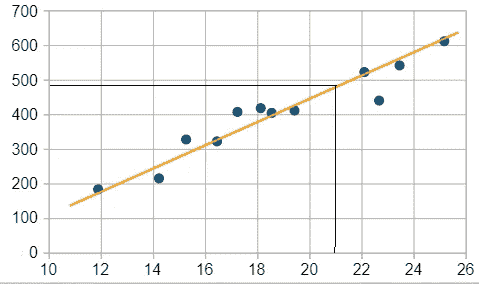

线性回归是为了找到最佳拟合线(橙色线)，因此可以预测新的点，例如，对于给定的橙色线，x 值 21 将对应于 y 值 495。x 和 y 被称为自变量和因变量

## 假设检验

H0: β0，β1… βn= 0

H1:至少有一个βi≠0

如果零假设为真，那么 y 和 x 之间就没有关系

# 线性回归方程的估计方法

计算回归方程的方法有很多。最常见的是

1.  最小二乘法(OLS)
2.  最大似然估计
3.  梯度下降
4.  亚当斯方法

# 最小二乘法或普通最小二乘法

这是估计回归方程最常用的方法之一。OLS 方法适用于线性回归。OLS 方法对变量的概率性质不做任何假设，被认为是确定性的。该方法通过最小化平方和(ss)来估计关系

# 三种类型的 SS

1.  总平方之和
2.  回归平方和
3.  误差平方和(SSE)

## 超音速运输机

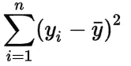

yi =独立变量数据点

y̅=mean

它是一个特性的值相对于该特性的平均值的变化。SST 表示数据的总可变性

## 苏维埃社会主义共和国

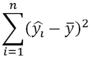

第 I 个 ŷi=Predicted 值

y̅=mean

它也被称为解释平方和。它显示了你的模型与数据的吻合程度，模型能够解释多少数据的可变性

如果 SSR=SST，那么模型捕捉到了所有的可变性。该模型可以解释数据集中的全部可变性

## 同ＳＯＵＴＨ-ＳＯＵＴＨ-ＥＡＳＴ

它是观察值和预测值之间的差值。换句话说，就是数据集中无法解释的可变性。

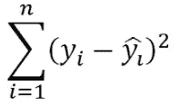

第 I 个 ŷi=Predicted 值

yi =第 I 个值

SST=SSR+SSE

OLS 专注于最小化 SSE(实际和预测之间的差异)

可以使用 SSR 和 SST 计算 r 平方

R =SSR/SST

# 模型摘要

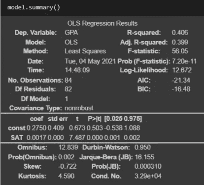

OLS 模式综述

**摘要分为 3 部分**

1.  关于数据的基本统计
2.  独立变量信息
3.  统计检验

摘要说明了基本信息，如所用的因变量、模型、方法、日期和时间。

## **第一部**

**R 平方:**是回归模型解释的数据的可变性(*这里 0.406 的 R 平方意味着 40.6%的数据可以被解释，或者 GPA 有 40.6%取决于 SAT，剩下的 59.36%要么取决于其他因素，如学习时间、出勤或健康问题)。*

当增加更多的特征(SAT，学习时间，出勤率)时，r 平方增加。范围从[0–1]0%表示模型解释不了可变性(结果不依赖于任何东西，基于随机)，100%表示模型能够准确预测

**调整后的 R 平方:**考虑到独立变量的数量或添加的特征，由模型解释的可变性。调整后的 R 平方将始终小于 R 平方。

*我们可以给模型 n 个特征，并且它会增加 R 平方(可变性解释)，但是每个特征对应一个维度。在上面的例子中，SAT 用于预测 GPA，所以 SAT 在 X 轴绘制，GPA 在 Y 轴绘制，这给出了拟合回归线的 2D 图，类似地，随着更多特征的增加，维度也增加，最简单的是 2D。可以到 10，100 或者 500 维，这样会造成很多问题*。

因此，我们需要限制添加的要素数量，并重点添加在解释变量时具有重要意义的要素。一般规则是，如果调整后的 R 平方比 R 平方低得多，则模型包含很多不重要的特征，因此调整后的 R 平方应该尽可能接近 R 平方

**F 统计量:**总体显著性的 F 检验表明，与不包含独立变量的模型相比，线性回归模型是否能更好地拟合数据。

H0:无因变量模型比有因变量模型更符合数据，H1:有因变量模型比无因变量模型更符合数据。如果 Prob(F-统计量)< 0.05 (α), then we can reject the null hypothesis

**对数似然:**这告诉我们，给定数据(*用于创建模型的数据*由所创建的模型产生的可能性是多少

AIC(Akaike 的信息标准)和 BIC(贝叶斯信息标准)用于特征选择

## **第二部分**

这一部分给出了因变量的总结

**系数:**常数(bo)和 SAT(B1)y = bo+B1 x1→y = 0.2750+0.0017 x1(根据任意一个 x1(SAT)值 y 可以计算出 GPA)

**P > t:** 表示各独立变量的 P 值。如果独立变量在预测值中不显著，则为> 0.05。在这种情况下，必须删除独立变量(仅适用于独立变量，而不是常量)

## **第 3 部分**

这部分讲述了模型的检验统计

**Omnibus and Jarque-Bera:** 它判断残差的分布是否遵循基于偏斜度和峰度的正态分布。值 0 表示分布完全遵循正态分布。残差是实际值和预测值之间的差值。

**Prob(综合)和 Prob(Jarque-Bera)** :给出了残差服从正态分布的概率

**偏斜:**表示正态分布的对称性，0 表示完全对称+ve 表示分布向右偏斜，而-ve 表示分布向左偏斜。

**峰度:**用于衡量趋紧程度。峰度降低表明尾部区域有大量数据。峰度越高，表明靠近尾部的数据越少。

**Durbin Watson:** 统计检验衡量数据的同质性(相同的分散性)。值[1–2]表示数据是同态的

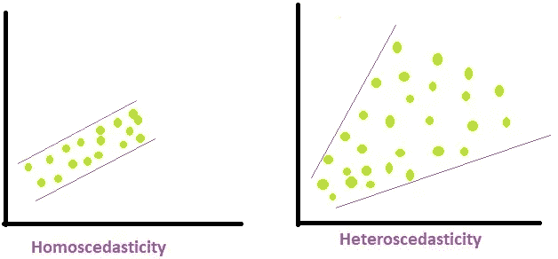

**条件数:**条件数提供了 x 中的不确定性(δx)被 f(x)放大的程度的度量。小于 1 的值告诉我们它被衰减了。条件数高的函数称为病态函数。

普通最小二乘法是一种非迭代方法，其拟合模型使得观察值和预测值的差的平方和最小化。

# 数学直觉

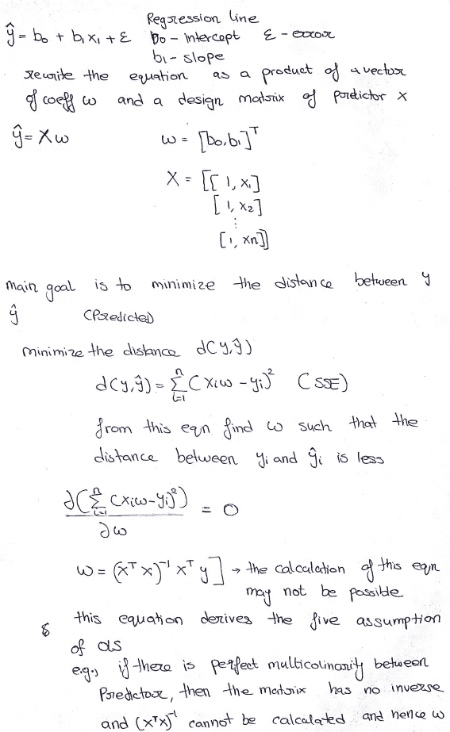

# OLS 假设

1.  线性:数据应该是线性的
2.  无内生性:自变量不应与误差项相关
3.  正态性:误差的方差在整个观测中应该是一致的
4.  无自相关:误差项的值之间不应存在可识别的关系
5.  无多重共线性:任何因变量都不应该完全解释另一个因变量(因变量不应该彼此相关)

## **优势**

*   没有迭代
*   不需要特征缩放
*   当特征数量较少时，它工作得很好。

## **缺点**

*   当数据集很大时，计算开销很大。
*   特征数量越多，速度越慢
*   运行时间为 O(n)
*   有时候，(X^T.X)^-1 是不可逆的

# 最大似然估计

MLE 是一种用于估计给定分布(μ，σ)的参数的技术，前提是已知该分布遵循正态分布

可能性由 L(参数|数据)给出。如果数据是这样的，可能性不同于概率，例如，在这种情况下，概率意味着 P(数据|参数)结果的可能性有多大

例如，假设我们有 5 个点(2、3.4、4、5、5.6)，对于情况 1，假设分布的μ和σ分别为μ=4 和σ =1.5，对于情况 2，假设μ=3.5 和σ2=2

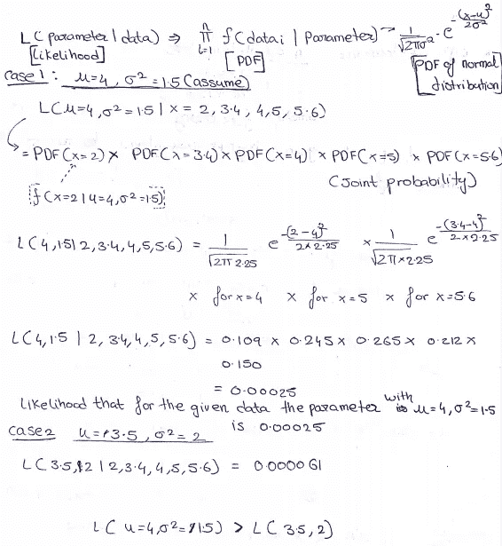

这样，我们可以计算每个假设的可能性，并将其相互比较。这可能会很忙乱，因此我们将通过偏导数来计算μ和σ的最大似然估计。

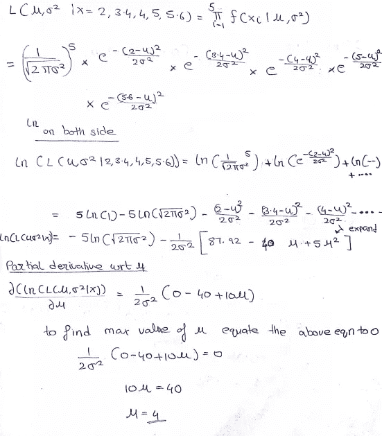

\

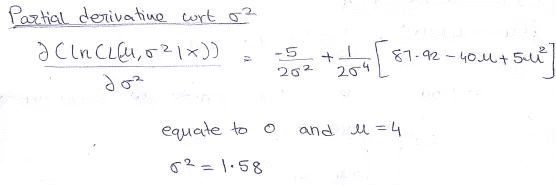

# 线性回归的最大似然估计

最大似然估计(MLE) 方法是一种更通用的方法，本质上是概率性的，不限于线性回归模型。

# 数学直觉

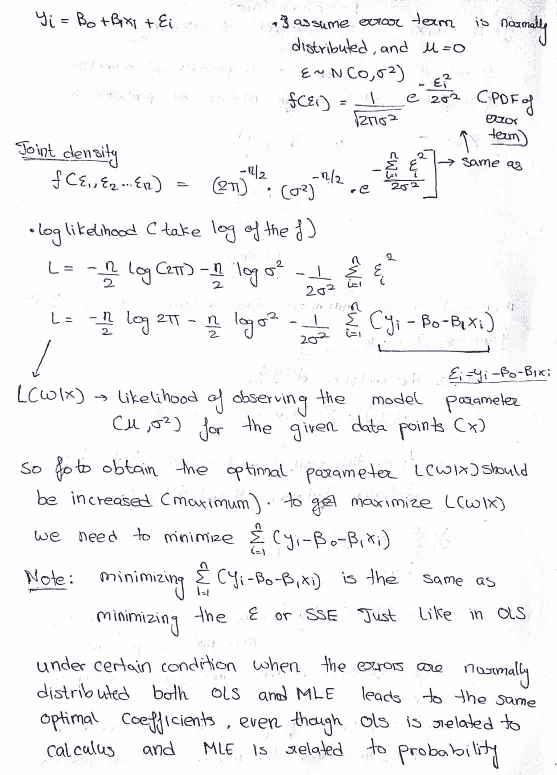

## 极大似然估计

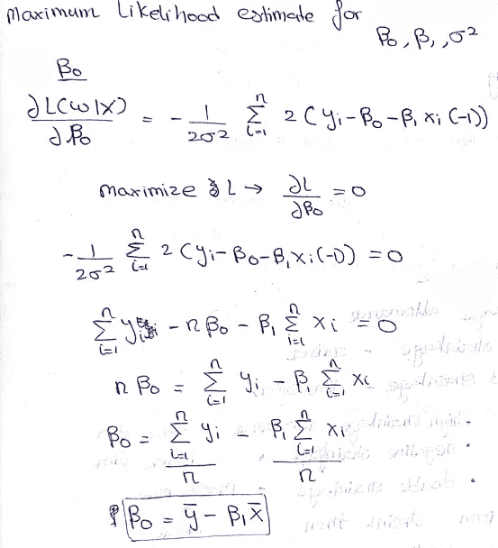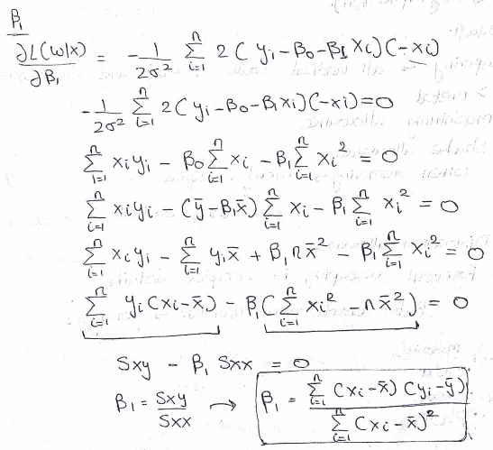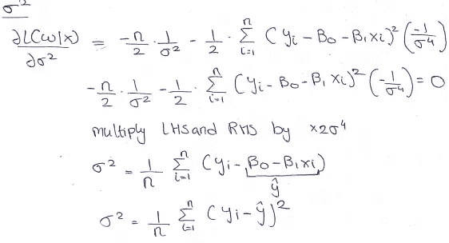

# 梯度下降

梯度下降是一种最小化函数的优化算法。梯度下降通过给参数分配一组初始值来找到局部或全局最小值，然后迭代地保持与函数梯度的负值成比例地改变这些值。

梯度下降迭代地找到模型参数

梯度下降算法通过对模型应用成本函数(SSE)来工作。成本函数用于测量

# 数学直觉

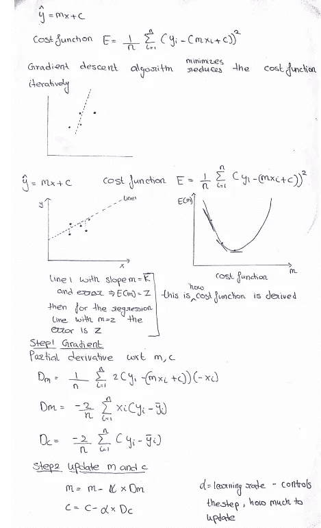

简化了成本函数；c(截距)保持不变。如果有两个独立的特征，那么成本函数将在 4D。

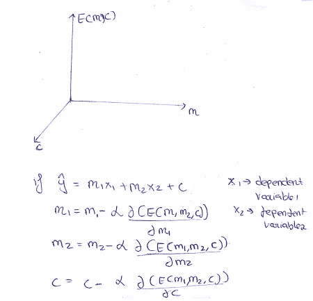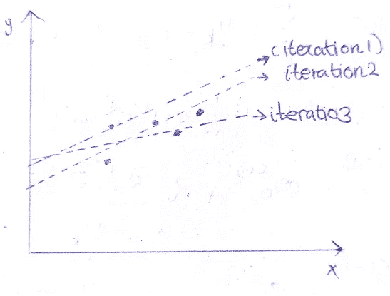

这就是回归线的更新方式。第一行是通过输入随机参数值获得的。

**优势**

*   运行时间为 O(kn)
*   适用于更多功能

**劣势**

*   需要选择合适的学习速率α，如果值太低，那么需要更长的时间收敛，如果值高，就会超调

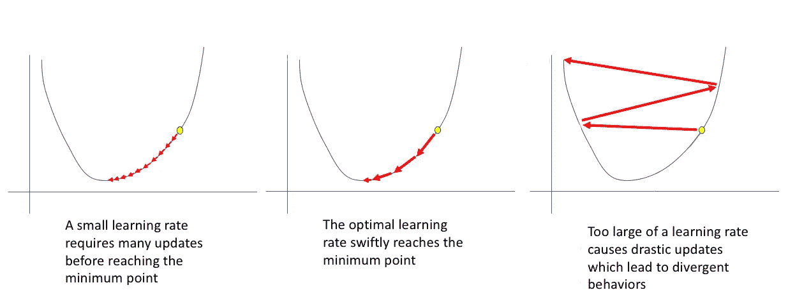

*   需要多次迭代才能收敛。
*   会陷入局部最小值
*   如果没有适当的学习速率 **α** ，那么它可能不会收敛

# 亚当斯方法

ADAM 代表自适应矩估计，是一种优化算法。这是一种迭代算法，适用于噪声数据。

梯度下降的问题是它可能陷入局部最小值或在一条平坦的线上。

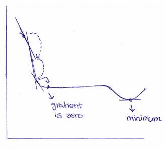

直线处的梯度为零，因此斜率和截距不会更新。使用动量概念，可以解决这个问题，动量是梯度下降的扩展，它在下降方向上建立惯性，以克服平坦线或局部最小值

通过缩放前一位置的合成梯度和动量来计算动量。缩放值(δ)在[0，1]之间

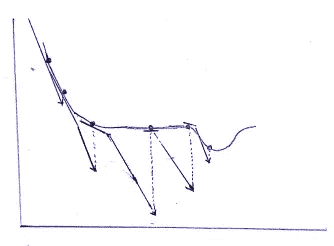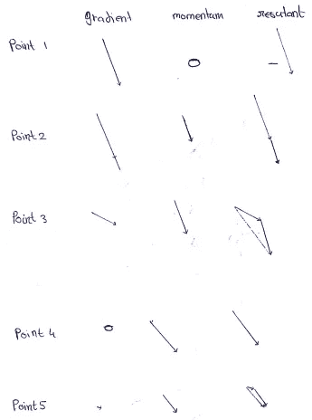

**优点**

*   计算效率高。
*   内存需求小。
*   非常适合数据和参数都很大的问题。
*   适用于非常嘈杂和/或稀疏梯度的问题。

**缺点**

*   对超参数敏感(学习率，δ)

# 回归模型的评估(性能指标)

它用来衡量模型有多好。由于我们预测的是一个连续的量，因此在回归中不能使用精度，因此模型的性能是根据误差来衡量的。如果误差很大，则模型不好

## 均方误差

MSE 是最流行的损失函数。该函数具有凸轮廓并且是可微分的；因此易于优化

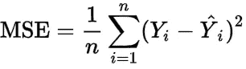

yi-期望值

Ŷi-Predicted 值

当 MSE 被用作损失函数时，它惩罚了由于期望值和预测值的差的平方而导致的模型中的较大误差，使得异常值突出。MSE 测量残差的方差。

## 平均绝对误差

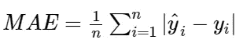

它是目标值和模型预测值之间的绝对差值的平均值。所有的误差都应该在相同的范围内，在有太多异常值的情况下，这是不可取的。MAE 测量残差的平均值

## 均方根误差(RMSE)

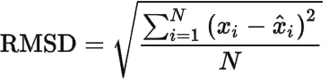

MSE 对于较高的值是高度偏向的。在处理大的误差值时，RMSE 在反映性能方面更好。当首选较低的残值时，RMSE 更有用，单位将与目标中的单位相同，而 MSE 将有单位

由于误差在平均之前被平方，因此 RMSE 对大误差给予相对较高的权重。这意味着与 MAE 相比，当大误差特别不理想时，RMSE 是最有用的。RMSE 测量残差的标准偏差

## 稀有

## Adj R

## 指标之间的差异

*   与平均误差相比，平均误差和 RMSE 用于惩罚较大的误差。但是，与 MSE 相比，RMSE 是首选，因为 RMSE 的单位与目标要素相同。
*   MSE 和 RMSE 是可微函数(MAE 是不可微的)。因此，RMSE 或 MSE 被用作损失函数
*   MAE 对于具有异常值的数据更加健壮

# Python 编码

 [## ma 2932/ML _ 回归算法 _ 线性回归

### 线性回归 Python 教程。通过…为 ma 2932/ML _ regression algorithms _ linear regression 开发做出贡献

github.com](https://github.com/MA2932/ML_RegressionAlgorithms_LinearRegression) 

# **参考文献**

 [## 解线性回归应该用哪些方法？- KDnuggets

### 机器学习学生艾哈迈德·本·沙菲克。线性回归是一种受监督的机器学习算法。它…

www.kdnuggets.com](https://www.kdnuggets.com/2020/09/solving-linear-regression.html) 

感谢您的阅读