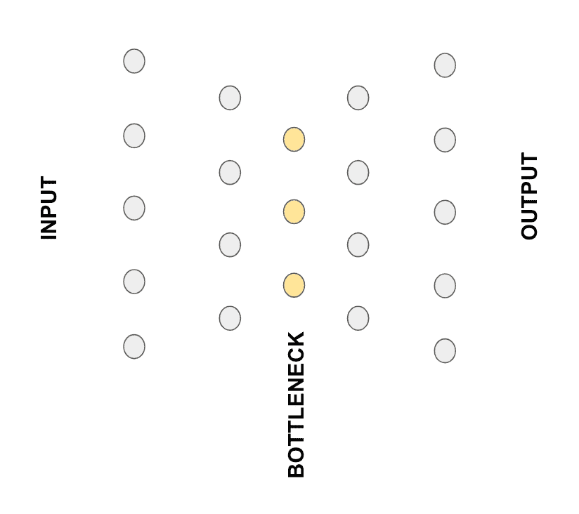
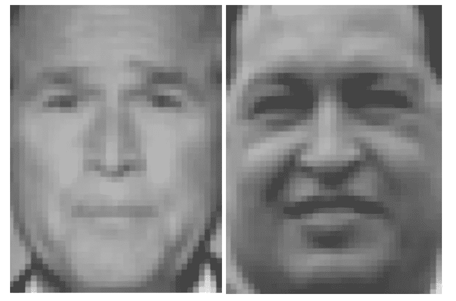
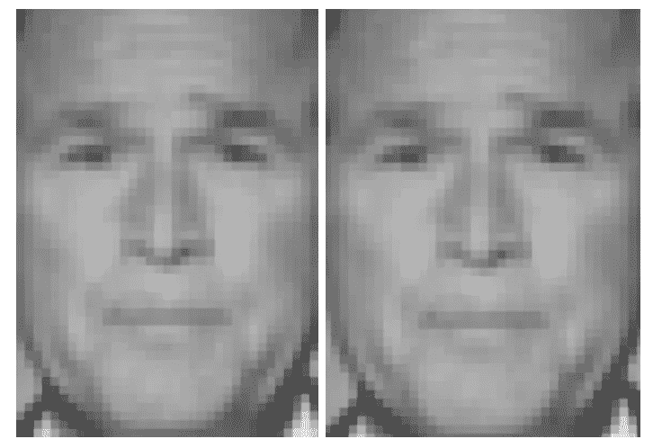
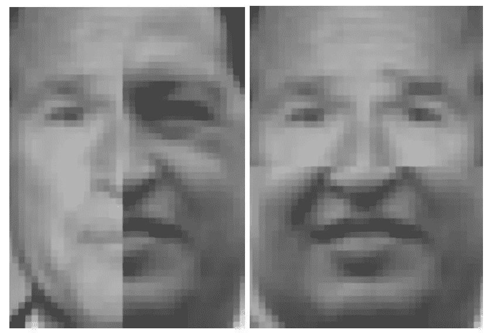
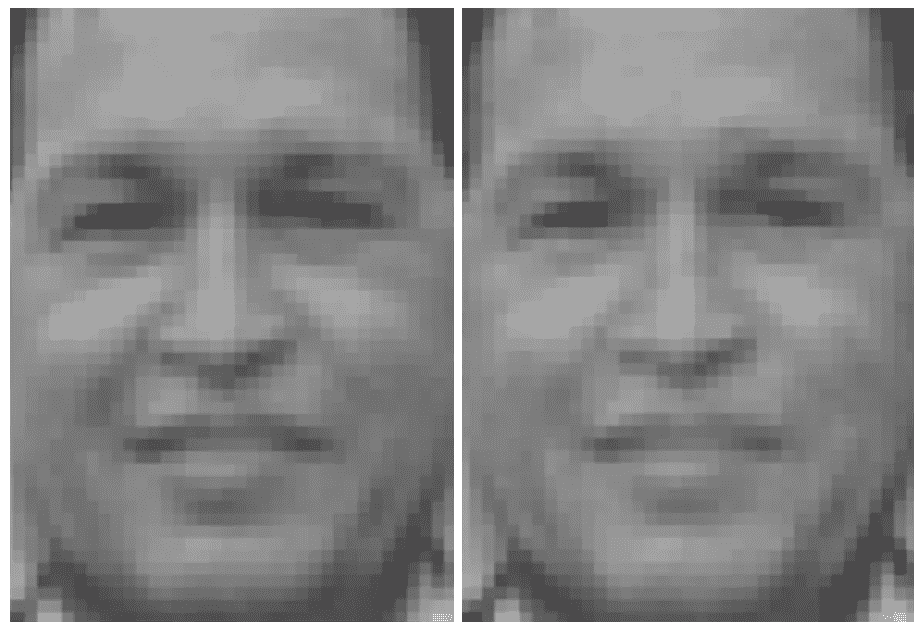

# 机器学习 Zuihitsu-III

> 原文：<https://medium.com/nerd-for-tech/machine-learning-zuihitsu-iii-e36157bc35a?source=collection_archive---------4----------------------->

***融合左翼和右翼政客…用自动编码器***

巴黎@Datategy 数据科学家和机器学习工程师埃伦·云吕博士

大家好。今天，我将向您展示自动编码器的一个简单而有趣的应用。对于第一次听到这个术语的人来说，自动编码器(在神经网络的上下文中；类似的策略可以应用于某些其他统计模型)是将输入数据投影到更小的嵌入向量并将其重建到输入维度的神经网络。因此，在他们的监督训练期间，输入和输出数据是相同的。

它们是最新机器学习的革命性产品，用于去噪、数据压缩、统计分析等等。它们通常有一个*沙漏*结构，其中神经元的数量在每一层逐渐减少，直到*瓶颈*层，然后对称地扩展回来，直到输出。因此，网络迫使最重要的数据内容集中在瓶颈层。因此，每个数据点的瓶颈层的输出可以用作代表性的压缩向量。由于这种结构，网络还消除了附加噪声或无关紧要的统计推断。自动编码器是一个庞大的主题；有数千种不同的版本，如用于计算机视觉的卷积自动编码器(解卷积层用于重建)、序列处理(可以使用 LSTM 单元)或变分自动编码器(生成应用)等。

今天，我将演示一个简单的计算机视觉实验，但将使用常规的多层感知器，而不是卷积层。我们的图像尺寸非常小，因此神经元应该能够捕捉所有类型的关于邻居等的信息。

我们将使用 scikit-learn 中的“野生标记人脸”数据集，其中包含几位政治家的 50x37 灰度面部图像。

在这个实验中，我将只使用两张图片，一张是乔治·w·布什，另一张是雨果·查韦斯。我试图找到这两个家伙最匹配的一对图像，这样他们的姿势和模仿就尽可能地相似和重叠。

因为我们只有两个图像，所以我将尽可能使用最简单的架构。只有一个有 128 个神经元的隐藏层。我们用几十个时期的两幅图像来训练简单的自动编码器模型。让我们看看它如何重塑布什总统的形象。

嗯，它们几乎一样。这暗示我们过度拟合，这对于仅包含 2 个输入数据点的情况是正常的。然而，这并不重要，因为我将要演示的实验并不要求避免过度拟合模型。

我们将纵向和横向剪切和缝合这两位政治家的半幅图像。然后，我们将把它输入到简单的自动编码器中，观察它重建了什么。

我们将这两个切割和缝合图像作为自动编码器的输入。

重建的图像如下:

很奇怪吧？几乎两个重建是相同的。我们这里确实有一个新人:乔治。查韦斯或雨果·布什。我们观察到 128 个神经元和(重建的突触)能够捕捉面部像素的语义插值。我希望这个简单的实验能帮助你理解和挖掘更多关于自动编码器的知识。

[1][https://sci kit-learn . org/stable/modules/generated/sk learn . datasets . fetch _ lfw _ people . html](https://scikit-learn.org/stable/modules/generated/sklearn.datasets.fetch_lfw_people.html)