# 机器学习 Zuihitsu — V

> 原文：<https://medium.com/nerd-for-tech/machine-learning-zuihitsu-v-7947e000d48a?source=collection_archive---------15----------------------->

***用人工智能生成假想的旗帜***

 [## Datategy -下一代企业 AI -

### 我们在我们的网站上使用 cookies，通过记住您的偏好并重复…

datategy.net](https://datategy.net/en/home/) 

发现下一代企业人工智能平台，其中最先进的算法和创新嵌入其 DNA。

巴黎@Datategy 数据科学家和机器学习工程师埃伦·云吕博士

无需谈论生成网络的宣传。到目前为止，凭借变压器支持的巨型 NLP 电机，这些是当前的人工智能中心。不仅仅是技术人员，还有来自不同背景的公民。只要看看 GPT-3 的热潮或主流和社交媒体中的深刻怀旧情绪[1][2]就知道了。

所以，最近我想，把人工智能喂给世界上所有的旗帜来生成“深度假旗”(或者我应该说，“深度假旗”)会是一个不错的主意？).所以，让我们直接进入技术步骤。我使用了两种截然不同(在某些部分几乎截然不同)的方法来解决这个问题；在这里，我将简要介绍每一个:变分自动编码器(VAEs)和深度卷积生成对抗网络(DCGANs)。此外，我分别使用了两个不同的框架，Keras (Tensorflow)和 Pytorch。GAN 是一个较新的、最先进的概念，它基于一个简单而巧妙的想法；然而令人惊讶的是，VAE 给出了更有希望的结果。

**带卷积层的变分自动编码器**

顾名思义，这种架构的基础是自动编码器的概念。我在以前的博客文章[3]中介绍了基于密集神经网络的自动编码器及其广泛的实际应用。然而，变化的自动编码器在处理数据的方式上有细微的差异，这也需要不同类型的神经存储/操作和梯度下降的损失函数。

在特定的约束意义上，我们可以断言 vae 是贝叶斯神经网络(BNNs)的自动编码器架构(其中，在这种情况下，潜在瓶颈特征向量被视为贝叶斯组件)。

我不打算用明确的数学内容来使读者厌烦，但同时它在一定程度上是必要的；因此，我建议这篇简单、解释清楚的博客文章。因此，在不触及其数学基础的情况下，让我们概述一下 VAE 的一般机制。让我们来看看这篇文章中的图表。

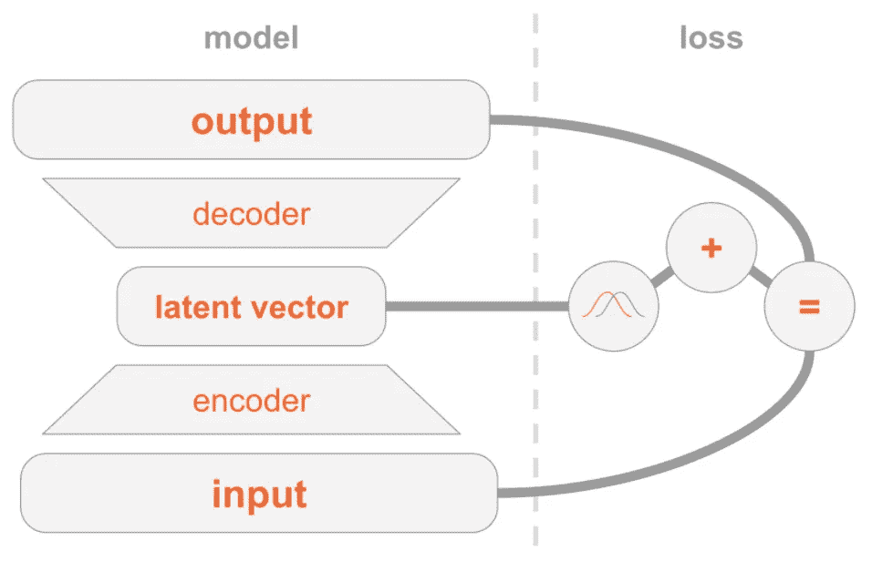

图片鸣谢:约尔·泽尔德斯[4]。正如你所见，VAE 很像一个常规的神经网络自动编码器，理想情况下具有沙漏状结构。输入特征在维度递减的层上传递，直到在瓶颈层上压缩信息；潜在向量。在此之后，对称地，逐渐重构潜在向量以匹配输入。但是，如您所见，VAE 的根本区别在于它对瓶颈向量和网络整体损耗的统计处理。(伪贝叶斯/我更愿意称之为伪贝叶斯。这是一个有争议的话题。但是，基于采样的先验/后验分布的近似值在我看来不适合称为贝叶斯)

当数据到达编码器层末端的潜在向量时，我们切换到统计宇宙，而不是常规神经网络的确定性。现在，我们感兴趣的是建模先验(具有潜在向量实例条件的输入分布)和后验分布(具有给定输入的潜在向量分布)。如前所述，这里很难概括这些程序中使用的所有统计概念，如抽样、ELBO 或辅助分布等。然而，我们可以通过陈述 VAEs 需要一种特殊的损失来完成，其目的是最大化输入数据的分布和辅助分布与原始后验分布的相似性。

那么，对一个常规的、确定性的自动编码器进行这些花哨的升级有什么好处呢？嗯，这是双重的。首先，通过引入非确定性潜在层；我们添加了一个额外的过拟合对策。我们的目标不是学习输入和它在潜在空间中的位置之间的一对一匹配，而是揭示概率过程。这就是赋予 VAEs 生殖能力的原因。第二，通过理解不同类型的输入与其对应的潜在向量的概率匹配，我们可以通过选择原始数据点的潜在向量的稍微不同的值来生成类似的人工数据点。例如，想象我们已经用几个人的脸训练了我们的 VAE。通过向解码器输入某个特定人图像潜在特征的略微近似值，我们可以得到一个非常相似的人造脸。一般来说，对于结构良好的数据集，相似的数据聚集在特定的邻域中；例如，在这个例子中，特定子空间中的金发男性。这使得我们可以有选择地制造金发男性的人造图像。

请注意，编码器和解码器可以是任何类型的神经网络架构，只要我们可以在它们之间产生一个潜在的矢量层。我们可以对图像使用卷积架构，对序列使用递归架构，或者对表格数据使用简单的密集神经网络；你说吧。

好的。我使用了著名的 Keras 示例[5]，通过稍微调整网络架构和参数来获得更有意义的结果。请注意，最重要的区别是，我使用 3 个通道有一个彩色版本，因为你会意识到颜色是非常重要的旗帜:)。此外，过滤器和潜在特征的数量等。编码器和解码器都是启发式选择的。请注意解码器中的转置卷积层。转置卷积层(或反卷积层)允许在 2D 使用可学习的内核升级数据，与常规卷积层的方式非常相反。因此，你甚至可以从 1D 矢量中重建出同样大小的图像。

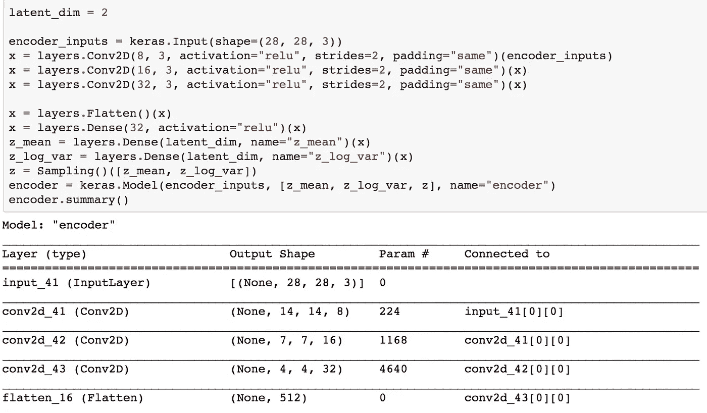

我的编码器架构

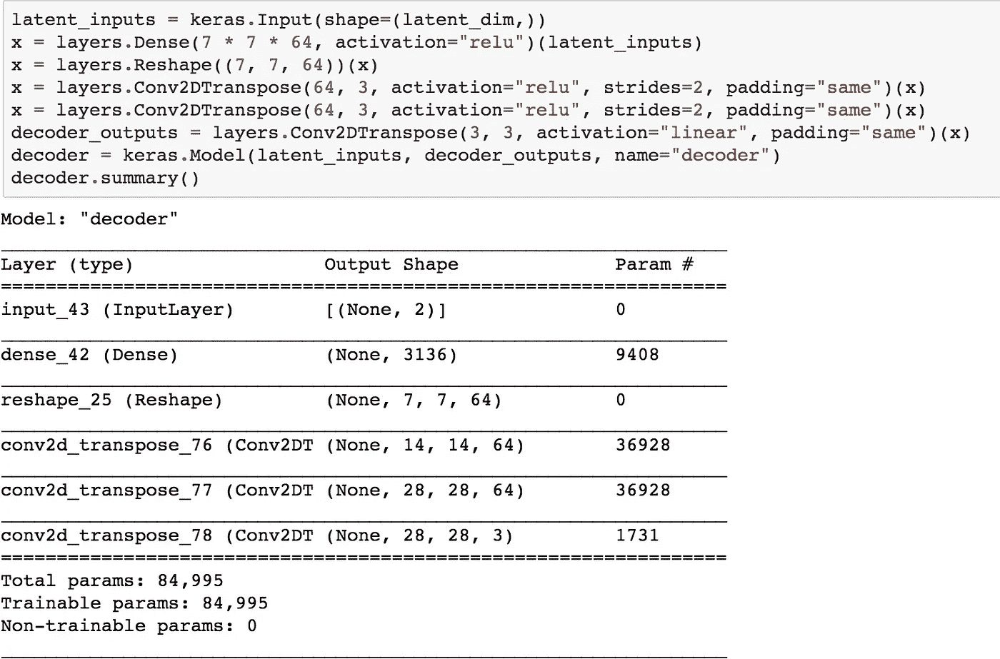

我的解码器架构

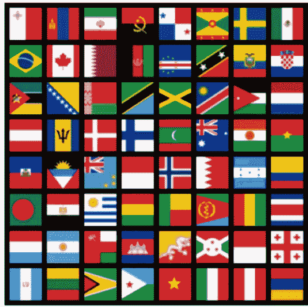

一些我们用于训练的图片。

在第一个时期，我们将有几乎一致的 RGB 值，如下所示:

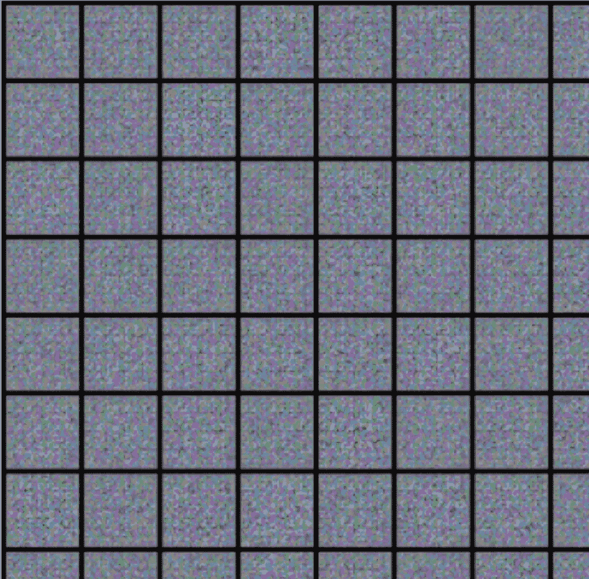

一些在第一纪元结束时产生结果。

然而，随着我们的继续，我们看到某些有意义的模式从随机中浮现出来。看那些美女。他们完全遵循可解释的一致性。例如，我们看到网络开始理解许多旗帜中常见的重复模式，如水平或垂直的三色、三角形或中间有符号的旗帜。

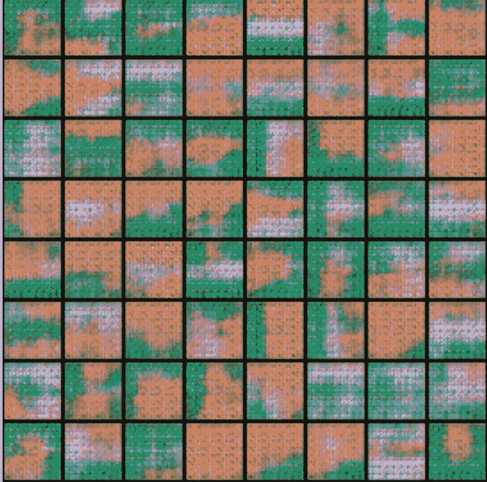

第五纪元末网络产生的人造图像。我们看到网络开始理解许多旗帜中常见的重复图案，如水平或垂直的三色、三角形或中间有符号的旗帜。

嗯，老实说，我对第 100 个纪元结束时的结果有点失望。尽管如此，它们还是很有趣。但是在看它们之前，我应该把这个迷因放在这里。

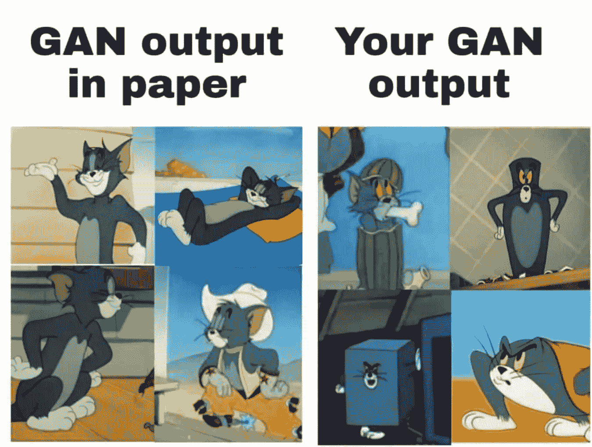

形象信用[6]

让我们来看看用我的 VAE 制作的假国旗的细节。它没有清晰的分辨率，但至少在语义上是可以解释的。它有一个深蓝色和红色的背景(世界旗帜最常见的两种颜色)，上面有一个白色的十字架；各种北欧国家的另一种频繁模式。而且，我们看到 VAE 试图在中间构造一个盾形纹章，这是许多国家国旗的共同特征。

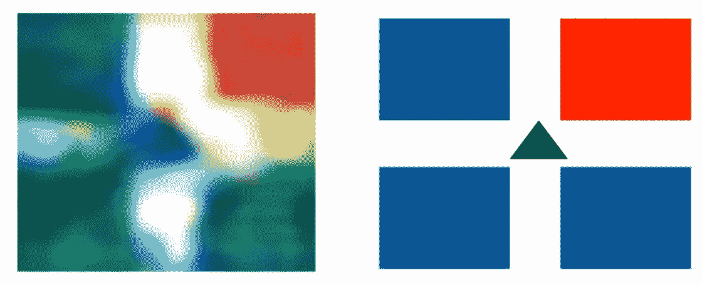

第 100 个训练纪元后生产的假旗。它有深蓝色和红色的背景(世界旗帜最常见的两种颜色)，上面有一个白色的十字架；各种北欧国家的另一种频繁模式。并且，我们看到 VAE 试图在中心建造一个盾形纹章；这是许多国家国旗的共同特征。

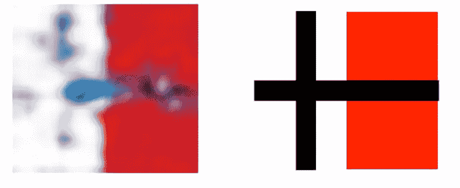

第 100 个训练纪元后生产的假旗。我是这样解释这个输出的:一个垂直的双色白红背景和一个黑色十字。

**深度卷积生成对抗网络**

深度学习大师 Yann LeCun 说..这是 Ian Goodfellow 在蒙特利尔大学与 Yoshua Bengio 一起学习时最初提出的想法(他后来转到了 Google Brain，最近又转到了 OpenAI)。在我看来，这一点，以及现在被提出的变化，是过去 10 年里最有趣的想法。【⑦】。可以肯定的是，我们已经看到了合并敌对计划的想法是多么简单而复杂，而且它在短短几年内就蓬勃发展。正是这种想法使伊恩·古德菲勒和诸如勒村或辛顿之类的名字一起被放在了艾的标记大厅里。

DC-GAN 是 GAN(生成对抗网络)的一种特定变体，它使用卷积层从潜在向量中产生图像，就像我们在 VAE 所做的那样。gan 有两个不同的神经网络，一个称为“生成器”，另一个称为“鉴别器”。中心思想是，在联合训练期间，发生器网络将从随机向量中产生假数据，并且鉴别器将试图对发生器的输出是真的还是假的进行分类；因为我们将向他提供我们的地面真实训练数据集和生成器的结果。因此，我们希望，随着时代的推移，生产者将学会生产越来越多的真正内容，而鉴别者在分类方面越来越好。因此，这是一个对抗性的环境，一个富有成效的竞争。注意，归根结底，我们关心的是发电机输出的质量。因此，我们实际上希望鉴别器变得越来越好，只是为了让我们的发电机逐渐变得更强。

不用说鉴别器，就是一个基本的二元分类器。另一方面，发电机很像我们在 VAE 的解码器。然而，这一次，潜在特征向量不是来自编码数据，而是纯粹随机的。这个想法是将这个随机空间限制到有用的极限，并且还学习神经网络权重，以从这个随机向量构造类似原始的假数据。显然，我们使用复合训练损失，这使得生成器和鉴别器一起变得更好。

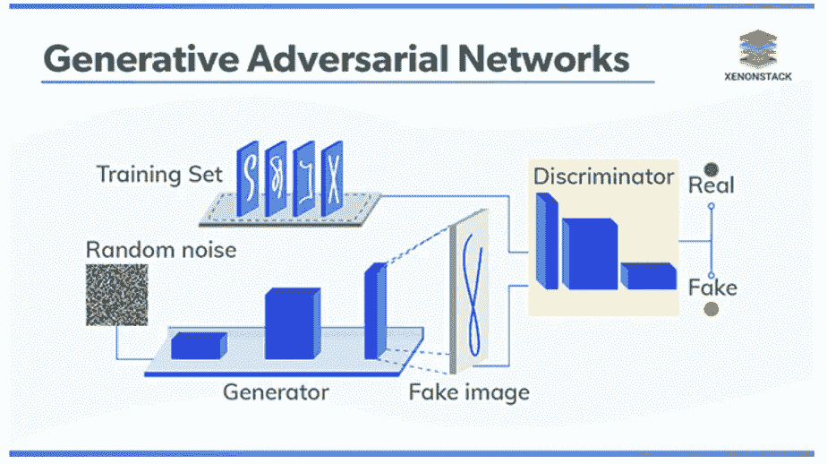

形象信用[8]。GAN 的主要结构。

我使用了这个著名的 PyTorch 教程[9]。至于 VAE，我需要根据我的具体情况调整架构和参数。我就不细说了。这是我的编码器和解码器。

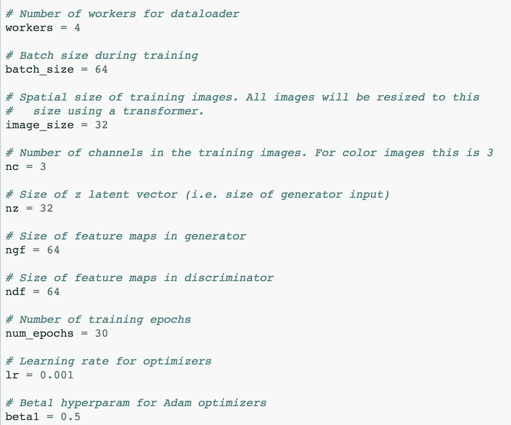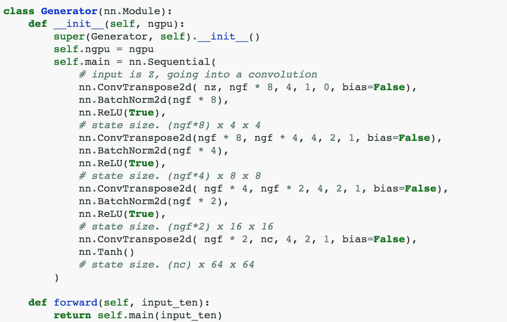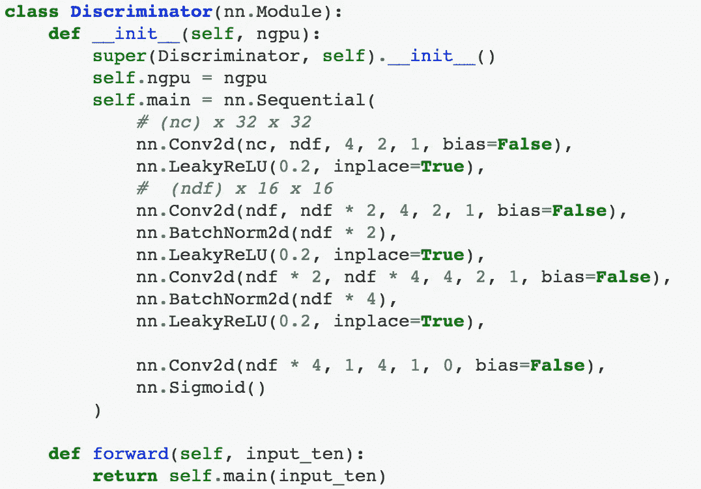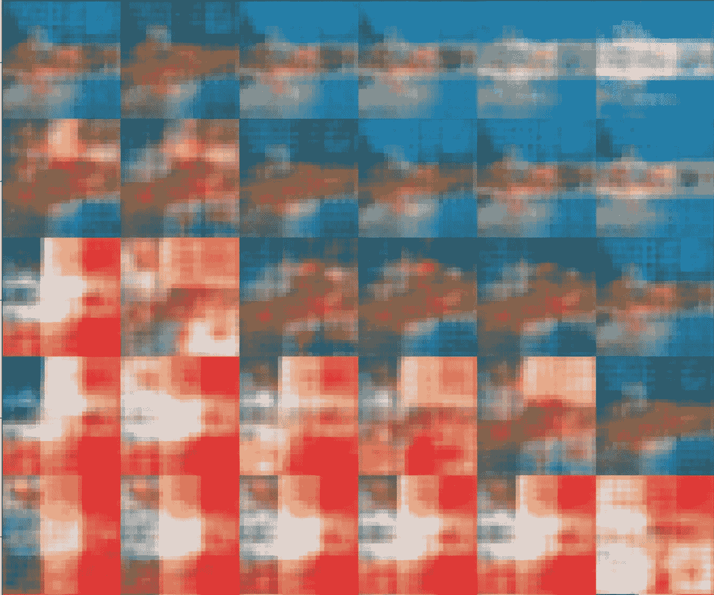

DC-甘结果。毫无疑问，正在经历模式崩溃。我们只能说它在法国(或垂直的三色)和阿根廷(或水平的三色)国旗上太多了。

**关键要点:**

GAN 在生产中实现了最先进的结果，但如果您家中有一台简陋的 PC，对于一个短期的有趣项目来说，VAE 是您的最佳选择。因为 DC 甘更难训练。在 GANs 中，我们试图从完全的随机性中构造出有意义的结果。同时，我们需要同时训练生成器和鉴别器，同时确保其中一个不会超过另一个。这是一种非常微妙的平衡，需要在训练中达到并保持。在线教程给出的参数不仅仅适用于单独的数据集。因此，你需要彻底的实验才能得到合理的结果。

[1]

[https://www . the guardian . com/commentis free/2020/sep/08/robot-written-this-article-GPT-3](https://www.theguardian.com/commentisfree/2020/sep/08/robot-wrote-this-article-gpt-3)

[2]

[https://edition . CNN . com/2021/03/02/business/deep-怀旧-myhertiage-ai-learning-trnd/index . html](https://edition.cnn.com/2021/03/02/business/deep-nostalgia-myhertiage-ai-learning-trnd/index.html)

[3]

[https://medium . com/nerd-for-tech/machine-learning-zuihitsu-iii-e 36157 BC 35a](/nerd-for-tech/machine-learning-zuihitsu-iii-e36157bc35a)

[4]

[https://towards data science . com/variation-auto encoders-explained-6f 9456 ee 030 c](https://towardsdatascience.com/variational-autoencoders-explained-6f9456ee030c)

[5]

[https://keras.io/examples/generative/vae/](https://keras.io/examples/generative/vae/)

[6]

[https://medium . com/ny bles/understanding-machine-learning-through-memes-4580 b 67527 BF](/nybles/understanding-machine-learning-through-memes-4580b67527bf)

[7]

[https://www . kdnugges . com/2016/08/yann-le Cun-quora-session . html](https://www.kdnuggets.com/2016/08/yann-lecun-quora-session.html)

[8]

[https://www . xenon stack . com/insights/generative-adversarial-networks/](https://www.xenonstack.com/insights/generative-adversarial-networks/)

[9]

[https://github . com/py torch/tutorials/blob/master/beginner _ source/dcgan _ faces _ tutorial . py](https://github.com/pytorch/tutorials/blob/master/beginner_source/dcgan_faces_tutorial.py)