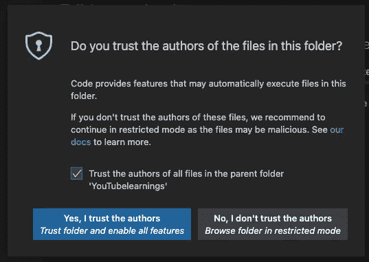
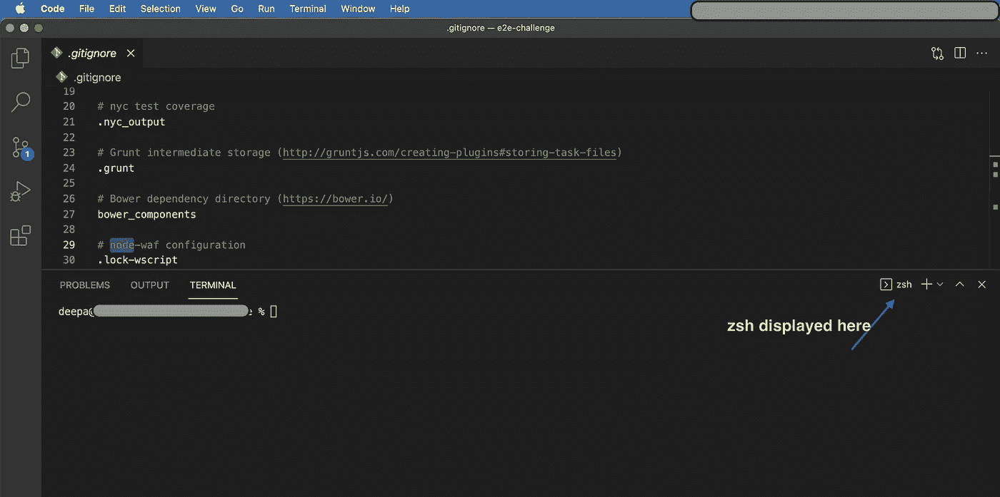

# VScode 中找不到 MacOS Big Sur — zsh 命令

> 原文：<https://medium.com/nerd-for-tech/macos-big-sur-zsh-command-not-found-in-vscode-f10ed18f4967?source=collection_archive---------8----------------------->

如何解决这个问题？

这个超级简单。

转到您的 Mac 终端，运行以下命令:

```
~ % which code
~ % code .  // don't forget the dot after "code"
```

如果 VSCode 可以访问所有文件夹，新窗口将打开，并显示 VSCode 提示。选择“是”。你完了。再次重新启动 VSCode，现在尝试 Ctrl + ~启动一个新的 zsh 终端。Tada！你完了！没必要去 settings.json 瞎折腾。



注:这是我升级到 MacOS Big Sur 后发现的修复。在我升级操作系统之前，VSCode 就已经开始工作了。

