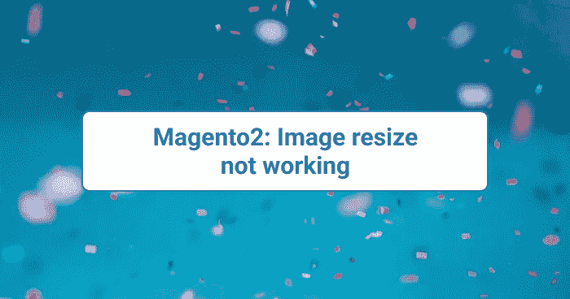

# Magento2:图像大小调整不起作用

> 原文：<https://medium.com/nerd-for-tech/magento2-image-resize-not-working-desssigner-in-aryan-srivastava-9981c2c55541?source=collection_archive---------2----------------------->



Magento2:图像大小调整不起作用

从管理员创建产品时，产品图像存储在缓存中。有时，在添加或更新产品时，由于缓存，映像无法正常工作。

你可以试试下面的步骤，我希望它一定会对你有用:

1.  进入***pub/media/catalog/product***文件夹，你会看到文件夹。
2.  重命名 ***缓存*** 文件夹。(例如。cache-、cache_bkp 等)
3.  通过执行以下命令创建调整大小的产品图像

```
php bin/magento indexer:reset 
php bin/magento indexer:reindex 
php bin/magento catalog:images:resize 
php bin/magento cache:flush
```

**注意:** *如果仍有问题，请检查* ***pub，var 的文件权限，生成*** *文件夹，然后尝试以上所有步骤。*

希望这篇文章对你有帮助。如果您有任何疑问，您可以直接发电子邮件至[](mailto:aryansrivastavadesssigner@gmail.com)**询问我，或在此 联系我 [**。**](https://desssigner.in/contact/)**

**如果你想要一个现场会议，请直接在 LinkedIn 上联系我，我会在周末安排一个在线会议。**

***原载于 2022 年 3 月 30 日*[*https://desssigner . in*](https://desssigner.in/magento2-image-resize-not-working/)*。***