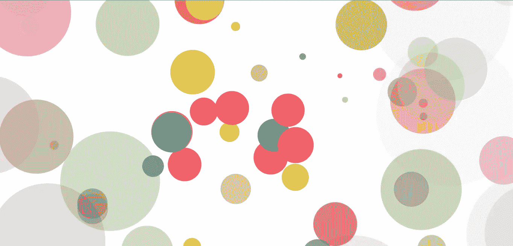
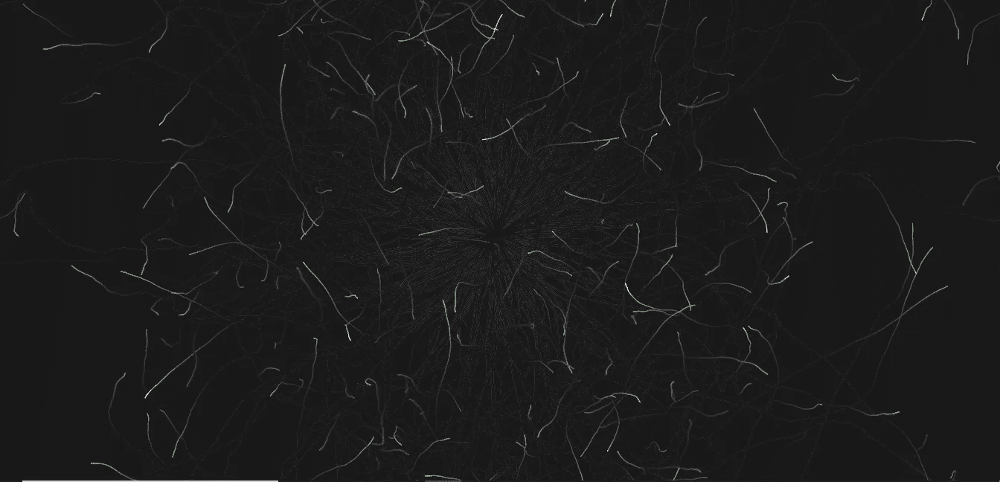
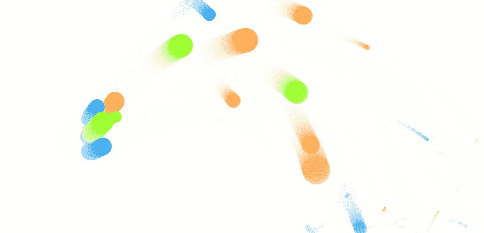

# 神奇的反应组件，提供特殊的移动粒子的背景

> 原文：<https://medium.com/nerd-for-tech/magical-react-component-that-provides-exceptional-moving-particles-background-ac4a51af735?source=collection_archive---------15----------------------->


移动圆圈



喷泉球



移动彩色线条



移动球

> 这是几个以移动粒子为背景的例子，但是一旦你看到它们，它们看起来甚至更吸引人，用它们创造的美丽效果吸引你的注意力。

点击观看现场演示[。](https://react-a6pm3w.stackblitz.io/)

看到了吗？背景中的魔法！

现在[再次打开这个链接](https://react-a6pm3w.stackblitz.io/)。这是带你去现场演示的同一个链接。

嗯，我猜你这次得到了不同的 bg 效应。**试着一次又一次地打开同一个链接，看看会发生什么。**

# 以下是你可以做到的

在控制台中打开你的 *react-project 文件夹*。

## 安装软件包

```
npm install --save particles-bg
```

## 如何在项目中使用？

这很简单:

```
import ParticlesBg from 'particles-bg'
.
.
.
.
.
.

return(
<>
  <ParticlesBg type="circle" bg={true} />
</>
) 
```

您可以试验并使用下面提到的不同的 ***类型*** 值

## 类型值

```
"color"
"ball"
"lines"
"thick"
"circle"
"cobweb"
"polygon"
"square"
"tadpole"
"fountain"
"random"
"custom"
```

早先我让你 ***反复打开那个相同的链接*** 是因为每次你打开那个链接，它都会随机显示一个*类型的粒子。*

*如果你注意到， ***bg*** 属性被设置为 ***true。*** 后面那个 ***真:****

```
*position: "absolute",
zIndex: -1,
top: 0,
left: 0*
```

*您可以通过用您自己的值传递对象来调整背景，如下所示:*

```
*bg={{
  position: "",
  zIndex: ,
  width: 
}} />*
```

*有趣的是，你甚至可以自定义你自己的粒子，但是可能会有点乱。如果你还想这样做，你可以这样做:*

*设置 ***类型= "自定义"****

*添加新属性***config = { value }****

*将您定制的粒子设置为 ***值*** ，这些粒子将被传递到***配置*** *。**

```
*let value= {
      num: [4, 7],
      rps: 0.1,
      radius: [5, 40],
      life: [1.5, 3],
      v: [2, 3],
      tha: [-40, 40],
      // body: "./img/icon.png", // Whether to render pictures
      // rotate: [0, 20],
      alpha: [0.6, 0],
      scale: [1, 0.1],
      position: "center", // all or center or {x:1,y:1,width:100,height:100}
      color: ["random", "#ff0000"],
      cross: "dead", // cross or bround
      random: 15,  // or null,
      g: 5,    // gravity
      // f: [2, -1], // force
      onParticleUpdate: (ctx, particle) => {
          ctx.beginPath();
          ctx.rect(particle.p.x, particle.p.y, particle.radius * 2, particle.radius * 2);
          ctx.fillStyle = particle.color;
          ctx.fill();
          ctx.closePath();
      }
    };
.
.
.
.
.
return(<ParticlesBg type="custom" config={config} bg={true} />)*
```

*如果你觉得有帮助，请留下评论。下次见！*