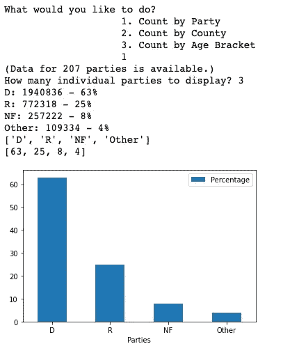
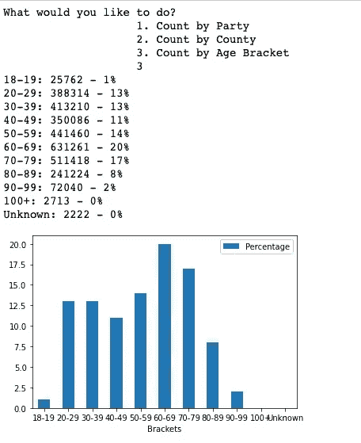

# 邮寄投票请求

> 原文：<https://medium.com/nerd-for-tech/mail-in-ballot-requests-8112e34b0650?source=collection_archive---------22----------------------->

Joshua Woroniecki 在 [Unsplash](https://unsplash.com/s/photos/mail-voting?utm_source=unsplash&utm_medium=referral&utm_content=creditCopyText) 上的照片

一旦我在 Coursera 上完成了我的第一个 Python 专门化，我想稍微活动一下肌肉。([点击这里查看 GitHub 上的项目](https://github.com/mpechter/ballot_requests))。)这是在 2021 年 4 月，但 2020 年大选的动荡及其后果令人感到新鲜(在许多方面，它仍然如此)。当我在 **Open Data Philly** 和 **Open Data PA** 中搜索数据集时， [PA 邮寄投票请求](https://data.pa.gov/Government-Efficiency-Citizen-Engagement/2020-General-Election-Mail-Ballot-Requests-Departm/mcba-yywm)引起了我的注意。

看到数据是 JSON 格式的，我开始做以下工作:

*   **使用 urllib 下载数据。**
*   **清理数据并将其移动到本地 SQLite 数据库中。**
*   **使用熊猫分析数据并展示见解。**

**检索**

我的存储库中的一个程序检索、清理和存储数据。一个有趣的部分处理检索选民的年龄。

由于隐私问题，一些用户掩盖了他们的日期，显示他们的出生日期是 1800 年 1 月 1 日。这是那一部分:

程序的一部分，用于处理稍微有点混乱的数据报信息。

如果`int_dob == 1800`，我将年龄段设为“未知”(第 13–14 行)。

此外，在第 16 行的`else`语句中，您还可以看到一个处理来自 100 岁以上老人的请求的策略。因为我假设不会有很多这样的请求(更别说 110 多岁的人了)，所以我把他们的括号定为“100+”(第 22-23 行)。

**分析**

存储库中的第二个程序从本地 SQLite 文件中检索数据，并根据用户的选择返回见解。我做的第一个功能是`count_by_Party()`。它查看数据库并报告缔约方的投票请求。

我尝试的一种技术是让列表和字典携带相同的信息。`parties_dic`是我存储每一方的请求数量的地方，而`parties_list`只是存储每一方的名字。

有了这两者，我就可以轻松地用`parties_list`遍历各方，以便访问`parties_dic`中的数据(第 24–29 行)。可能有更好的方法来做到这一点，但现在，它似乎给你两种数据结构的优势。

**显示数据**

当您运行不同的选项来查看数据时，您最终得到了这些熊猫图:

按交易方列出的请求，显示三方。

按县排列的请求，显示五个县。

按年龄段划分的请求。

**见解**

需要更多的分析才能得出可靠的结论。显然，民主党选民倾向于使用邮寄选票，并且 60-69 岁年龄段的人提出的要求比例最高。但是，如果不将这些与更广泛的 PA 总数和分布进行比较，它们并不能告诉我们整个故事。

在 PA 中，民主党人数超过共和党，在得出民主党倾向于邮寄选票的结论之前，必须考虑到这一点。2020 年 10 月，民主党代表了宾夕法尼亚州所有注册选民的 47%，但他们代表了宾夕法尼亚州所有邮寄选票请求的 63%——显然那里发生了一些事情。右翼媒体发起的大规模误传运动可能与此有关。)

虽然我没有深入研究这个问题，但我的策略是进行更彻底分析的一条途径。

**漫长而曲折的道路**

这里有一个更简单的方法来得到结果。Open Data PA 网站使用的是 [Socrata API](https://dev.socrata.com/foundry/data.pa.gov/mcba-yywm) ，我可以很容易地通过它来检索我想要的信息。我在项目早期就知道这一点，但我想用 urllib、SQL 和 Pandas 来测试我的技能。我想要挑战，而且我确实得到了挑战！