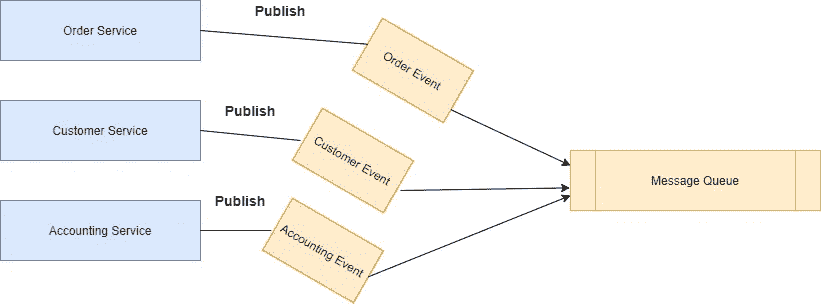
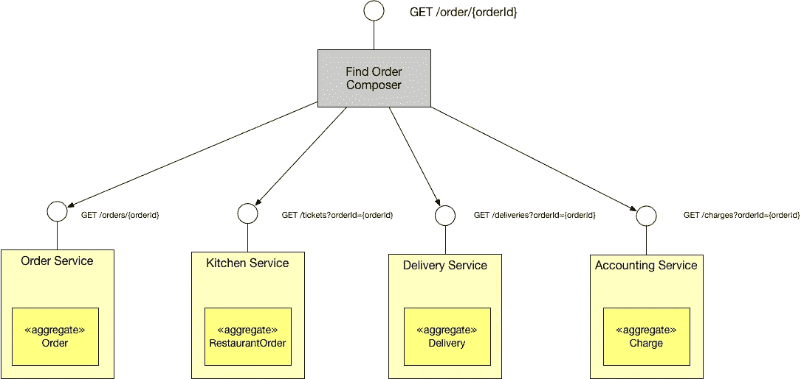
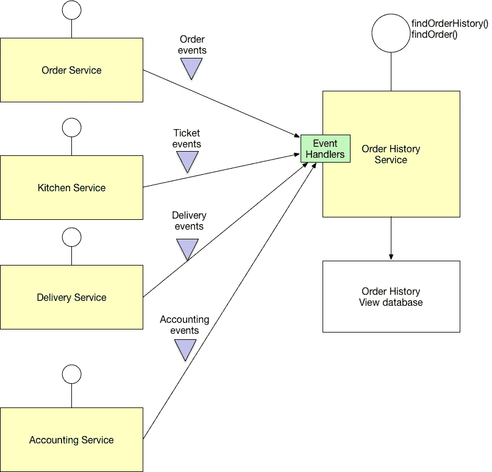

# 使用 Kafka 跨多个微服务进行实时查询

> 原文：<https://medium.com/nerd-for-tech/make-a-real-time-query-across-multiple-microservices-using-kafka-ecd46d651acd?source=collection_archive---------0----------------------->

我们的主要问题是，当涉及每个服务的数据库并且共享数据库不是一个选项时，如何在微服务架构中实现从多个服务检索数据的查询？

在微服务架构中，每个服务都彼此独立工作，拥有自己的数据库，并使用消息传递和一些模式进行通信，以处理数据和事务问题，如 Saga，但如果我需要跨多个服务进行即席查询，该怎么办呢，如下图所示，我们有 3 个服务，如果发生了什么，每个服务都会发布一个事件

例如，我们需要查询与订单和付款状态等相关的客户数据，我们可以用不同的方式解决这个问题，我们将解释它，但我将更多地关注 Kafka 解决方案。

**API 组合模式**

这种模式通过调用拥有的服务并组合结果来实现查询操作，例如通过 id 查找订单，组合器将调用订单服务来获取订单的基本细节，调用会计服务来获取支付状态等，并将结果组合到订单状态模型或类似的东西中。但是当使用这种模式时，尽管这种模式是在微服务架构中实现查询的一种简单而直观的方式，但是您必须解决几个设计问题

*   决定您架构中的哪个组件是 API composer 可能是前端应用程序或 API 网关
*   如何编写高效的聚合逻辑可能需要更长的时间
*   延迟情况，因为您通过不同的网络调用多个服务，所以存在可用性降低和开销增加的风险

**命令查询责任分离(CQRS)**

不要通过 API 组合从多个服务中查询数据，而是使用事件来维护从服务中复制数据的只读视图数据库。让我们回到 API 组合，因为它是一种从多个服务查询直接数据的简单方法，但实际上，当查询更复杂的数据查询(如订单历史记录和应用一些过滤标准、分页等)时，它并不那么容易，因为不是所有的服务都存储所有用于过滤或排序的属性，因此最终会导致组合器查询大量数据并在内存中过滤和连接。

CQRS 是关于关注点分离的，它被分解成一个持久的数据模型，模块分为两个部分:命令端和查询端。我们可以定义一个只读数据存储，它将来自多个服务的数据进行合并，并通过订阅来自多个服务的已发布事件和更新历史数据库来同步和更新数据

所以我们不调用多个服务，而是调用订单历史服务，在查询问题中应用 CQRS 的好处

*   支持在微服务中高效实现查询
*   支持不同查询的有效实现，并使基于事件源的应用程序中的查询成为可能。
*   改善关注点的分离。

但是它也有明显的缺点

*   像 API 组合这样的实现并不容易
*   处理复制滞后。

**使用 Kafka 流实时查询多个微服务**

Apache Kafka 是一个开源的分布式事件流平台，被数千家公司用于高性能数据管道和流分析。Kafka 是一个消费者-生产者模型事件日志，生产者将消息发布到 Kafka 单元中，称为 topic，消费者查看主题日志，并从最后使用的偏移量开始使用消息，因为每个消费者都可以通过消费者组组成最后使用的偏移量，因此如果消费者应用程序停机一段时间，它可以从最后提交的偏移量开始获取消息，直到变为最新。Kafka 通过可配置的保留策略提供了数据持久性，这意味着您可以根据需要短期/长期保留数据。Kafka 还提供了 3 种消息等幂模型

*   至少一次，以便使用者可以通过配置 auto 多次使用消息。commit 等于 false 并处理手动提交，这样，如果业务用例成功完成，我们就可以提交消息，否则，您可以在修复问题并重新启动服务后再次收到消息。
*   最多自动一次。提交就像许多消息总线一样真实
*   正好一次，你也可以收到一个特定的信息，它是分区和偏移量由消费者寻找 API。

Kafka Streams 是一个用于构建应用程序和微服务的客户端库，其中的输入和输出数据存储在 Apache Kafka 集群中。它结合了在客户端编写和部署标准 Java 和 Scala 应用程序的简单性和 Kafka 服务器端集群技术的优势。Kafka 流提供了许多无状态 API，如过滤器、映射等。Kafka 还提供了有状态流 API，如 SQL DB inner、left、outer join 和 grouping、count、aggregate 等，可以帮助我们跨多个主题进行连接和有状态操作。

回到主要问题，我们需要从多个服务中查询数据，如“通过他的 ID 查找订单”API，涉及从订单、支付、交付服务等获取数据，让我们假设我们正在我们的微服务架构上使用 Kafka 来处理事件，因此我们将有以下主题(订单、会计、交付),每个服务拥有 Kafka 主题来发布更新，其他服务可以使用 Kafka 的更新。因此，我们可以使用 Kafka steam 服务，而不是创建一个只读数据库，该服务使用消息分区键在彼此之间的实时连接中流式传输主题。

Kafka 流客户端在许多编程语言中可用，但不幸的是，并非所有 K-stream 客户端库都是活动的只有 java、scala 和 JVM 语言是活动的，因为 Kafka 在 JVM 中编写，所以所有 API 功能在 java one 上都可用，但其他客户端也提供良好的客户端。

因此，在流服务中，我们必须定义以下流

*   订单流将在具有关键订单 Id 的订单主题上构建流
*   在具有关键订单 Id 的会计主题之上具有构建流的会计流
*   构建流位于具有关键订单 Id 的交付主题之上的交付流

我们可以使用 join stateful API 通过键连接所有这些流，我们可以将值 joiner 或结果映射到由我们需要的数据组成的新模型中，然后我们可以使用“to”功能将结果自动发布到另一个 Kafka 主题，该主题可以由查询实时服务或订单历史服务使用，如 CQRS 解释中所示。

此外，我们可以使用 Kafka 表并将其与流连接，例如获取与订单相关的客户或产品数据。我们可以将客户视为 Kafka 表或全局 k 表，并将其与流订单连接，并在订单对象中使用客户 Id 进行连接。

Kafka 中的表现在更像是 RDBMS 物化视图，而不是 RDBMS 表，因为它依赖于在其他地方进行的更改，而不是自身可直接更新)。然而，从事件流的角度来看，表也是一个聚合流。K 表在所有正在运行的 Kafka Streams 实例之间共享数据，而全局 K 表拥有每个实例上所有数据的完整副本。全局 K 表的缺点是它显然需要更多的内存。优点是，您可以使用流中的非键属性进行 KStream-GlobalKTable 连接。对于 KStream-KTable 连接和连接的非键流属性，只有在进行连接之前提取连接属性并将其设置为键，才是可能的——这将导致在计算连接之前对流进行重新分区。

所以使用 Kafka 来查询多个微服务是合适的

*   支持高效查询，因为 Kafka stream 提供了许多有状态和无状态的 API，如 RDBMS
*   Kafka 流 API 提供动态更改流的数据键，您可以更改分区键来匹配与另一个流或表的连接。
*   实时查询
*   在基于事件源的微服务中是高效的，因为您可以通过 Kafka 表拥有一个状态存储。
*   可扩展和容错，能够处理大数据

但是它也有明显的缺点

*   这很复杂
*   您也可能面临复制延迟，这取决于网络