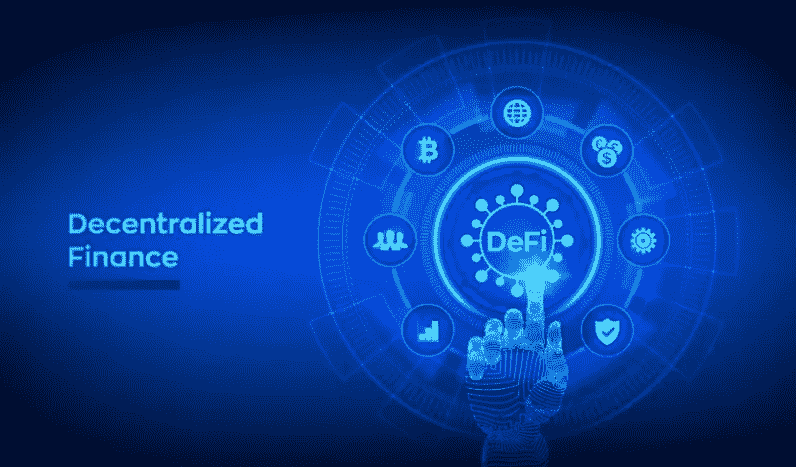

# 用 DeFi 借贷平台做一个加密金融家的声明！

> 原文：<https://medium.com/nerd-for-tech/make-a-statement-as-a-crypto-financier-with-a-defi-lending-and-borrowing-platform-2e83b53e3824?source=collection_archive---------15----------------------->

从很久以前开始，借贷就已经成为最受欢迎的金融业务。该系统随着时间的推移而发展，今天，我们仍然在很大程度上利用来自工业革命(工业 1.0)的**银行运营模式**进行融资。诈骗、抢劫、繁琐的中介过程和高额费用等问题都与传统银行业背道而驰。时代在变，较弱的东西会被忽略，这对于金融来说也是一样，因为一种新的金融模式正在崛起，挑战中央集权的金融世界。

DeFi 贷款和借款

当我们谈论这一切的时候，分散金融(DeFi)作为**区块链世界**的帮凶，为**加密世界**管理金融系统，因其运行 DeFi 贷款服务和解决方案的能力而变得越来越受欢迎。在这里，我们将更多地关注受密码持有者和交易者欢迎的 [**DeFi 借贷平台**](https://bit.ly/3AuGLr2) 。

> 什么是德富借贷平台？
> 
> DeFi 借贷平台是人们可以通过**点对点(P2P)** 模式借出 [**加密货币**](https://en.wikipedia.org/wiki/Cryptocurrency) 并稳定收益的平台。就像法定货币一样，加密代币如果放在钱包里闲置，就没有任何用处。虽然投机交易可能会给持有它们提供一个理由，但投机水平必然会根据市场趋势而变化，而且并不是每次都有结果。
> 
> cryptos 的受欢迎程度已经达到了人们希望通过这些平台获得加密贷款的程度。希望获得被动收入的密码持有者可以将其持有的密码投资于这些平台并赚取利息，所有这些都将使他们获利。**支持 DeFi 分散借贷的顶级平台有 Maker、**[**【Aave】**](https://aave.com/)**[**Compound**](https://compound.finance/)**[**InstaDapp**](https://instadapp.io/)****Alpha Homora****。********

# ****DeFi 借贷平台的工作流程****

*   ****用户(贷款人/借款人)注册 DeFi 借贷平台。****
*   ****贷方将其持有的**(法定/加密)**存放在平台上的流动性池中。****
*   ****通过设计定制贷款协议的智能合同，借款人与贷款人相匹配。****
*   ****借款人提供**加密资产**作为抵押品，其价值通常高于借款金额。这里的一个优点是，这种超级抵押比出售这些资产要好。****
*   ****在通过智能合同批准贷款后，借款人应该连本带利偿还贷款，利息归贷款人所有，并收取少量维护费用。****
*   ****在完全支付贷款金额和利息后，借款人可以取回他们的抵押品，智能合同终止，尽管所有交易永远存在于区块链上。****

# ****为什么要选择分散式借贷和 DeFi 借贷？****

****在 **NFT 繁荣时期**，随着许多人步入 **Web3 世界**，分散式借贷和 DeFi 解决方案变得流行起来，一些敢于冒险的投资者出于多种原因迅速需要额外的资金。以下是 [**DeFi lending 解决方案和服务**](https://bit.ly/3AuGLr2) 从用户端角度的一些优势:****

*   ****贷款业务的高透明度****
*   ****利率和抵押品的有效定价****
*   ****世界各地的任何人都可以随时访问****
*   ****区块链完成的快速交易****
*   ****分散分类帐中存储的不可篡改的记录****
*   ****没有审查，因为改变记录的数据是不可能的****
*   ****投资成本低，任何人都可以成为贷款人****
*   ****由区块链技术辅助的全自动过程****
*   ****通过自动智能合约进行的资金总托管****
*   ****有预防措施的保证金交易设施****

# ****DeFi 借贷应用程序的业务优势****

*   ****平台内部的每一个流程都极其透明。****
*   ******资产(流动性/抵押品)**可轻松获取。****
*   ****这些平台提高了灵活性、实用性和速度。****
*   ****定价结构是有效的，并且可以变化。****
*   ****消除了对中央权威的需要。****

# ****最终光线****

****DeFi 借贷平台已经在现代的 Web3 领域变得流行起来。这些平台致力于改革传统金融机构的缺点，通过自动化拯救实现点对点金融。他们还考虑到了加密市场的不稳定性，这种不稳定性表现在超抵押协议上。随着加密货币的日益普及，预计借贷将在 Web3 世界变得越来越重要。如果你想用 DeFi 开发一个基于分散借贷的解决方案，有几家公司凭借他们的 Web3 经验掌握了这个过程。****