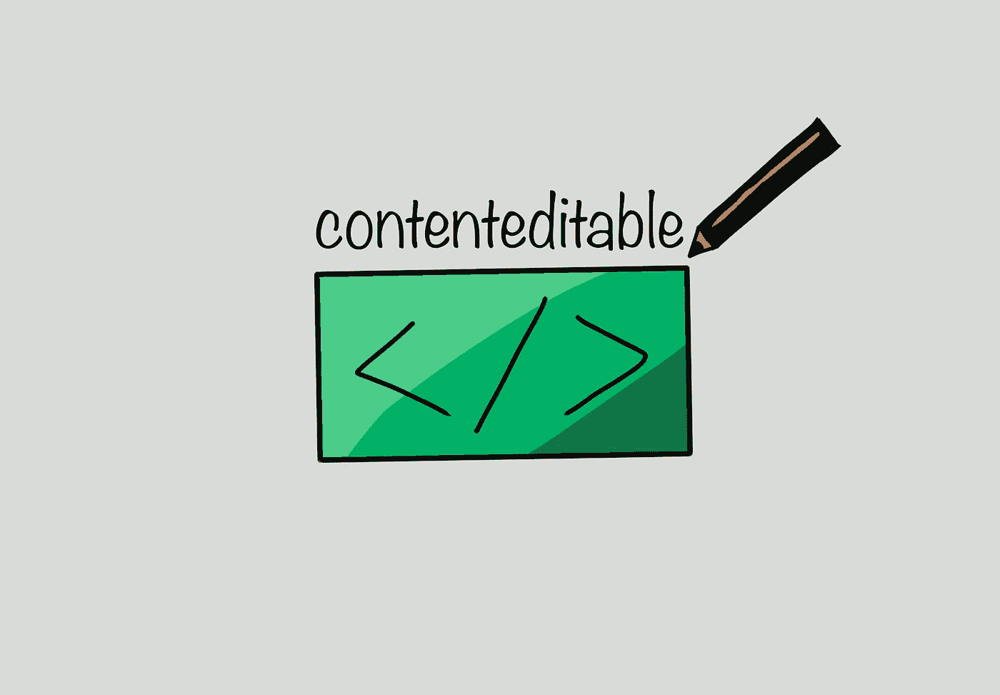

# 使任何元素文本可随内容更改可编辑

> 原文：<https://medium.com/nerd-for-tech/make-any-element-text-changeable-with-contenteditable-274769ff70f9?source=collection_archive---------5----------------------->

不久前，当我试图找到一种构建所见即所得的方法时，我发现了 [contenteditable](https://developer.mozilla.org/en-US/docs/Web/HTML/Global_attributes/contenteditable) 属性。

简单地说，向任何 HTML 元素添加 contenteditable 属性都允许您编辑该元素的内容。在浏览器和元素支持的范围内。例如，编辑一个按钮最多也是错误的。

通过这样做，您可以允许高级编辑功能、上下文菜单等，其中简单的输入元素仅允许您将整个文本内容作为一个元素进行样式化或与之交互。

我在试用现代所见即所得编辑器 [TipTap](https://tiptap.dev/) 时遇到了这个问题。我希望能够为我的[日文应用](https://japapps.com)内嵌编辑< ruby >标签。

有了 contenteditable 属性，我甚至不需要使用 TipTap，普通的 HTML 就可以了。

前几天，我想为我制作的一个视频生成一些快速提示，我再次求助于这个属性。

编辑带内容的样式文本可编辑

你可以在 [GitHub](https://github.com/ddikman/text-prompt) 或者[上找到完整的(微小的)源代码，试试这里](https://ddikman.github.io/text-prompt/)。

关于你可以用这个做什么还有其他的提示吗？你用过吗？请在评论中告诉我。

感谢您的阅读。