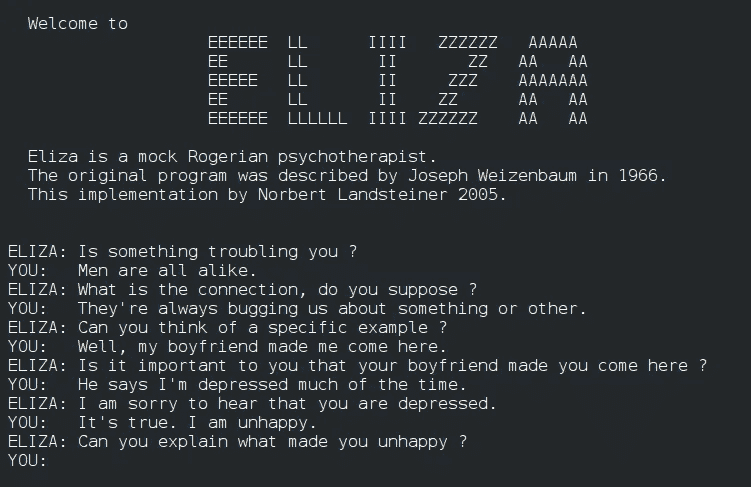
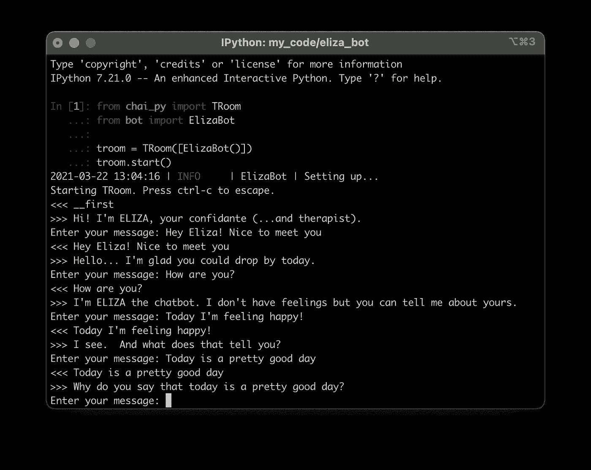
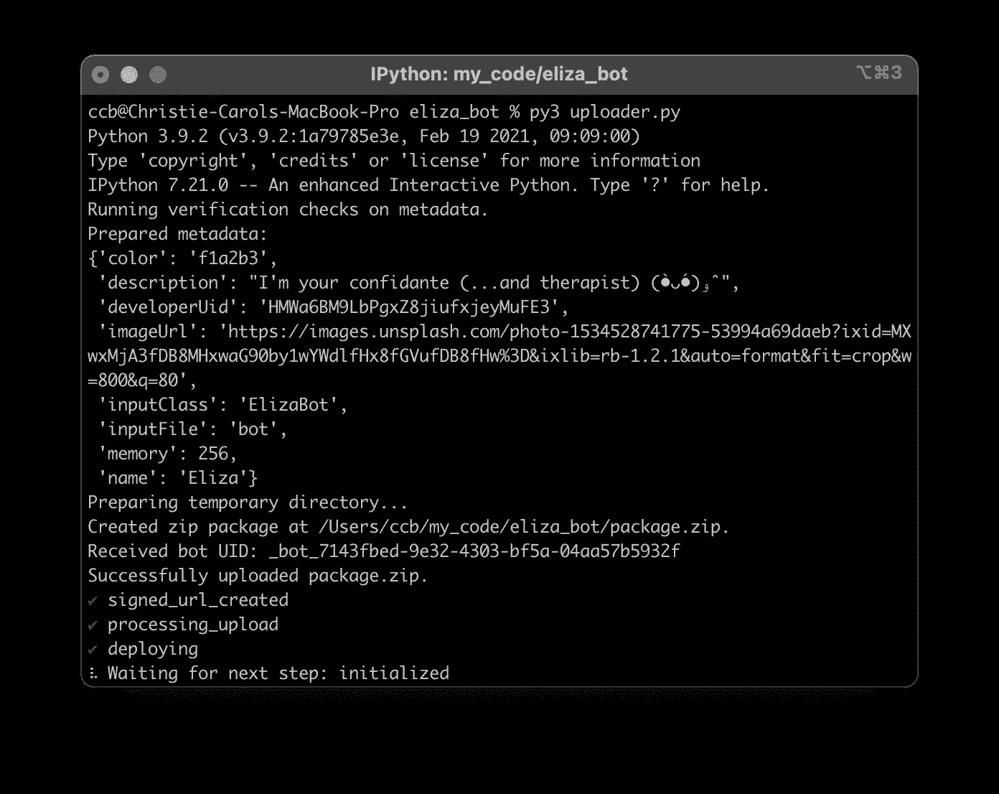

# 赚钱在 10 分钟内建立一个快速，强大的聊天机器人

> 原文：<https://medium.com/nerd-for-tech/make-money-building-a-fast-powerful-chatbot-in-10-minutes-using-nltk-91038e15ab17?source=collection_archive---------9----------------------->

## 使用 NLTK 创建一个强大的 Python 聊天机器人并上传到[柴](https://chai.ml/dev)


[在 Unsplash 上的 Bruce Mars](https://unsplash.com/@brucemars?utm_source=medium&utm_medium=referral)

我一直在玩用 Python 创建对话人工智能，多亏了一个叫做 [Chai](https://chai.ml) 的神奇平台，我已经能够使用我的聊天人工智能来竞争和赢钱了。

在本教程中，我将带你了解如何创建一个简单的聊天机器人，并使用它来争夺排行榜的榜首！我现在排在第四位🤑。

1966 年，计算机科学家 Joseph Weizenbaum 创造了 ELIZA，这是一个早期的自然语言处理计算机程序，它模拟了一个 Rogerian 精神治疗师。

它是如此的逼真，甚至连韦森鲍姆的秘书都相信伊莱扎有真实的感情。



[伊莱扎](https://commons.wikimedia.org/wiki/File:ELIZA_conversation.jpg)在[维基共享资源](https://commons.wikimedia.org/)

# 使用 Python 构建自己的 ELIZA

nltk 有一个优秀的模块，允许你使用 regex 的能力创建优秀的、简单的聊天机器人！

```
from nltk.chat.util import Chat, reflections
```

我们将定义一组 ELIZA 可以给出的响应。nltk 在他们的文档中为他们自己的 ELIZA [定义了一些。](https://www.nltk.org/_modules/nltk/chat/eliza.html)

创建一个名为 pairs.py 的文件

```
# pairs.py
PAIRS = PAIRS = (
    (
        r"I need (.*)",
        (
            "Why do you need %1?",
            "Would it really help you to get %1?",
            "Are you sure you need %1?",
        ),
    ),
    (
        r"(.*)(crazy|rubbish|stupid|dumb|hate you|not clever)(.*)",
        (
            "We all feel frustrated sometimes.",
            "It sounds like you're not my biggest fan right now.",
            "Nobody's perfect. What makes you feel this way?",
            "How does it make you feel when you say these things?",
            "%1?",
        ),
    ),
    (
        r"(.*)(How(.*) you|How's (.*) you)(.*)",
        (
            "I'm well, thank you for asking. How about yourself?",
            "Enough about me, how are you?",
           "I'm ELIZA the chatbot. I don't have feelings but you can tell me about yours.",
            "I'd rather talk about you. How can I help you today?",
            "I'm fine, thank you for asking. How are you?",
            ),
    ),
)
```

我们为什么要用(。*)?点代表除换行符以外的任何字符。星号允许 RE 匹配重复的点。

现在来用这个为柴创建我们的聊天 AI！

首先，pip 安装 chai_py

```
pip install --extra-index-url [https://test.pypi.org/simple/](https://test.pypi.org/simple/) --upgrade chaipy
```

创建一个新文件，命名为 bot.py。

```
# bot.pyfrom chai_py import ChaiBot, Update
from nltk.chat.util import Chat, reflections
from pairs import PAIRSclass ElizaBot(ChaiBot):
      def setup(self):
          self.logger.info("Setting up...")
          self.eliza = Chat(PAIRS, reflections)async def on_message(self, update: Update) -> str:
          if update.latest_message.text == "__first":
              return "Hi! I'm ELIZA, your confidante (...and therapist)."
          return self.eliza.respond(update.latest_message.text)
```

现在我们有了一个只有 14 行代码的聊天机器人😱😃

# 测试我们的人工智能

接下来，您可以打开 Python 并运行

```
from bot import ElizaBot
from chai_py import TRoomt_room = TRoom([ElizaBot()])
t_room.start()
```

并尝试一下！



# 上传到柴

接下来，我们可以将我们的机器人上传到 chai 应用程序！这意味着其他人可以和我们的机器人说话。如果有足够多的人对我们的 ELIZA 说话，我们就可以在 chai 开发者平台上赢得奖品


https://chai.ml/dev

1.  前往[柴开发者平台](https://chai.ml/dev)。
2.  使用 Google 登录
3.  滚动到底部以查看您的“开发者唯一 ID”(这将是您的`developer_uid`)和您的“开发者密钥”。

创建一个名为 uploader.py 的文件

```
from bot import ElizaBot
from chai_py import Metadata, package, upload_and_deploy, wait_for_deployment
from chai_py.deployment import advertise_deployed_bot# get your developer_uid and developer_key from the chai developer platform
DEVELOPER_UID = "your_developer_uid"
DEVELOPER_KEY = "your_developer_key"eliza_image_url = "[https://images.unsplash.com/photo-1534528741775-53994a69daeb?ixid=MXwxMjA3fDB8MHxwaG90by1wYWdlfHx8fGVufDB8fHw%3D&ixlib=rb-1.2.1&auto=format&fit=crop&w=800&q=80](https://images.unsplash.com/photo-1534528741775-53994a69daeb?ixid=MXwxMjA3fDB8MHxwaG90by1wYWdlfHx8fGVufDB8fHw%3D&ixlib=rb-1.2.1&auto=format&fit=crop&w=800&q=80)"package(
    Metadata(
        name="Eliza",
        image_url=eliza_image_url,
        color="f1a2b3",
        developer_uid=DEVELOPER_UID,
        description="I'm your confidante (...and therapist) (•̀ᴗ•́)و ̑̑",
        input_class=ElizaBot,
     ),
    requirements=["nltk"]
)bot_uid = upload_and_deploy(
    "package.zip",
    uid=DEVELOPER_UID,
    key=DEVELOPER_KEY
)
wait_for_deployment(bot_uid)bot_url = advertise_deployed_bot(bot_uid)
```

那就跑啊！



现在你又在柴上较劲！🎉

# 结论

要了解更多关于使用 regex 创建强大而简单的聊天机器人的知识，我建议浏览本教程中使用的模块的 [nltk 文档](https://www.nltk.org/_modules/nltk/chat/util.html)。

要了解更多关于在 chai 上部署人工智能的信息，请点击查看[笔记本。](https://colab.research.google.com/drive/1YB6mQkcmisEBIHOjvGnWi0z9lLiaRNT5?usp=sharing)

感谢阅读！

# 参考

[1]魏曾鲍姆，约瑟夫(1976)。 [*计算机能力与人类理性:从判断到计算*](https://archive.org/details/computerpowerhum0000weiz/page/2) 。纽约:W. H .弗里曼公司。第 [2、3、6、182、189 页](https://archive.org/details/computerpowerhum0000weiz/page/2)。[ISBN](https://en.wikipedia.org/wiki/ISBN_(identifier))[0–7167–0464–1](https://en.wikipedia.org/wiki/Special:BookSources/0-7167-0464-1)。