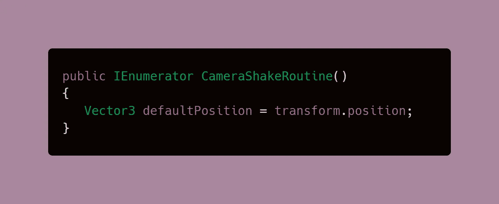
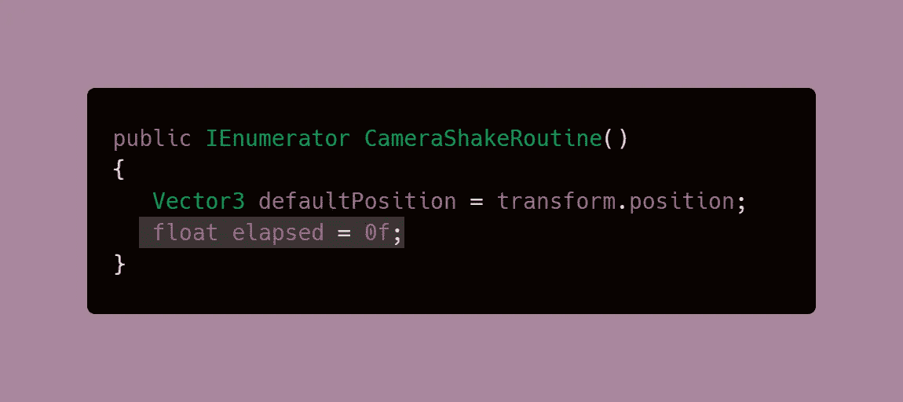
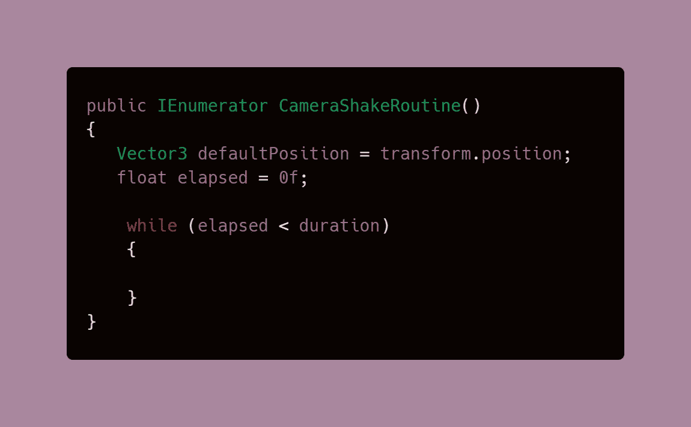
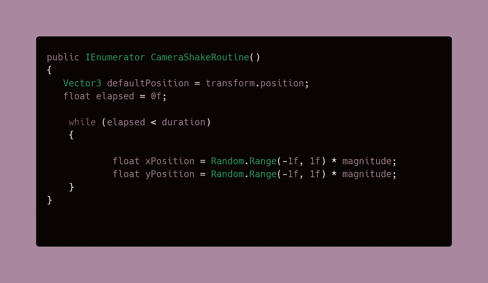
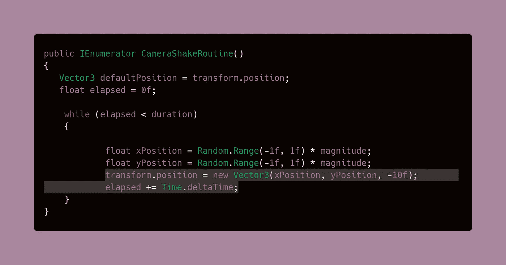
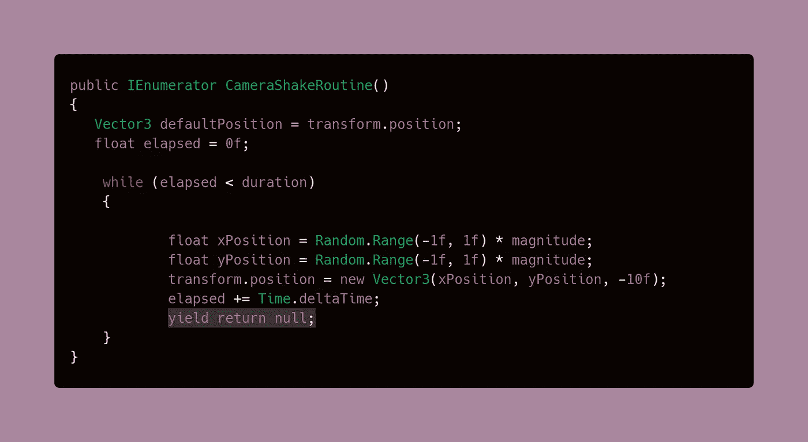
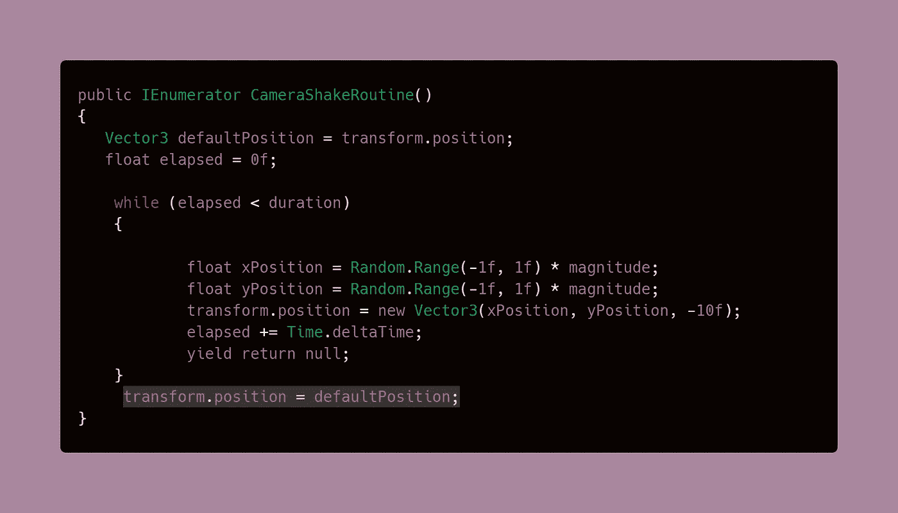
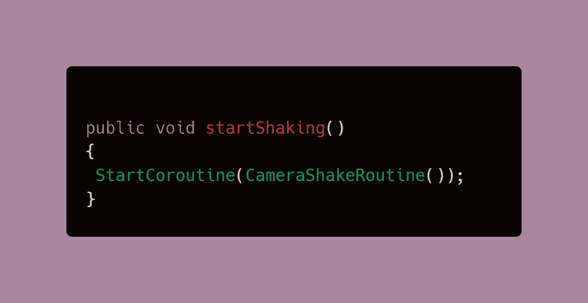
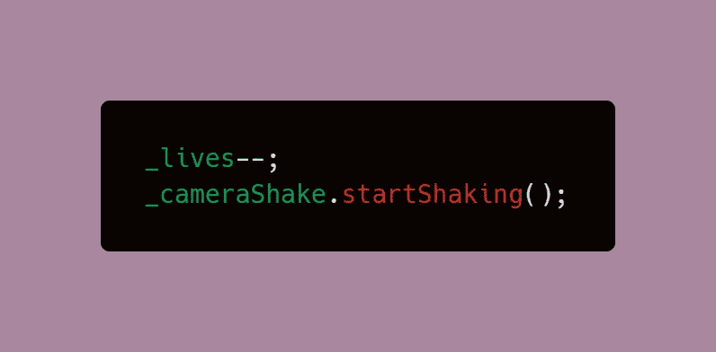
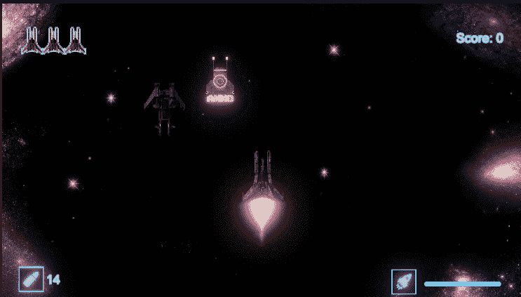

# 当播放器损坏时，使相机抖动

> 原文：<https://medium.com/nerd-for-tech/make-the-camera-shake-when-the-player-is-damaged-7034a858bc6f?source=collection_archive---------21----------------------->

我们已经有了[伤害 VFX](/codex/damage-vfx-using-animated-sprites-in-unity-c13e2dbb68bb)、[爆炸](https://levelup.gitconnected.com/creating-enemy-explosions-e2404cd45833)和一个[生命计数器 UI](/codex/creating-a-lives-counter-ui-element-in-unity-9d48b485555e)……为什么不在玩家被击中时加入一个相机抖动来让事情变得更戏剧性呢？毕竟，视觉上表现游戏元素有助于伟大的游戏设计！

**目标**:暂时将摄像机变换到随机位置，以制造抖动的错觉。然后将位置设置回默认值，这样摄像机就不会无限移动。

# 用协程让相机抖动

1.  为相机抖动行为创建一个新脚本，并相应地命名它。这需要一个单独的脚本，因为它将被附加到相机本身。

2.创建三个全局变量，稍后将用于计算抖动。

*   **_isShaking** 将用于**激活**摇动效果
*   **持续时间**决定**摇晃将持续多长时间**。
*   **震级**是我们对于震动强度的**乘数**。

3.创建一个[协程](/codex/coroutines-with-unity-b5a2b3fc3426)，这个与我在之前的文章中讨论的略有不同，但是我们会一步一步来。

你要添加到这个协程的第一件事是一个默认的位置向量，这将是摄像机的常规[变换。我们需要这个，这样我们就可以在震动结束后随时重置位移。](https://docs.unity3d.com/ScriptReference/Transform-position.html)

4.创建一个变量来跟踪自协程开始运行以来经过的时间。您可能会发现一些代码类似于[冷却系统](https://dennisse-pd.medium.com/how-to-create-a-cooldown-system-in-unity-4156f3a842ae?source=your_stories_page-------------------------------------)，但是我们不会使用 Time.time，因为我们需要计算从*最后一帧*开始的时间，而不是从应用程序*开始运行*开始的时间。

5.创建一个 while 循环，它将在运行时间小于我们为 shake 效果设置的持续时间时运行。

6.为相机的 X 和 Y 位置指定一个随机值。这里将使用数量乘数

> **注意**:让我们回顾一些现实生活中的知识，它们可以帮助这些代码更容易理解和记忆。一个**震级**是**地震**的物理大小，长度和宽度。这就是为什么我们指定的变量乘以 X 和 Y 位置的运动被命名为。

7.有了新添加的 x 和 y 位置变量，我们可以设置一个新的向量来接收这些信息。-10 是摄像机的默认 Z 位置。然后，我们必须加上经过的时间，使数字相应增加。这里我们使用 Time.deltaTime，因为它告诉我们自上一帧以来的时间，这正是我们所需要的。

8.为协程添加点睛之笔，即 yield 语句。

> **注意:为什么用 return null 代替 0？null 和 0 不是一回事吗？**是和否。虽然两者都适用于单个帧，但 return 0 会分配内存，因为它有一个需要装箱和取消装箱的数值。另一方面，Null 则不会，这增强了性能。

9.为了用协程结束工作，我们只需要将摄像机的位置设置回默认值。

# 启动协程

1.  在同一个脚本中，创建一个 void 方法来启动协程。

2.使用[脚本通信](/codex/script-communication-in-unity-using-getcomponent-ca4444bfec6)从你的玩家脚本中调用新创建的 void 方法。理想情况下，当你的玩家受到伤害时应该调用这个函数。在减去生命后，我的将被放在 damagePlayer()方法中。

## 结果是:

