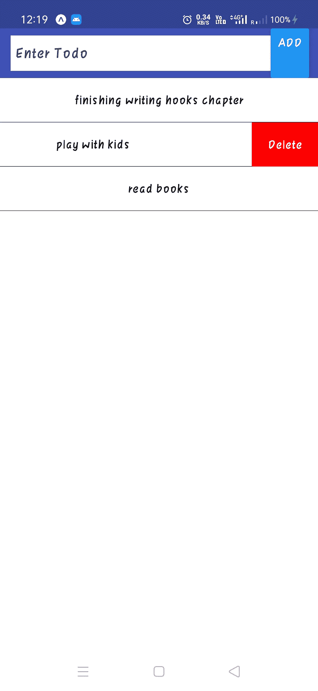
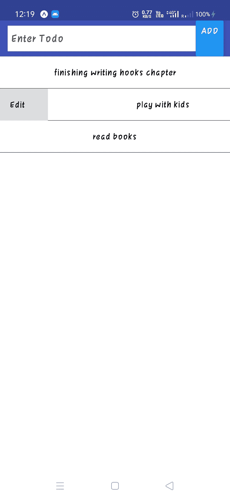
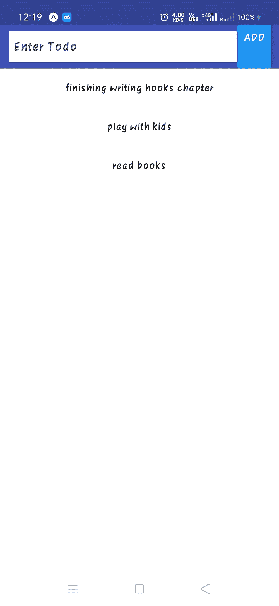

# 使用 React Native Expo 为 IOS 和 Android 设备制作待办事项列表应用程序

> 原文：<https://medium.com/nerd-for-tech/make-todo-list-application-using-react-native-expo-for-ios-and-android-device-1de436168f86?source=collection_archive---------3----------------------->

## 使用 react native Expo 的 CRUD 操作

您好，React 原生开发者..！！

您经常想知道如何创建一个遵循所有 CRUD 操作(即创建、读取、更新、删除)的应用程序。制作一个遵循 CRUD 操作的应用程序是非常重要的。因为所有的应用程序都遵循这些 CRUD 规则。因此，让我们使用 React Native Expo 制作一个遵循所有 CRUD 操作的移动应用程序。抓住你的座位，喝杯咖啡，让我们开始吧。


在 [Unsplash](https://unsplash.com?utm_source=medium&utm_medium=referral) 上由[法扎德·纳齐菲](https://unsplash.com/@euwars?utm_source=medium&utm_medium=referral)拍摄的照片

# 设置和安装

> 1.制作一个目录并导航到它
> 2。在这个目录中打开终端或命令提示符，运行命令:expo init ToDo
> 3。选择空白模板并继续下载
> 4。导航至“待办事项”文件夹
> 5。使用命令安装一个包:NPM install react-native-swipe-list-view
> 6。使用命令安装另一个包:NPM install native-base @ 2 . 13 . 0
> 7。使用以下命令安装另一个软件包:npm install uuid-random

完成以上所有步骤后，我们就完成了安装部分。现在，在您最喜欢的文本编辑器中打开这个项目，并开始编码。

# React 本机 Expo 中待办事项列表的代码

在父目录中创建一个文件，并将其命名为“ToDoList.js”。

## ToDoList.js

```
import React, { useContext, useState } from 'react'
import { TodosContext } from './App'
import { SwipeListView } from 'react-native-swipe-list-view';
import { Header, Item, Input } from 'native-base';
import { StyleSheet, TouchableOpacity, View, Text, Button } from 'react-native';
import uuid from 'uuid-random';export default function ToDoList() {
    // receive state and dispatch from App.js
    const {state, dispatch} = useContext(TodosContext); 
    const [todoText, setTodoText] = useState("")
    const [editMode, setEditMode] = useState(false)    
    const [editTodo, setEditTodo] = useState(null)    
    const buttonTitle = editMode ? "Edit" : "Add";const handleSubmit = () =>{
        if(editMode){            
            dispatch({type: 'edit', payload:{...editTodo,text:todoText}})
            setEditMode(false)
            setEditTodo(null)
        }
        else{
            const newToDo = {id: uuid(), text: todoText};
            dispatch({type: 'add', payload: newToDo})
        }              
        setTodoText('') // to clear field after adding     
    }const renderItem = data => (
        <View style={styles.rowFront}>
            <Text>{data.item.text}</Text>
        </View>
    );const renderHiddenItem = (data, rowMap) => (
        <View style={styles.rowBack}>
            <TouchableOpacity onPress={() => editRow(data.item, rowMap)}>
                <Text>Edit</Text>
            </TouchableOpacity>  
            <TouchableOpacity
                style={[styles.backRightBtn]}
                onPress={() => deleteRow(data.item)}                
            >
                <Text style={{color: '#FFF'}}>Delete</Text>
            </TouchableOpacity>
        </View>
    );const deleteRow = (todo) => {
        dispatch({type:'delete',payload:todo});
    };const editRow = (todo,rowMap) => {        
        setTodoText(todo.text)
        setEditMode(true)
        setEditTodo(todo)
        if (rowMap[todo.id]) {
            rowMap[todo.id].closeRow();
        }        
    };return (
        <View> 
            <Header searchBar>
                <Item>                
                    <Input 
                        placeholder="Enter Todo" 
                        onChangeText={text => setTodoText(text)} 
                        value={todoText} 
                    />                
                </Item>
                <Button transparent onPress={handleSubmit} title={buttonTitle} />

            </Header><SwipeListView
                data={state.todos}
                renderItem={renderItem}
                renderHiddenItem={renderHiddenItem}
                leftOpenValue={75}
                rightOpenValue={-75}
            />          
        </View>
    );
}const styles = StyleSheet.create({
    rowFront: {
        alignItems: 'center',
        backgroundColor: '#FFF',
        borderBottomWidth: 0.25,
        justifyContent: 'center',
        height: 50,
    },
    rowBack: {
        alignItems: 'center',
        backgroundColor: '#DDD',
        flex: 1,
        flexDirection: 'row',
        justifyContent: 'space-between',
        paddingLeft: 15,
    },
    backRightBtn: {
        alignItems: 'center',
        bottom: 0,
        justifyContent: 'center',
        position: 'absolute',
        top: 0,
        width: 75,
        backgroundColor: 'red',
        right: 0
    }
});
```

我们首先从 javascript 库中导入所有需要的依赖项。之后，在 ToDoList 函数中，我们使用 react hooks 概念。为了添加和编辑待办事项，我们使用了钩子。因为它改变了状态。它从初始状态变化到当前状态(我们所改变的)。

我们使用与编辑和添加 todo 相同的输入空间。所以，在“handleSubmit”箭头函数中，我们设置了两个条件。一种是，如果状态处于编辑模式，则采用初始状态并用当前状态替换它们。另一个是如果状态处于添加模式，这意味着用户然后添加待办事项，用新 id 分配待办事项，并添加待办事项。

我们正在制作，swipeable 编辑和删除功能。那些东西被藏起来了。为了渲染它，我们使用了箭头函数，对于 UI 部分，我们使用了一些样式。为了呈现 todo 项，我们使用了 arrow 函数，并通过一些样式将它们返回到文本字段中。

删除和编辑箭头功能也是如此，我们将它与 App.js 中的 reducer 连接，后者处理状态并呈现当前状态。

我们选择简单的 UI，因此在 UI 部分，在标题搜索栏中我们设置输入字段。在它的右边，我们设置了一个会相应改变的按钮，如果用户编辑了什么，那么按钮文本将会是 edit，如果用户添加了什么，那么按钮文本将会显示 add。

在这下面，我们添加了待办事项列表。这个列表是可滑动的，这意味着你可以向左或向右滑动它们。当你向左滑动时，你会看到删除按钮，当你向右滑动列表时，你会看到编辑按钮。

剩下的部分就是造型了。你可以根据你的想象来改变它们。

## App.js

```
import React, { useReducer } from 'react';
import ToDoList from './ToDoList';const todosInitialState = { 
  todos:[{ id:'1', text: "finishing writing hooks chapter"},
    { id:'2', text: "play with kids"},
    { id:'3', text: "read books"}
  ]
};export const TodosContext = React.createContext()export default function App() {const [state, dispatch] = useReducer(todosReducer,todosInitialState)return (
    <TodosContext.Provider value={{state,dispatch}}>      
      <ToDoList />
    </TodosContext.Provider>    
  )
}function todosReducer(state, action){ 
  switch(action.type){ 
    case 'add':      
      // add new todo onto array
      const addedToDos = [...state.todos,action.payload]
      // spread our state and assign todos
      return {...state,todos:addedToDos} 
    case 'edit':   
      const updatedToDo = {...action.payload} 
      const updatedToDoIndex = state.todos.findIndex(t => t.id === action.payload.id)
      const updatedToDos = [
        ...state.todos.slice(0,updatedToDoIndex),
        updatedToDo,
        ...state.todos.slice(updatedToDoIndex + 1)
      ];
      return {...state, todos: updatedToDos}      
    case 'delete':
      const filteredTodoState = state.todos.filter( todo => todo.id !== action.payload.id)
      return {...state, todos: filteredTodoState}
    default:
      return todosInitialState
  }
}
```

在 App.js 文件中导入“ToDoList.js”。出于测试目的，我们设置了初始 todos。可以删除，也可以编辑。之后，我们在主函数中调度 Reducer，因为 Reducer 处理应用程序的全局状态变化。我们将初始状态设置为 todosReducer。

现在在 App 函数的返回中，我们只是返回了 ToDoList，它在上下文标签里面。React 上下文允许我们与组件树中需要这些值的任何组件共享值。并且提供者将该值提供给子组件。

在“todosReducer”功能中，添加了四种情况。我们在“add”的情况下添加，用现有的 todos(“…”spread 操作符)创建一个新数组，并向它添加一个 newToDo。这里我们不修改状态，而是返回新的状态。为了进行编辑，我们首先找到元素的索引，然后为更新后的元素创建一个新的数组。

现在，使用以下命令在终端中运行 expo 应用程序:npm start

从您的设备上扫描 QR 码。这个待办事项列表可以在 Android 和 IOS 设备上运行。查看项目运行情况。你会看到这样的东西。



如果你面临任何困难，请在评论区告诉我。这个项目的 Github 代码是[这里是](https://github.com/imrohit007/To-Do-List-in-React-Native-Expo)。

感谢阅读！如果这篇文章对你有帮助，那就鼓掌直到你的手流血。