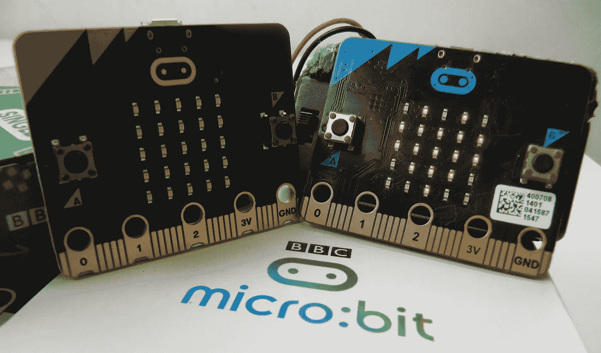

# 用这款低价的单板电脑制作自己的玩具 BBC Micro:Bit V2:价格，规格，从印度购买。

> 原文：<https://medium.com/nerd-for-tech/make-your-own-toy-with-this-single-board-computer-bbc-micro-bit-v2-price-specification-buy-d9b4130c8f05?source=collection_archive---------20----------------------->

## 一个完整的细节，英国广播公司微:位 V2 SBC

这种袖珍计算机有一个 LED 灯显示，按钮，传感器，和许多输入/输出功能，当编程时，你可以编码，定制，并控制你的微型:位从任何地方！你可以用它从机器人到乐器等等。

BBC 微:比特

这款半信用卡大小的电脑配备了 25 个可以闪烁信息的红色 LED 灯，两个可编程的触觉按钮和一个触摸感应标志，可以用来控制游戏或暂停和跳过播放列表中的歌曲。微型钻头甚至可以探测到运动，并告诉你前进的方向。它还可以使用蓝牙低能耗(BLE 5.0)与其他设备和互联网进行交互。

使用这台小型单板计算机，可以制作很棒的玩具和工具，如正确的脚步计数器、数字骰子、手势控制套件、温度计、吉他等。它的编程非常简单和容易。[查看更多关于 SBC 的](https://microbit.org/projects/\)。不仅如此，你还可以根据你的思维能力做出其他的东西。

# 规范

## 1.处理器

北欧半导体 nRF52833

## 2.记忆

512kB 闪存，128kB 内存

## 3.连接

恩智浦 KL27Z，32kB RAM

## 4.边缘连接器

25 针。4 个专用 GPIO、PWM、i2c、SPI 和 ext。力量

## 5.I2C

外设专用 I2C 总线

## 6.无线的

2.4Ghz 微比特无线电/BLE 蓝牙 5.0

## 7.力量

5V 通过微型 USB 端口，3V 通过边缘连接器或电池组，LED 电源指示灯，电源关闭(按住电源按钮)

## 8.当前可用

200mA 可用于附件

## 9.运动传感器

圣 LSM 303

## 10.长度(毫米)

50

## 11.宽度(毫米)

40

## 12.装运重量

0.04 千克

## 13.装运尺寸

6 × 5 × 3 厘米

# 利弊

## **优点:**

**尺寸:**

*   它很小，像一块手表。

**端口**

*   *就其尺寸而言，它有相当数量的接口端口和传感器*。

1.  使用电池电源的端口。
2.  将程序和其他数据上传到主板的端口。
3.  通用输入/输出(GPIO)端口，为电路板增加其他功能，如伺服电机或其他传感器
4.  还有一个 3 V 电源和一个接地边缘连接器，添加设备时也需要。

***内置温度传感器***

*   他们有一种天生的脾气。传感器，这有助于确保 CPU 不会烧毁。

**三轴加速度计**

*   该板有一个 3 轴加速计传感器，可用作指南针或磁力计，使板能够感应其方向和附近磁场的强度

**演讲者:**

*   它的扬声器可以达到 80 分贝左右的噪音水平，与智能手机相当

**25 个红色 LED 灯和麦克风**

*   该板内置 25 个红色 LED 灯，可以闪烁信息。还有一个内置的状态 LED，所以你可以检查麦克风是否通电。

**电容式触摸传感器**

*   电路板正面的电容式触摸传感器，可编程为在触摸时执行特定操作(如切换到不同的 LED 模式)。

## 骗局

## 力量

*   微:位 V2 不是超级强大的，所以它不适合高计算任务。

## 处理器

*   它使用 ARM Cortex-M4 nRF52833 处理器，时钟速度为 64 MHz。作为对比，Raspberry Pi Zero 使用 400 MHz 的时钟速度。这无疑是董事会的一个缺点，

## 随机存取存储

*   它有 128 KB (0.000128 GB)的内存，与其他提供 1 GB 以上内存的单板机相比非常小。

## 在印度购买

 [## sb 组件微:位 RFID 扩展 BBC 微:位开发扩展板信息 ID…

### 购买 sb 组件微:位 RFID 扩展 BBC 微:位开发扩展板信息 ID 卡阅读器 RFID…

amzn.to](https://amzn.to/3wG2iIN)  [## roboCraze BBC Micro bit Go 开发板

### roboCraze BBC Micro bit Go 开发板:Amazon.in: Electronics

amzn.to](https://amzn.to/3xCGrSz)