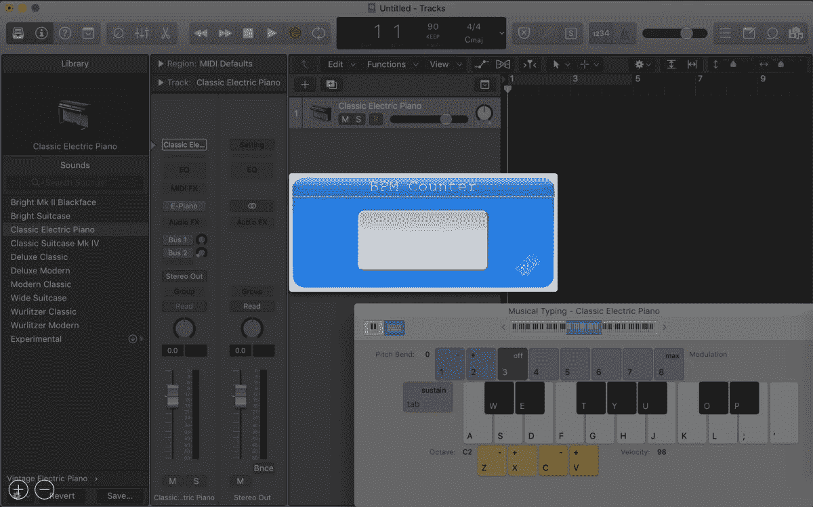
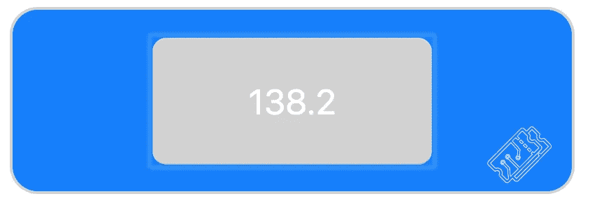
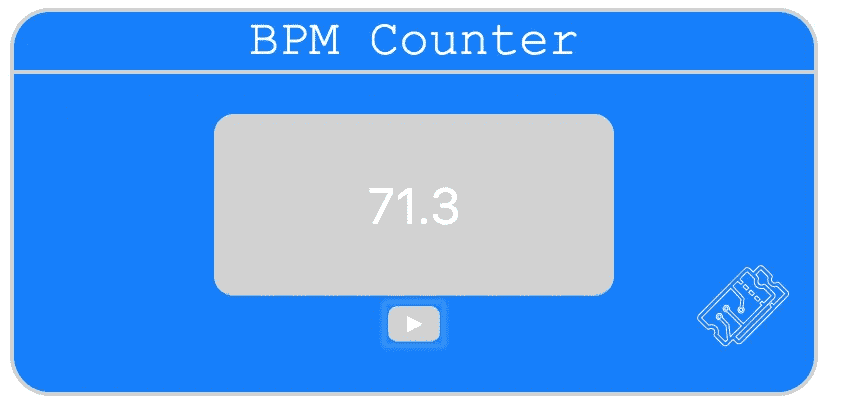
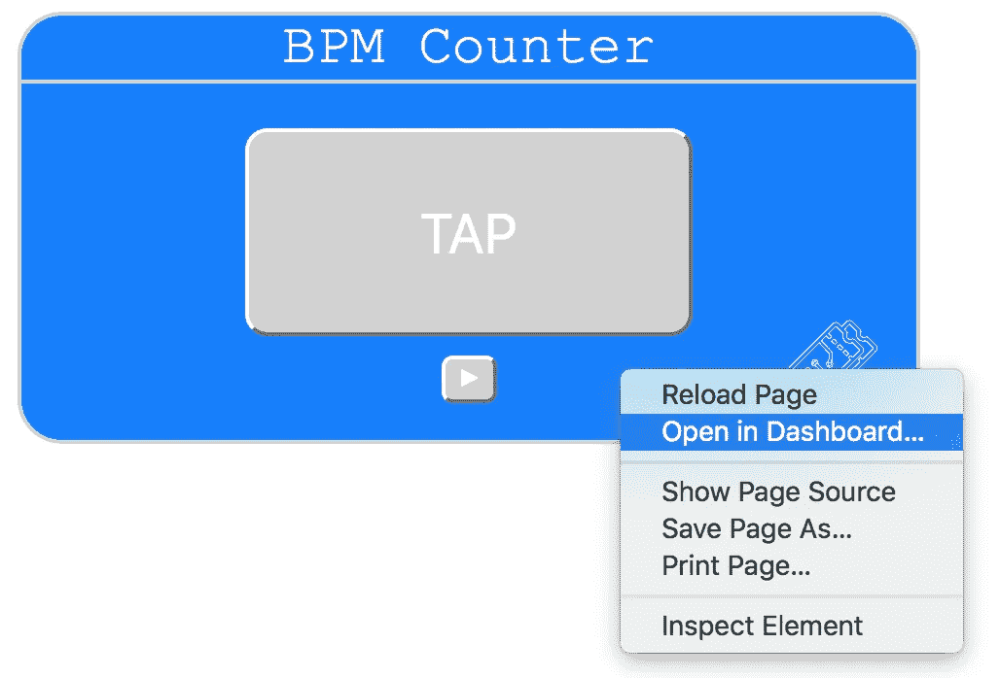
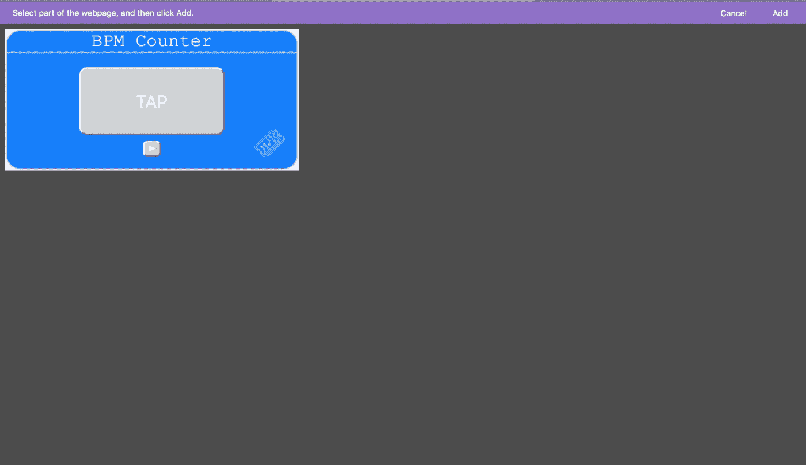
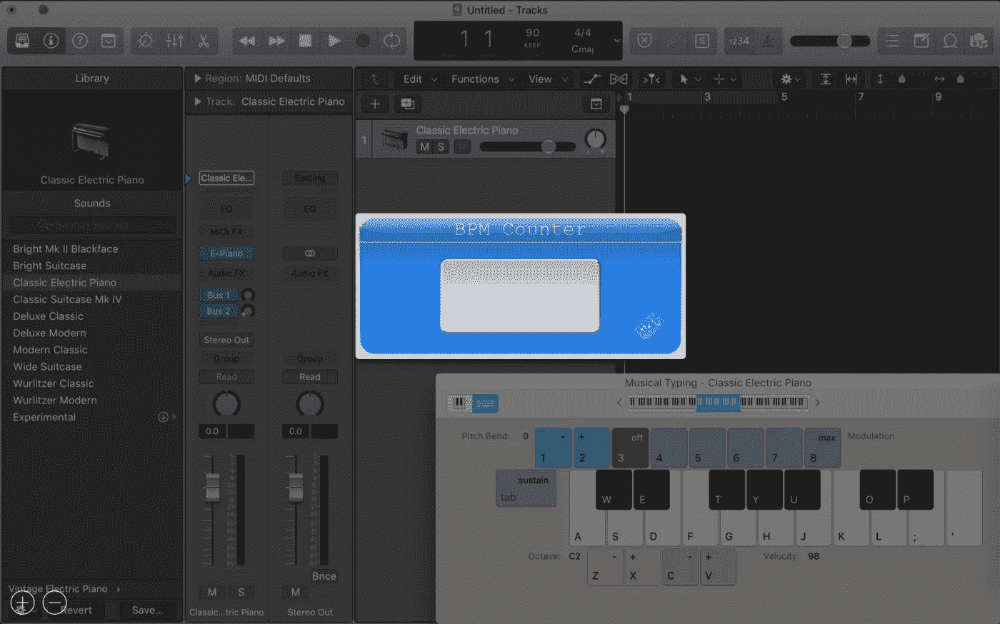

# 轻松制作自己的小部件——OSX 仪表板中的快速 BPM 计数器

> 原文：<https://medium.com/nerd-for-tech/make-your-own-widgets-easily-speedy-bpm-counter-in-osx-dashboard-87756edfa4e4?source=collection_archive---------2----------------------->

Web 应用程序很常见，但不需要互联网接入的 web 应用程序则不常见。

在本文中，我将向您展示如何在一个简单的 HTML 页面中使用普通的 javascript 创建 BPM 计数器。如果下载的话，这个小工具可以离线使用——非常适合那些想要创作但不总是能上网的音乐人。更好的是，通过使用 OSX 仪表板应用程序(它以前似乎从来没有这么有用)，我们可以让这个 BPM 计数器使用起来非常快。

> [🔗在 Github 上获取 BPM 计数器代码📔](https://github.com/sk-t3ch/BPM_Counter)



# 应该是什么样子？

显然，问题的答案见仁见智。我的立场是，它应该超级简单，只做 BPM 计数器需要做的事情:计算每分钟的心跳数。因此，它所需要的只是一个按钮和一个计数值



# 逻辑

估计 BPM 就像测量两次连续心跳之间的时间，并计算一分钟内你可以完成多少次一样简单。

```
let prev_click = new Date(); const getBPM = function (){
 const currentTime = new Date();
 const interval = (currentTime - prev_click)/1000;
 const bpm = 60/interval;
 prev_click = currentTime;
 return bpm;
} get_bpm(); // e.g. 120
```

我进一步对之前的 3 个节拍进行平均，如下所示:

```
const averaging = 3;
const prev_bpms = [60];const getBPM = function() {
 const currentTime = new Date();
 const interval = (currentTime - prev_click) / 1000;
 const bpm = 60 / interval;
 prev_click = currentTime;
 while (prev_bpms.length > prev_bpm_list_max_length) {
    prev_bpms.shift();
 }
 prev_bpms.push(bpm);
 average_bpm = prev_bpms.reduce((acc, cVal) => acc + cVal) / prev_bpms.length;
 return bpm;
} 

get_bpm(); // e.g. 120
```

此外，不是每个人都想按下按钮，而是按下一个键:

```
// space bar trigger
window.addEventListener('keypress', (e) => {
 if(e.code === 32) getBPM();
});
// instant ability
document.querySelector('.clicker button').focus();
```

现在，一旦页面加载完毕，用户也可以使用空格键点击。

# 听到你的 BPM

你已经输入了 BPM，但现在你想回放它，这样你就可以跟着你最喜欢的节奏一起演奏了。

为此，我们必须发出声音。但是怎么做呢？我们在浏览器[音频](https://developer.mozilla.org/en-US/docs/Web/API/Web_Audio_API) API 中内置了两个选项，使用声音文件或者创建一个合成器。

我们将首先使用合成器创建一个蜂鸣声:

```
const AudioContext = window.AudioContext || window.webkitAudioContext;let context, oscillator;
const bpm = 60;
const bpmInterval = 60/bpm * 1000; //mssetInterval(beep, bpmInterval);const beep = function (){
      if(!context) context = new AudioContext();
      oscillator = context.createOscillator();
      oscillator.type = "sine";
      oscillator.start(0);
      oscillator.connect(context.destination);
      setTimeout(oscillator.disconnect, 150, context.destination);
    }
```

现在让我们用一个音频文件来做类似的事情:

```
const click = new Audio('./cowbell.mp3');
const bpm = 60;
const bpmInterval = 60/bpm * 1000; //mssetInterval(beep, bpmInterval);const beep = function (){
      click.play();
      setTimeout(()=>{ 
          click.pause(); 
          click.currentTime = 0.0;
        }, 150);
    };
```

最后添加控制它们的逻辑:

```
// HTML
<div class="player">
        <button class="controler" onclick="togglePlayerOutput()">
          &#9654;
        </button>
</div> // JS
let isPlayerPlaying = false;
let bpmRepeaterId;const togglePlayerOutput = function (){
        const button = document.querySelector('.player button');
        if (!isPlayerPlaying){
          button.innerHTML = '&#9724;';
          bpmRepeaterId = setInterval(beep, bpmInterval);
        }
        else{
          button.innerHTML = '&#9654;';
          clearInterval(bpmRepeaterId);
        }
        isPlayerPlaying = !isPlayerPlaying;
    };
```

# 把所有的放在一起



现在把所有的功能放在一起，再加上一点点造型(我不打算解释)，我们就有了这个最终产品:

我不知道有多少代码人们真的想直接在文章中看到，所以在 [Github](https://github.com/sk-t3ch/BPM_Counter) 找到完整代码。

# 有效使用(仅限 OSX 用户)

如果你以前使用过 mac，你可能会偶然发现原生的 Dashboard 应用程序，但你可能不会停留很久。

我从来没有真正用过它…直到现在。

在 Safari 中，你可以右击页面，有时会弹出一个操作选项，包括*在仪表板中打开…*



点击这里，你会看到一个网页小工具的创建者。您可以选择要添加到仪表板中的页面部分。这是一个非常酷的特性，但是对于我们来说，这是一个超级酷的特性。

打开我们刚刚制作的 BPM 计数器，您可以像这样选择框:



现在使用 F12 键的快捷键。嘣。自己快速、轻松地创建小部件从未如此容易。



你可能想知道为什么这个没有节拍器回放功能。当我试图在仪表板中使用它时，程序不能可靠地播放音频:(但至少逻辑可以很容易地做到这一点。

我向你们展示如何用两种不同的方式创造声音的原因是，使用合成器的`Audio Context`版本在仪表盘内无法工作。

最后，你不能简单地点击 F12 并继续使用空格键来获得速度，你必须直接点击按钮，这是一个降级。

但我想这可能是我从现在开始制作小部件的方式。如果你对此有什么很酷的想法，当你实现的时候给我看看:)

> [🔗在 Github 上获取 BPM 计数器代码📔](https://github.com/sk-t3ch/BPM_Counter)

# 感谢阅读

查看[T3chFlicks.org](https://t3chflicks.org/Projects/bpm-counter)获得更多以科技为中心的教育内容( [YouTube](https://www.youtube.com/channel/UC0eSD-tdiJMI5GQTkMmZ-6w) 、 [Instagram](https://www.instagram.com/t3chflicks/) 、[脸书](https://www.facebook.com/t3chflicks)、 [Twitter](https://twitter.com/t3chflicks) )。