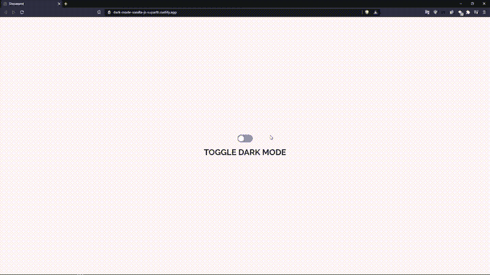

# 让您的项目感受夜晚！

> 原文：<https://medium.com/nerd-for-tech/make-your-project-feel-the-night-5a00ff2270af?source=collection_archive---------14----------------------->

普通 JavaScript 中的黑暗模式

你好。

在你的项目中创建多个主题的趋势，特别是在网页设计和全栈社区中，吸引了许多开发者，这是有原因的。它不仅提供了在多个主题下查看和工作的自由，最终用户也可以根据自己的喜好查看您的项目，这降低了跳出率，增加了您的页面排名，有助于搜索引擎优化。

尽管多主题设计有很多优点，但它可能看起来极其乏味，因为改变每个组件的颜色会导致多余的代码。然而，真相很大程度上来自这个骗局。如果你很好的掌握了 CSS 变量，那么创建多主题设计的代码是非常简单的，也是非常优雅的！

> - [项目的现场演示](https://dark-mode-vanilla-js-suparth.netlify.app/)
> -这里每个方面的工作将会很长，所以项目的启动文件可以在 [GitHub 资源库这里](https://github.com/suparthghimire/Dark-Mode-in-Vanilla-JavaScript/tree/starter-files)
> 获得-完成的文件也可以在同一资源库这里的已完成项目[分支获得](https://github.com/suparthghimire/Dark-Mode-in-Vanilla-JavaScript/tree/completed-project)

最终项目:

打开和关闭黑暗模式的最终图像

设置好项目后，让我们先简要回顾一下 CSS 文件。
文件中的所有其他代码用于创建切换开关并将内容置于中心。这里需要关注的是前几行。

# CSS

黑暗模式所需的 CSS

这里唯一需要关注的部分是在 CSS 中创建变量。这实际上类似于在实际的编程语言中声明变量和赋值。CSS variables 还有很多其他很棒的东西可以研究，下次我会为此写另一篇博客。现在，让我们忍受这里的代码。

这里的前两节课 ***。黑暗 _ 主题*** 和 ***。light_theme*** 各有两个同名变量***clr-background***和 ***clr-text，*** 然而这里的值是不同的。 ***。dark_theme*** 类的值为深色背景和浅色文本，反之亦然。

现在，在 body 元素中我们看到 ***背景*** 和 ***颜色*** 属性中的值是这里声明的变量名，而不是实际值。当涉及到 JavaScript 时，这将有所帮助。

最初，在 HTML 文件中，body 标签有一个 light 主题类，它使得 ***背景*** 和 ***颜色*** 属性中的值来自于类 ***变量中的值。灯光 _ 主题。***

# Java Script 语言

谈到 JavaScript，我们只有几行代码来切换项目中的黑暗模式。

打开和关闭黑暗模式的 JavaScript 代码

就是这样！仅仅**六**行代码就可以在你的项目中打开和关闭黑暗模式。这里的代码也是不言自明的！
这里前两行只是选择拨动开关标签和主体标签。现在，拨动开关有一个事件监听器，当点击它时触发一个匿名函数，该函数检查 body 标签的类为***【dark _ theme】，*** ，如果是，那么 body 标签的类用类 ***light_theme*** 更新，否则 body 标签的类被设置为 ***dark_theme。***

这将有助于在项目中打开和关闭黑暗模式。

# 大规模应用

这似乎只适用于小规模的项目，这与事实相差甚远。大规模应用也使用相同的技术，即基于开关的打开或关闭的切换，用类 ***light_theme*** 或 ***dark_theme*** 更新 body 标签。这就是为什么学习 CSS 变量是非常重要的，并且在今天的行业中被广泛使用。

关于 CSS 变量的博客将很快推出。不过对于 bow 来说，YouTube 上有很多关于这个主题的视频可以探索。

我希望你明白如何使用普通的 JavaScript 和 HTML 以及 CSS 来打开或关闭黑暗模式。

非常感谢您阅读文章！如果它的任何部分让你困惑，你可以[发电子邮件](mailto:suparthnarayanghimire2014@gmail.com)给我，甚至在评论中提问！！！！

注销！！再见！✌✌