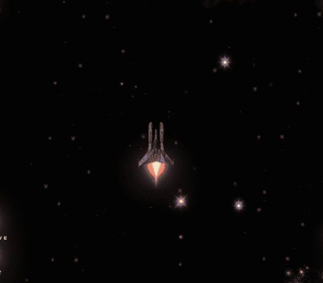
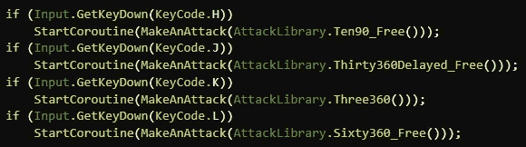
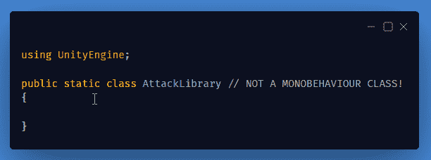
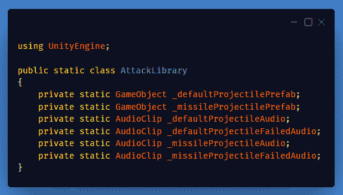
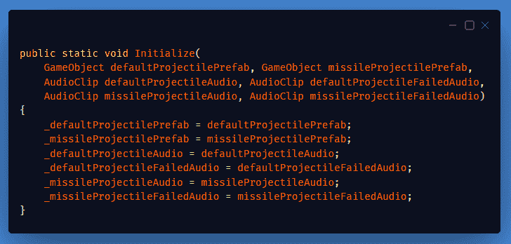
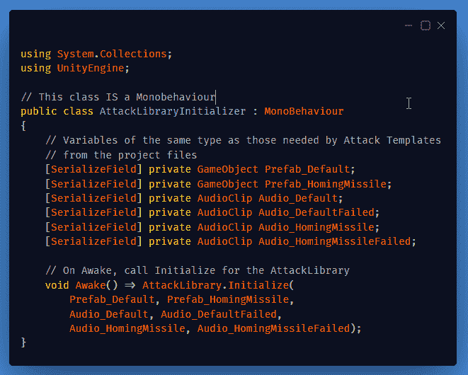
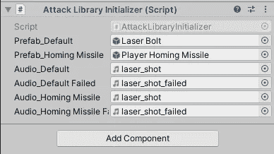
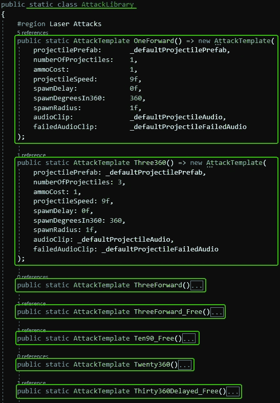
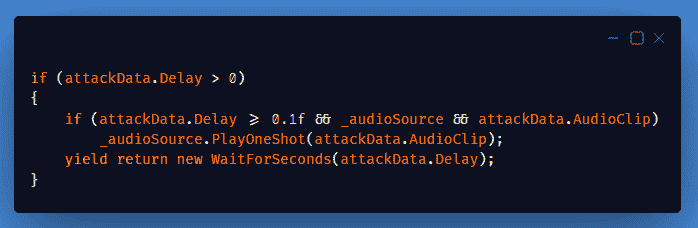
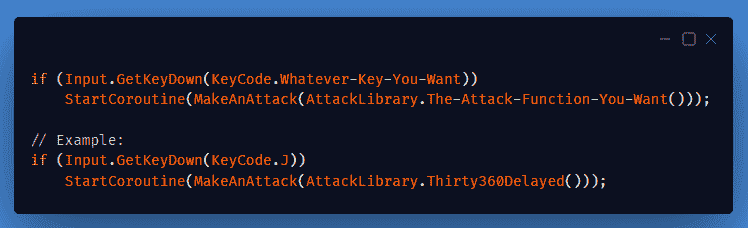

# 打造定制的子弹地狱式攻击系统(第 2 部分)

> 原文：<https://medium.com/nerd-for-tech/making-a-custom-bullet-hell-style-attack-system-part-2-2f3673a332a4?source=collection_archive---------10----------------------->

## 今天我完成了昨天想象的攻击模板库，让创建和使用子弹地狱式攻击变得更加容易。如果您错过了，请查看第 1 部分！

> **仅用 8 行代码就激活了四种不同的攻击！**

**今天的目标:**创建一个全球通用的 ***攻击模板*** 类库来保存我所有的攻击模板，随时可供游戏中的任何单位使用。

## 首先，创建一个名为"***attack library***的新静态类:

由于 ***攻击模板*** 包含一个**游戏对象**变量用于投射预设，一个**音频剪辑**用于音频，我们必须以某种方式将它放入这个类，它不在任何场景对象上。

为预设和音频剪辑文件(项目文件中唯一的攻击模板数据)创建私有静态变量

创建一个公共静态初始化函数来设置这些变量，使用相同类型的参数

## **现在，创建另一个名为“*attacktlibraryinformatizer*”的新类:**

添加与 AttackTemplate 需要的项目文件相同的变量，并初始化 Awake 函数调用

将这个类添加到第一个场景的游戏管理器游戏对象中，并填入变量

## 现在回到攻击库类，我们可以创建和存储任何我们想要的攻击模板:

注意:这些实际上是函数，而不是变量，因为它们需要获得我们之前缓存的初始化并存储的预置和音频变量。

我已经将在[第 1 部分](https://vintay.medium.com/making-a-custom-radial-attack-system-part-1-198228cc85ce)中的单位枪脚本内创建的“***spawn punchets()”***函数变成了一个 ***IEnumerator*** 协程，这样我就可以根据需要在两次产卵之间有一个延迟，并且我还将该函数重命名为“***MakeAnAttack(attack template attack data)***”。

在那个函数中 循环的 ***底部，我添加了【下面】来处理延迟，并决定是否需要为每个产卵播放音频剪辑:***

最后，要激活攻击，只需要两行代码:

你可以选择增加额外的激活条件，比如攻击冷却等。

现在创建和使用非常独特的攻击超级容易，游戏中的任何单位都可以做到！这段代码也能正确处理变换旋转！

我计划对这个系统做一些更小的改进，加上新的攻击模板，但是我不确定我是否会再发一篇关于它的帖子。

我希望这是有用的，给你一些想法！