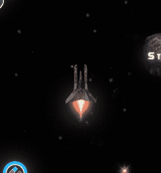
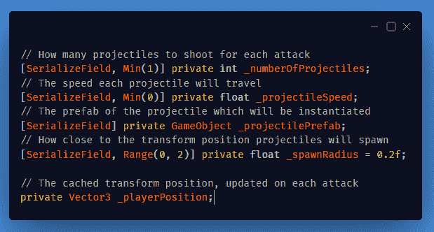
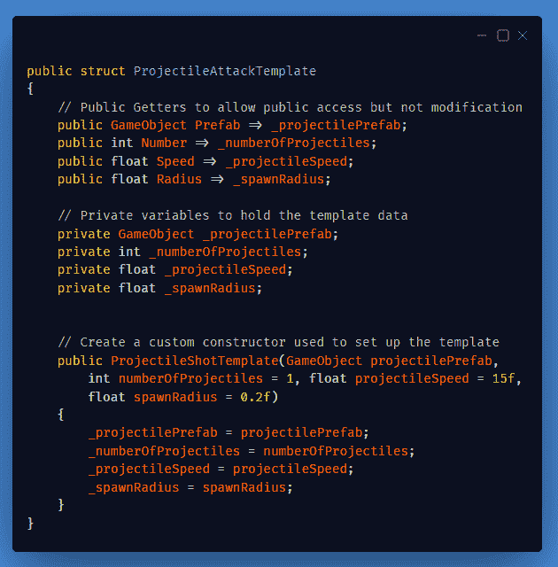
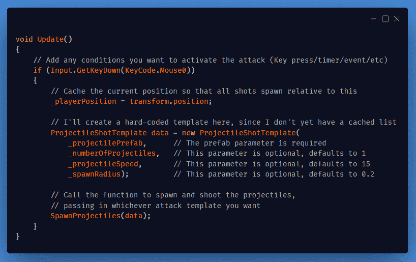
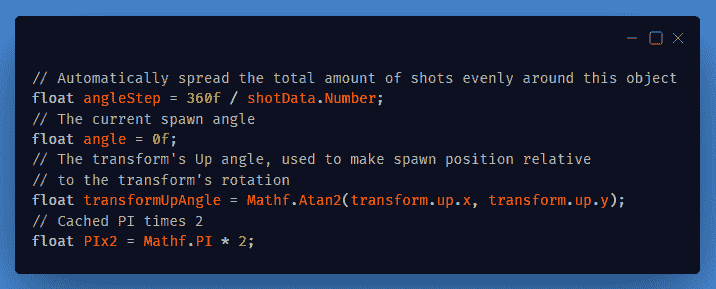
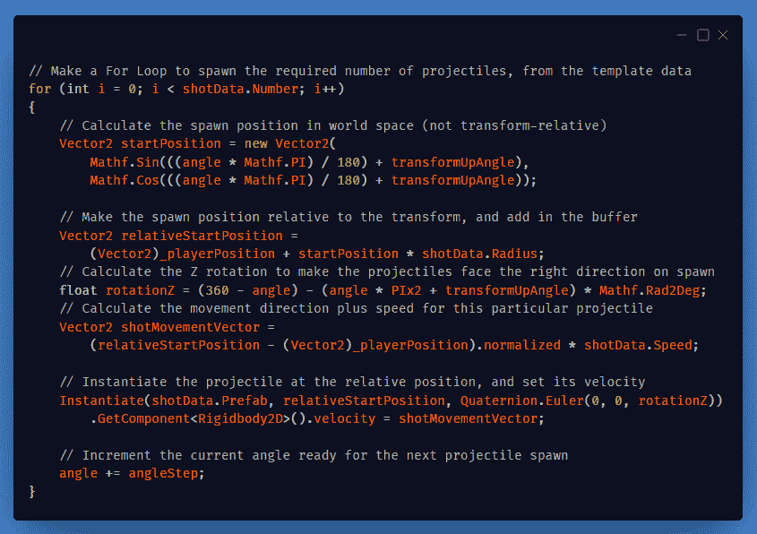
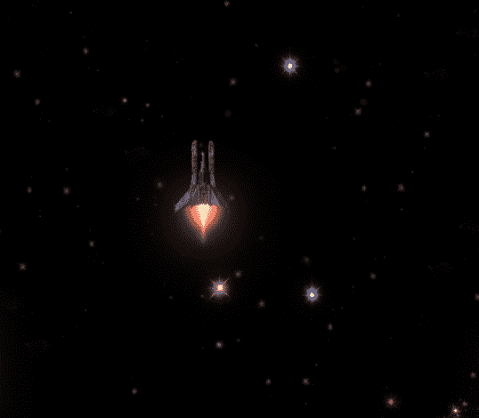

# 制作定制的子弹地狱式攻击系统(第 1 部分)

> 原文：<https://medium.com/nerd-for-tech/making-a-custom-radial-attack-system-part-1-198228cc85ce?source=collection_archive---------4----------------------->

## 我想升级玩家和敌人的射击机制，所以我今天会做一个“子弹地狱”风格的系统。这将是一个多部分的职位。

**今天的目标:**通过创建一个基本的*子弹地狱*风格的射击脚本来升级射击技能。

## 创建新脚本:

创建用于攻击的变量

现在创建一个空的 ***Update()*** 和***spawn projections()***函数。

## 暂时保留这个脚本，并创建另一个名为“***ProjectileAttackTemplate***”的新脚本。

使它成为一个 ***struct*** 而不是一个 ***类。***

此模板结构的目的是允许预定义攻击类型，以便于访问。也就是说，你可以创建一个***ProjectAttackTemplate***变量，为单次向前拍摄设置，然后调用 shoot 函数并传入该变量。20 发径向进攻也是如此。

现在再回到第一个脚本，在 ***更新()*** :

在 Update()中，创建一种激活攻击的方法

并且在*中，我首先创建了一些局部变量:*

**

*然后制作一个 **For 循环**来产生每个弹丸:*

**

*计算位置，旋转，方向和速度，然后产卵弹丸*

## *结果是:*

**

*一次射出 40 束激光！*

*明天在第 2 部分，我将继续这一发展，以改善它，并作出一些拍摄模式和模板。期待，也记得去看看！*