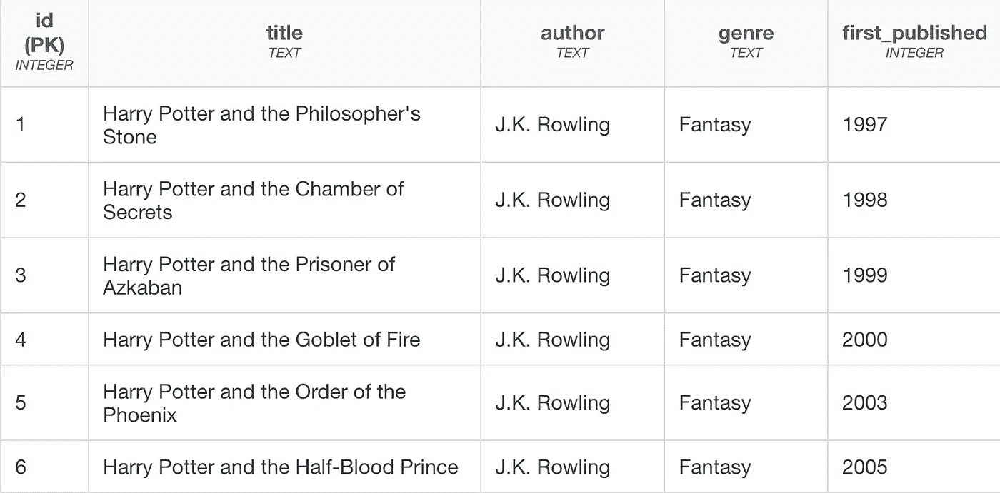
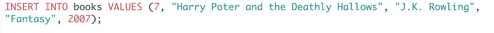
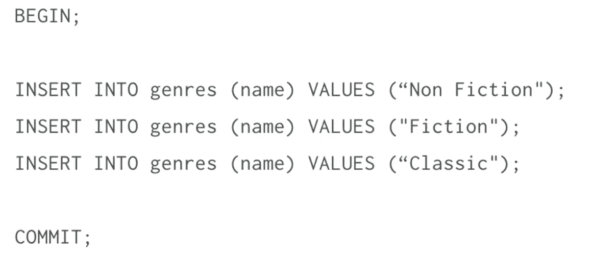
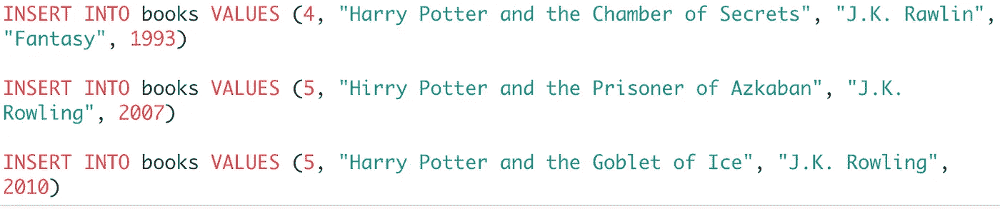

# 与您的数据库进行交易:如何完成交易

> 原文：<https://medium.com/nerd-for-tech/making-a-deal-with-your-database-how-to-complete-a-transaction-d8bda556e910?source=collection_archive---------12----------------------->

## 保持一个干净而全面的数据库是至关重要的 SQL 中的事务如何在实现这一点上发挥关键作用

最近几周，我有幸作为班级导师参与了一个名为“编码梦想”(CTD)的组织。这个机会让我从 JavaScript 中抽身出来，重新进入 Ruby on Rails & SQL 的后端世界。

要了解更多关于如何参与梦想编码的信息，请访问他们的网站！

*当我兴奋地再次尝试使用 Ruby 时，我意外地得知 CTD 课程的前几周是 SQL，即结构化查询语言。*

*哦，天啊…我在熨斗学校的时候绝对忽略了这一部分。使用活动记录 ORM(或对象关系映射)，我这样做是有道理的。许多开发人员无需编写一行 SQL 就可以完成他们的任务。毕竟，Active Record 或其他 ORM(如 Django (Python)和 Hibernate (Java ))允许开发人员执行 CRUD 操作，并以各自的语言与数据库通信。*

*所以我来了，我被期望成为新生的班级导师，我不仅在半年前学习了一小段时间，而且还浏览了一下，因为我当时觉得这并不太重要。*

**

*我的工作被砍掉了。但回顾这一周，这无疑是塞翁失马焉知非福。*

*把 ORMs 想象成一辆车。当你把钥匙插入点火装置并转动它时(或者我猜对于新的高档车，按一个按钮)，你的车神奇地启动了。当你把脚踩在油门踏板上时，你期望汽车会移动。当你把脚踩在刹车踏板上时，你希望车停下来。*

*当你做这些动作时，你没有想到的是在引擎盖下发生了什么使这些动作发生。学习 SQL 的基础知识就像打开引擎盖&理解代码如何与数据库通信的一些基本机制。*

*就这一点而言，我诚实地打开了我最后一辆车的引擎盖，可能总共打开了 5 次。也许这就是它不再存在的原因…*

*我假设您对 SQL 的工作原理和基本语法有一个大致的了解。让我们建立一个基本的数据库开始吧！*

**如果你想学习 SQL 的基础知识或者需要复习，我推荐 SQLBolt 进行一些练习:*[*https://sqlbolt.com/lesson/introduction*](https://sqlbolt.com/lesson/introduction)*

# *建立我们的数据库*

*假设我们拥有一个简单的图书数据库。看看我的书架，这是我们有的:*

**

*那是一些书架。但看起来我们的收藏中少了一本重要的书。谢天谢地，我们有 SQL 来帮助我们！*

*在复习了 SQL 的一些基础知识之后，我们可以很快地确定我们可以使用 INSERT INTO 关键字在数据库中创建一行。我们的语句可能看起来像这样:*

**

*那是一个书架！我们的数据库里有全部 7 本哈利波特。一切都好。*

*除了…我们犯了一个错误。我不小心拼错了“波特”跑！*

*在你们这些哈利波特迷开始给我发愤怒的信息之前，我是故意的，我想表达我的观点。*

**

*虽然我们*可以*使用 UPDATE 关键字创建另一个语句来更新我们的数据库，但假设我们正在处理一个有数千行的数据库，您必须在其中进行大量更改，或者如果您正在为一家新公司将大量数据植入数据库，但由于犯了一些错误，您希望恢复到以前的状态。如果你问我的话，那将是一项相当令人厌倦的任务。*

*幸运的是，我们可以使用一种叫做交易的东西来使我们的生活变得更容易。*

# *提交和回滚*

*当编写 SQL 语句时，我们必须确定我们编写和运行的语句正是我们想要执行的。在生产环境中，如果您和您的团队想要恢复到以前的状态，可能会非常困难。这是因为在大多数情况下，我们的语句是在自动提交模式下运行的，换句话说，它会自动保存到我们的磁盘上。*

*假设我们正在进行批处理操作，或者一起运行多个语句。最好在运行脚本文件时关闭自动提交，以防遇到任何问题。*

*我们可以通过使用事务来完成。让我们看看这个会是什么样子:*

**

*我们使用 BEGIN 关键字(或者我们也可以使用 BEGIN TRANSACTION)向数据库发送信号，以便在我们准备好的时候立即运行所有的语句。换句话说，它告诉我们的数据库关闭自动提交。*

*在我们的语句之后，我们使用 COMMIT 关键字锁定我们的语句，并将我们的更改提交给数据库。*在提交之前，确保一切正常！**

*然而，回到我们之前的错误点。比方说，相反，我们的手指很粗，不小心打错了一些字，或者输入了一些错误的日期:*

**

**嗯哦。现在我们做到了！**

*但是没关系。通过在提交之前发出 ROLLBACK 关键字，我们可以将更改恢复到之前的状态。这是一个有益的交易！*

# *交易回顾*

*简单地说，事务可以定义为对数据库的任何更改；数据库组件及其包含的数据字段之间的任何“事务”。为了把这个概念讲清楚，让我们请一些专家来帮忙。*

*Techopedia 解释说，事务是由 COMMIT 和 ROLLBACK SQL 语句(如上所示)完成的，这些语句指示事务的开始或结束。ACID 缩写定义了数据库事务的属性:*

*事务必须完全完成、提交或回滚。
**C** 一致性:事务必须完全符合数据库先前的状态。换句话说，事务不能打破数据库的约束。
**I** solation:在提交或回滚原始事务之前，事务数据不能用于其他事务。
**D** 可用性:即使在数据库出现故障的情况下，事务数据更改也必须可用。*

*如果我们的交易包括所有这些财产，那么我们就成交了。*

**

# *结论*

*我希望本演练能帮助您更好地理解事务！如果您还没有，我鼓励您花些时间看看“引擎盖下”,并练习编写一些 SQL 语言，这样您就可以更好地理解一些神奇的东西是如何工作的——很容易想当然。*

*请让我知道你的想法——我很乐意听到！*

# *来源*

*Techopedia:什么是事务(在数据库中)？[https://www . techopedia . com/definition/16455/transaction-databases](https://www.techopedia.com/definition/16455/transaction-databases)*